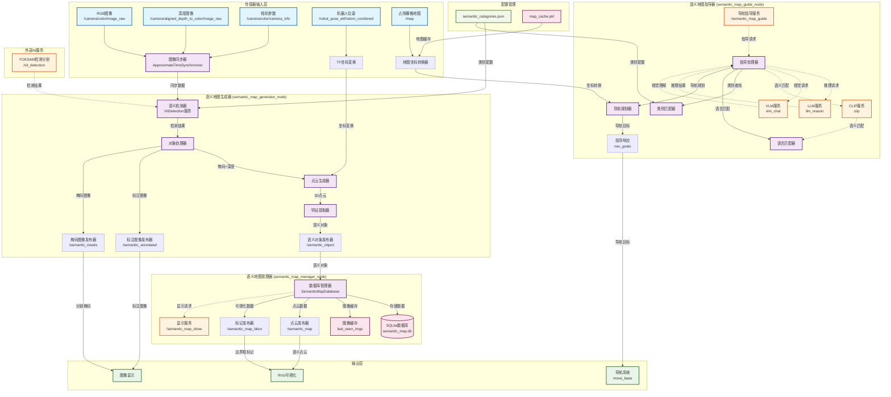

# 如何使用这个工程

_Exported on 2025/7/18 at GMT+8 23:42:43 from Cursor (1.1.7)_

---

**User**

讲解一下我该如何使用这个工程

---

**Cursor**

我来帮您分析这个工程的结构和使用方法。首先让我查看一下项目的README文件和主要配置文件。

README文件是空的，让我查看一下scripts目录下的配置文件，这些通常包含项目的使用说明。

现在让我查看一些主要的launch文件来了解系统的启动方式：

现在让我查看一些主要的Python节点文件来了解系统的功能：

基于我对项目结构的分析，我来为您详细讲解这个YanBot工程的使用方法：

## YanBot工程使用指南

### 项目概述

YanBot是一个基于ROS Noetic的智能机器人系统，集成了语音交互、视觉感知、导航定位、机械臂控制等功能。项目采用模块化设计，分为以下几个主要部分：

### 1. 系统架构

- **Brain（大脑）**: 包含LLM和VLM模块，负责语言理解和视觉理解
- **Cerebellum（小脑）**: 包含导航、交互、语义地图等核心功能模块
- **Arm（机械臂）**: ARX-R5机械臂控制系统

### 2. 环境配置

#### 2.1 基础环境设置

```bash
# 1. 运行基础配置脚本
cd /home/kara/YanBot-zyt
chmod +x scripts/basic.sh
./scripts/basic.sh

# 2. 安装依赖
chmod +x scripts/deps.sh
./scripts/deps.sh
```

#### 2.2 Conda环境配置

项目需要两个conda环境：

**interact环境（语音交互）**:

```bash
conda env create -f scripts/interact.yaml -v
conda env update -n interact -f scripts/py310.yaml -v
```

**py310环境（视觉处理）**:

```bash
conda env create -f scripts/py310.yaml -v
conda env update -n py310 -f scripts/py310.yaml -v
```

### 3. 主要功能模块

#### 3.1 语音交互系统

- **唤醒词检测**: 使用Picovoice进行语音唤醒
- **语音识别(STT)**: 基于FunASR的中文语音识别
- **语音合成(TTS)**: 基于ChatTTS的语音合成

启动语音交互测试：

```bash
roslaunch cerebellum_pkg test_interact.launch
```

#### 3.2 导航系统

- **2D导航**: 基于Wheeltec机器人的2D导航
- **3D导航**: 支持3D环境导航
- **SLAM建图**: 支持激光雷达和视觉SLAM

启动主系统：

```bash
roslaunch cerebellum_pkg main.launch
```

#### 3.3 语义地图系统

- **目标检测**: 基于YOLO的目标检测
- **实例分割**: 基于SAM的实例分割
- **语义理解**: 基于CLIP的语义理解

启动语义地图：

```bash
roslaunch semantic_map_pkg semantic_map.launch
```

#### 3.4 机械臂控制

- **ARX-R5控制**: 支持机械臂的精确控制
- **CAN通信**: 基于CAN总线的硬件通信

### 4. 使用流程

#### 4.1 首次使用

1. **环境配置**:

   ```bash
   source ~/.bashrc
   cd $YANBOT_WS
   ```

2. **编译工作空间**:

   ```bash
   catkin_make
   source devel/setup.bash
   ```

3. **下载模型权重**:
   ```bash
   cd src/Cerebellum/semantic_map/yolo_evsam_ros/weights/
   ./download_weights.sh
   ```

#### 4.2 日常使用

**语音交互模式**:

```bash
# 启动语音交互
roslaunch cerebellum_pkg test_interact.launch
# 说"你好"或其他唤醒词开始交互
```

**完整系统模式**:

```bash
# 启动完整系统（包含导航、视觉等）
roslaunch cerebellum_pkg main.launch
```

**建图模式**:

```bash
# 首次建图
roslaunch cerebellum_pkg first_mapping.launch
```

### 5. 配置参数

#### 5.1 导航配置

- 地图文件位置: `src/Cerebellum/wheel_dir/wheeltec_noetic_src/turn_on_wheeltec_robot/map/`
- 导航参数: 可在launch文件中调整

#### 5.2 语音配置

- 唤醒词: 可在`wakeup_pkg`中配置
- 语音模型: 使用SenseVoiceSmall模型
- 音频设备: 自动检测或手动配置

#### 5.3 视觉配置

- 相机: 支持RealSense相机
- 检测模型: YOLO + SAM
- 语义模型: CLIP

### 6. 故障排除

#### 6.1 常见问题

1. **环境变量未设置**: 确保运行了`basic.sh`脚本
2. **依赖缺失**: 运行`deps.sh`安装所有依赖
3. **模型文件缺失**: 下载相应的模型权重文件
4. **权限问题**: 确保音频设备权限正确

#### 6.2 调试方法

- 使用RViz进行可视化调试
- 查看ROS话题和服务状态
- 检查日志输出

### 7. 扩展开发

项目采用模块化设计，可以方便地添加新功能：

- 在`src/Brain`中添加新的AI模型
- 在`src/Cerebellum`中添加新的功能模块
- 在`src/Cerebellum/arm`中添加新的硬件支持

这个系统集成了现代机器人技术的多个方面，是一个功能完整的智能机器人平台。建议先从语音交互功能开始熟悉系统，然后逐步探索其他功能模块。

```shellscript
# 1. 运行基础配置脚本
cd /home/kara/YanBot-zyt
chmod +x scripts/basic.sh
./scripts/basic.sh

# 2. 安装依赖
chmod +x scripts/deps.sh
./scripts/deps.sh
```

```shellscript
conda env create -f scripts/interact.yaml -v
conda env update -n interact -f scripts/py310.yaml -v
```

```shellscript
conda env create -f scripts/py310.yaml -v
conda env update -n py310 -f scripts/py310.yaml -v
```

```shellscript
roslaunch cerebellum_pkg test_interact.launch
```

```shellscript
roslaunch cerebellum_pkg main.launch
```

```shellscript
roslaunch semantic_map_pkg semantic_map.launch
```

```shellscript
   source ~/.bashrc
   cd $YANBOT_WS
```

```shellscript
   catkin_make
   source devel/setup.bash
```

```shellscript
   cd src/Cerebellum/semantic_map/yolo_evsam_ros/weights/
   ./download_weights.sh
```

```shellscript
# 启动语音交互
roslaunch cerebellum_pkg test_interact.launch
# 说"你好"或其他唤醒词开始交互
```

```shellscript
# 启动完整系统（包含导航、视觉等）
roslaunch cerebellum_pkg main.launch
```

```shellscript
# 首次建图
roslaunch cerebellum_pkg first_mapping.launch
```

---

**User**

oslaunch cerebellum_pkg main.launch 告诉我这个系统的完整逻辑

---

**Cursor**

我来详细分析`roslaunch cerebellum_pkg main.launch`这个系统的完整逻辑。让我先查看相关的launch文件和代码来理解整个系统的架构。

现在让我查看被包含的各个子系统的launch文件：

现在让我查看一些关键的节点实现来理解系统逻辑：

现在让我查看Brain模块的launch文件：

现在让我查看一些关键的节点实现：

现在让我查看导航系统的核心组件：

基于我对代码的深入分析，现在我可以为您详细解释`roslaunch cerebellum_pkg main.launch`这个系统的完整逻辑：

## YanBot主系统完整逻辑架构

### 1. 系统启动流程

当执行`roslaunch cerebellum_pkg main.launch`时，系统会按以下顺序启动各个模块：

#### 1.1 参数初始化

```xml
<!-- 可视化参数 -->
<arg name="main/use_rviz" default="true"/>
<!-- 导航功能选择 -->
<arg name="main/navi_func" default="2D"/>
<!-- 语义地图参数 -->
<arg name="main/semantic_map/semantic_map_mode" default="simple"/>
<arg name="main/semantic_map/det_seg_mode" default="yoesam"/>
```

#### 1.2 模块启动顺序

1. **RViz可视化** (可选)
2. **导航系统** (2D/3D)
3. **RealSense相机**
4. **语义地图系统**

### 2. 核心模块详细逻辑

#### 2.1 导航系统 (Navigation System)

**启动链**:

```
main.launch → navigation.launch → turn_on_wheeltec_robot.launch
```

**核心组件**:

- **底层控制**: `base_serial.launch` - 控制机器人底盘
- **激光雷达**: `mid360_laserscan.launch` - MID360激光雷达驱动
- **地图服务**: `map_server` - 加载预建地图
- **定位算法**: `amcl.launch` - 自适应蒙特卡洛定位
- **路径规划**: `teb_local_planner.launch` - TEB局部路径规划

**工作流程**:

1. 加载预建地图文件 (`WHEELTEC.yaml`)
2. 启动AMCL进行机器人定位
3. 启动move_base进行路径规划
4. 发布机器人TF变换关系

#### 2.2 语义地图系统 (Semantic Map System)

**启动链**:

```
main.launch → semantic_map.launch → [yoesam.launch, llm.launch, vlm.launch, clip.launch]
```

**核心节点**:

**A. 语义地图生成器** (`semantic_map_generator_node`):

```python
# 主要功能
1. 订阅RGB+Depth图像和相机信息
2. 调用YOLO+SAM进行目标检测和分割
3. 将2D检测结果转换为3D语义点云
4. 发布语义对象消息
```

**B. 语义地图管理器** (`semantic_map_manager_node`):

```python
# 主要功能
1. 接收语义对象消息
2. 管理语义地图数据库
3. 处理对象跟踪和更新
4. 发布可视化标记
```

**C. 语义地图引导器** (`semantic_map_guide_node`):

```python
# 主要功能
1. 提供语义查询服务
2. 结合LLM/VLM进行智能问答
3. 生成导航指导
```

#### 2.3 AI大脑系统 (Brain System)

**A. LLM节点** (`llm_node`):

- 使用DeepSeek-V2.5进行对话
- 使用DeepSeek-R1进行推理
- 提供`llm_chat`和`llm_reason`服务

**B. VLM节点** (`vlm_node`):

- 视觉语言模型
- 提供`vlm_chat`服务

**C. CLIP节点**:

- 图像-文本匹配
- 语义相似度计算

#### 2.4 视觉感知系统

**A. YOESAM检测分割**:

- YOLO目标检测
- SAM实例分割
- 提供`/vit_detection`服务

**B. RealSense相机**:

- RGB图像: `/camera/color/image_raw`
- 深度图像: `/camera/aligned_depth_to_color/image_raw`
- 相机信息: `/camera/color/camera_info`

### 3. 数据流和通信

#### 3.1 传感器数据流

```
RealSense相机 → RGB/Depth图像 → 语义地图生成器 → 语义对象 → 语义地图管理器
```

#### 3.2 AI服务调用链

```
语义地图引导器 → LLM/VLM服务 → 智能问答响应
```

#### 3.3 导航数据流

```
激光雷达 → AMCL定位 → move_base规划 → 底盘控制
```

### 4. 系统集成逻辑

#### 4.1 多模态融合

1. **视觉感知**: 实时检测环境中的物体
2. **语义理解**: 为检测到的物体赋予语义标签
3. **空间定位**: 将语义信息映射到3D空间
4. **智能交互**: 通过LLM/VLM理解用户意图

#### 4.2 实时处理

- **图像处理**: 1Hz频率的语义地图更新
- **导航控制**: 实时路径规划和避障
- **AI推理**: 按需调用LLM/VLM服务

#### 4.3 数据持久化

- **语义地图数据库**: SQLite存储语义对象
- **图像缓存**: 保存标注图像用于特征匹配
- **配置参数**: 通过launch文件管理

### 5. 系统特点

#### 5.1 模块化设计

- 每个功能模块独立运行
- 通过ROS话题和服务通信
- 支持动态配置和扩展

#### 5.2 智能化程度

- 多模态AI融合 (视觉+语言)
- 实时语义理解
- 智能导航指导

#### 5.3 可扩展性

- 支持不同的检测分割算法
- 可配置的语义类别
- 灵活的导航策略

这个系统实现了一个完整的智能机器人平台，集成了感知、认知、决策和执行的全栈能力，能够进行环境理解、智能交互和自主导航。

```xml
<!-- 可视化参数 -->
<arg name="main/use_rviz" default="true"/>
<!-- 导航功能选择 -->
<arg name="main/navi_func" default="2D"/>
<!-- 语义地图参数 -->
<arg name="main/semantic_map/semantic_map_mode" default="simple"/>
<arg name="main/semantic_map/det_seg_mode" default="yoesam"/>
```

```plaintext
main.launch → navigation.launch → turn_on_wheeltec_robot.launch
```

```plaintext
main.launch → semantic_map.launch → [yoesam.launch, llm.launch, vlm.launch, clip.launch]
```

```python
# 主要功能
1. 订阅RGB+Depth图像和相机信息
2. 调用YOLO+SAM进行目标检测和分割
3. 将2D检测结果转换为3D语义点云
4. 发布语义对象消息
```

```python
# 主要功能
1. 接收语义对象消息
2. 管理语义地图数据库
3. 处理对象跟踪和更新
4. 发布可视化标记
```

```python
# 主要功能
1. 提供语义查询服务
2. 结合LLM/VLM进行智能问答
3. 生成导航指导
```

```plaintext
RealSense相机 → RGB/Depth图像 → 语义地图生成器 → 语义对象 → 语义地图管理器
```

```plaintext
语义地图引导器 → LLM/VLM服务 → 智能问答响应
```

```plaintext
激光雷达 → AMCL定位 → move_base规划 → 底盘控制
```

---

**User**

能帮我分析一下，如果我想复现这个系统，我一步步应该如何组织我的代码吗

---

**Cursor**

我来帮您分析如何一步步组织代码来复现这个YanBot系统。让我先查看一些关键的配置文件和依赖关系。

现在让我查看一些关键的Python模块实现：

基于我对整个系统的深入分析，我来为您提供一个详细的复现指南：

## YanBot系统复现指南

### 1. 项目结构规划

#### 1.1 目录结构设计

```
YanBot-Reproduction/
├── scripts/                          # 配置和安装脚本
│   ├── basic.sh                      # 基础环境配置
│   ├── deps.sh                       # 依赖安装
│   ├── interact.yaml                 # 语音交互环境
│   └── py310.yaml                    # 视觉处理环境
├── src/                              # ROS工作空间源码
│   ├── Brain/                        # AI大脑模块
│   │   ├── llm_pkg/                  # 大语言模型
│   │   └── vlm_pkg/                  # 视觉语言模型
│   ├── Cerebellum/                   # 小脑控制模块
│   │   ├── cerebellum_pkg/           # 主控制包
│   │   ├── semantic_map/             # 语义地图
│   │   ├── interact/                 # 语音交互
│   │   └── wheel_dir/                # 导航系统
│   └── Utils/                        # 工具模块
├── thirdparties/                     # 第三方依赖
├── docs/                             # 文档
└── README.md                         # 项目说明
```

### 2. 环境配置阶段

#### 2.1 基础环境设置

```bash
# 创建项目目录
mkdir -p YanBot-Reproduction
cd YanBot-Reproduction

# 创建基础配置脚本
cat > scripts/basic.sh << 'EOF'
#!/bin/bash
WS_DIR=$(pwd)
echo "export YANBOT_WS=$WS_DIR" >> ~/.bashrc
echo "export HF_ENDPOINT=\"https://hf-mirror.com\"" >> ~/.bashrc
echo "export PATH=/home/$USER/.local/bin:\$PATH" >> ~/.bashrc
source ~/.bashrc
EOF

chmod +x scripts/basic.sh
./scripts/basic.sh
```

#### 2.2 Conda环境配置

```bash
# 创建语音交互环境
cat > scripts/interact.yaml << 'EOF'
name: interact
channels:
  - pytorch
  - nvidia
  - defaults
dependencies:
  - python=3.10
  - pip
  - pip:
    - torch==2.5.0
    - torchvision==0.20.0
    - torchaudio==2.5.0
    - transformers==4.51.3
    - openai
    - sounddevice
    - soundfile
    - librosa
    - pvporcupine
    - funasr
    - chattts
EOF

# 创建视觉处理环境
cat > scripts/py310.yaml << 'EOF'
name: py310
channels:
  - defaults
dependencies:
  - python=3.10
  - pip
  - pip:
    - torch==2.6.0
    - torchvision==0.21.0
    - opencv-python==4.11.0.86
    - ultralytics==8.3.94
    - segment-anything==1.0
    - openai-clip==1.0.1
    - supervision==0.25.1
    - scikit-learn==1.6.1
    - numpy==1.24.4
EOF

# 创建环境
conda env create -f scripts/interact.yaml
conda env create -f scripts/py310.yaml
```

### 3. ROS包开发阶段

#### 3.1 创建ROS工作空间

```bash
mkdir -p src
cd src

# 创建Brain模块
mkdir -p Brain/llm_pkg/{scripts,launch,srv}
mkdir -p Brain/vlm_pkg/{scripts,launch,srv}

# 创建Cerebellum模块
mkdir -p Cerebellum/cerebellum_pkg/{scripts,launch,rviz}
mkdir -p Cerebellum/semantic_map/semantic_map_pkg/{scripts,launch,msg,srv,rviz}
mkdir -p Cerebellum/interact/{wakeup_pkg,stt_pkg,tts_pkg}
```

#### 3.2 核心模块实现

**A. LLM模块** (`src/Brain/llm_pkg/`)

```python
# scripts/llm.py
from openai import OpenAI
import os

class LLM:
    def __init__(self, model="deepseek-ai/DeepSeek-V2.5", api_key=None):
        self.api_key = api_key or os.environ.get("SILICONFLOW_API_KEY")
        self.client = OpenAI(
            base_url="https://api.siliconflow.cn/v1/",
            api_key=self.api_key
        )
        self.model = model

    def chat(self, messages, **kwargs):
        response = self.client.chat.completions.create(
            model=self.model,
            messages=messages,
            **kwargs
        )
        return response.choices[0].message.content
```

```python
# scripts/llm_node.py
import rospy
from llm_pkg.srv import LLMChat, LLMChatResponse
from llm import LLM
import json

class LLMNode:
    def __init__(self):
        rospy.init_node("llm_node")
        self.llm = LLM()

        # 加载配置
        with open("scripts/llm_types.json", "r") as f:
            self.llm_types = json.load(f)

        # 创建服务
        self.service = rospy.Service("llm_chat", LLMChat, self.handle_chat)

    def handle_chat(self, req):
        try:
            messages = [
                {"role": "system", "content": self.llm_types["chat"][req.type]["system_prompt"]},
                {"role": "user", "content": req.content}
            ]
            response = self.llm.chat(messages)
            return LLMChatResponse(success=True, response=response)
        except Exception as e:
            return LLMChatResponse(success=False, response=str(e))
```

**B. 语义地图模块** (`src/Cerebellum/semantic_map/semantic_map_pkg/`)

```python
# scripts/semantic_map_generator_node.py
import rospy
import cv2
import numpy as np
from sensor_msgs.msg import Image, CameraInfo
from message_filters import ApproximateTimeSynchronizer, Subscriber
from cv_bridge import CvBridge

class SemanticMapGenerator:
    def __init__(self):
        rospy.init_node("semantic_map_generator")

        # 订阅器
        image_sub = Subscriber("/camera/color/image_raw", Image)
        depth_sub = Subscriber("/camera/aligned_depth_to_color/image_raw", Image)
        camera_info_sub = Subscriber("/camera/color/camera_info", CameraInfo)

        # 时间同步
        self.ts = ApproximateTimeSynchronizer(
            [image_sub, depth_sub, camera_info_sub],
            queue_size=5,
            slop=0.05
        )
        self.ts.registerCallback(self.sync_callback)

        # 发布器
        self.semantic_pub = rospy.Publisher("/semantic_object", SemanticObject, queue_size=10)

        # 检测服务客户端
        rospy.wait_for_service("/vit_detection")
        self.detector = rospy.ServiceProxy("/vit_detection", VitDetection)

        self.bridge = CvBridge()

    def sync_callback(self, img_msg, depth_msg, camera_info_msg):
        # 处理同步的图像数据
        rgb = self.bridge.imgmsg_to_cv2(img_msg, "bgr8")
        depth = self.bridge.imgmsg_to_cv2(depth_msg, "passthrough")

        # 调用检测服务
        results = self.detector(rgb, self.current_prompt)

        # 处理检测结果并发布语义对象
        self.process_detection_results(results, rgb, depth, camera_info_msg)
```

**C. 数据库模块**

```python
# scripts/lib/semantic_map_database.py
import sqlite3
import numpy as np
import cv2
import os

class SemanticMapDatabase:
    def __init__(self, db_path, img_dir, renew_db=False):
        self.db_path = db_path
        self.img_dir = img_dir

        if renew_db and os.path.exists(db_path):
            os.remove(db_path)

        self._init_db()

    def _init_db(self):
        conn = sqlite3.connect(self.db_path)
        conn.execute("""
            CREATE TABLE IF NOT EXISTS semantic_objects (
                label TEXT PRIMARY KEY,
                bbox BLOB,
                time_stamp TIMESTAMP DEFAULT CURRENT_TIMESTAMP,
                x_data BLOB,
                y_data BLOB,
                z_data BLOB,
                rgb_data BLOB,
                feature_data BLOB
            )
        """)
        conn.commit()
        conn.close()

    def update_entry(self, label, bbox, x, y, z, rgb, feature):
        conn = sqlite3.connect(self.db_path)
        conn.execute("""
            INSERT OR REPLACE INTO semantic_objects
            (label, bbox, x_data, y_data, z_data, rgb_data, feature_data)
            VALUES (?, ?, ?, ?, ?, ?, ?)
        """, (label, bbox, x, y, z, rgb, feature))
        conn.commit()
        conn.close()
```

### 4. 配置文件创建

#### 4.1 语义类别配置

```json
// scripts/semantic_categories.json
{
  "categories": ["chair", "table", "sofa", "bed", "refrigerator", "microwave-oven", "television", "human"]
}
```

#### 4.2 LLM类型配置

```json
// scripts/llm_types.json
{
  "chat": {
    "test_chat": {
      "system_prompt": "你是一个AI助手，只能回答是或否。",
      "max_tokens": 4096,
      "temperature": 0.5
    },
    "category_or_language_chat": {
      "system_prompt": "你是一个机器人语义理解模块...",
      "max_tokens": 4096,
      "temperature": 0.2
    }
  },
  "reason": {
    "task_plan_reason": {
      "system_prompt": "你是机器人任务规划模块...",
      "max_tokens": 4096,
      "temperature": 0.2
    }
  }
}
```

### 5. Launch文件创建

#### 5.1 主Launch文件

```xml
<!-- launch/main.launch -->
<launch>
    <!-- 参数配置 -->
    <arg name="use_rviz" default="true"/>
    <arg name="navi_func" default="2D"/>
    <arg name="semantic_map_mode" default="simple"/>

    <!-- RViz可视化 -->
    <group if="$(arg use_rviz)">
        <node pkg="rviz" type="rviz" name="rviz"
              args="-d $(find cerebellum_pkg)/rviz/main.rviz"/>
    </group>

    <!-- 导航系统 -->
    <group if="$(eval arg('navi_func') == '2D')">
        <include file="$(find turn_on_wheeltec_robot)/launch/navigation.launch"/>
    </group>

    <!-- 相机 -->
    <include file="$(find realsense2_camera)/launch/rs_camera.launch">
        <arg name="align_depth" value="true"/>
    </include>

    <!-- 语义地图 -->
    <group if="$(eval arg('semantic_map_mode') == 'simple')">
        <include file="$(find semantic_map_pkg)/launch/semantic_map.launch"/>
    </group>
</launch>
```

#### 5.2 语义地图Launch文件

```xml
<!-- launch/semantic_map.launch -->
<launch>
    <!-- 检测分割服务 -->
    <include file="$(find yolo_evsam_ros)/launch/yoesam.launch"/>

    <!-- 语义地图生成器 -->
    <node name="semantic_map_generator_node"
          pkg="semantic_map_pkg"
          type="semantic_map_generator_node.py"
          output="screen">
        <param name="semantic_categories_json_path"
               value="$(find semantic_map_pkg)/scripts/semantic_categories.json"/>
    </node>

    <!-- 语义地图管理器 -->
    <node name="semantic_map_manager_node"
          pkg="semantic_map_pkg"
          type="semantic_map_manager_node.py"
          output="screen">
        <param name="db_path" value="$(env YANBOT_WS)/semantic_map.db"/>
    </node>

    <!-- AI服务 -->
    <include file="$(find llm_pkg)/launch/llm.launch"/>
    <include file="$(find vlm_pkg)/launch/vlm.launch"/>
</launch>
```

### 6. 依赖安装脚本

#### 6.1 系统依赖

```bash
# scripts/deps.sh
#!/bin/bash

# ROS依赖
sudo apt install -y ros-noetic-gmapping ros-noetic-rtabmap-ros \
    ros-noetic-joy ros-noetic-robot-pose-ekf ros-noetic-image-transport \
    ros-noetic-rgbd-launch ros-noetic-ddynamic-reconfigure

# 相机依赖
sudo apt install -y libssl-dev libusb-1.0-0-dev pkg-config \
    libgtk-3-dev libglfw3-dev libgl1-mesa-dev libglu1-mesa-dev

# 音频依赖
sudo apt install -y swig libatlas-base-dev libasound2-dev \
    portaudio19-dev libportaudio2 libportaudiocpp0 python3-pyaudio

# Python依赖
pip install sxtwl requests geopy httpx[socks] qrcode[pil]
pip install -U openai
pip install git+https://github.com/openai/CLIP.git
```

### 7. 开发步骤建议

#### 7.1 第一阶段：基础框架

1. **环境搭建**: 配置ROS、Conda环境
2. **基础模块**: 实现LLM、VLM基础服务
3. **数据流**: 建立相机数据订阅和发布

#### 7.2 第二阶段：核心功能

1. **检测分割**: 集成YOLO+SAM
2. **语义地图**: 实现数据库和可视化
3. **导航系统**: 集成move_base

#### 7.3 第三阶段：集成测试

1. **端到端测试**: 完整流程验证
2. **性能优化**: 调整参数和频率
3. **文档完善**: 使用说明和API文档

### 8. 关键注意点

#### 8.1 环境管理

- 使用conda管理不同的Python环境
- 确保ROS和Python环境的兼容性
- 正确设置环境变量

#### 8.2 数据同步

- 使用message_filters进行多传感器数据同步
- 处理TF变换的时间戳对齐
- 确保检测结果的实时性

#### 8.3 错误处理

- 添加完善的异常处理机制
- 实现服务调用的超时处理
- 提供详细的日志输出

#### 8.4 性能优化

- 合理设置消息队列大小
- 优化图像处理频率
- 使用多线程处理耗时操作

这个复现指南提供了一个系统性的方法，您可以根据自己的需求和硬件条件逐步实现各个模块。建议先从基础的环境配置开始，然后逐步添加功能模块。

```plaintext
YanBot-Reproduction/
├── scripts/                          # 配置和安装脚本
│   ├── basic.sh                      # 基础环境配置
│   ├── deps.sh                       # 依赖安装
│   ├── interact.yaml                 # 语音交互环境
│   └── py310.yaml                    # 视觉处理环境
├── src/                              # ROS工作空间源码
│   ├── Brain/                        # AI大脑模块
│   │   ├── llm_pkg/                  # 大语言模型
│   │   └── vlm_pkg/                  # 视觉语言模型
│   ├── Cerebellum/                   # 小脑控制模块
│   │   ├── cerebellum_pkg/           # 主控制包
│   │   ├── semantic_map/             # 语义地图
│   │   ├── interact/                 # 语音交互
│   │   └── wheel_dir/                # 导航系统
│   └── Utils/                        # 工具模块
├── thirdparties/                     # 第三方依赖
├── docs/                             # 文档
└── README.md                         # 项目说明
```

```shellscript
# 创建项目目录
mkdir -p YanBot-Reproduction
cd YanBot-Reproduction

# 创建基础配置脚本
cat > scripts/basic.sh << 'EOF'
#!/bin/bash
WS_DIR=$(pwd)
echo "export YANBOT_WS=$WS_DIR" >> ~/.bashrc
echo "export HF_ENDPOINT=\"https://hf-mirror.com\"" >> ~/.bashrc
echo "export PATH=/home/$USER/.local/bin:\$PATH" >> ~/.bashrc
source ~/.bashrc
EOF

chmod +x scripts/basic.sh
./scripts/basic.sh
```

```shellscript
# 创建语音交互环境
cat > scripts/interact.yaml << 'EOF'
name: interact
channels:
  - pytorch
  - nvidia
  - defaults
dependencies:
  - python=3.10
  - pip
  - pip:
    - torch==2.5.0
    - torchvision==0.20.0
    - torchaudio==2.5.0
    - transformers==4.51.3
    - openai
    - sounddevice
    - soundfile
    - librosa
    - pvporcupine
    - funasr
    - chattts
EOF

# 创建视觉处理环境
cat > scripts/py310.yaml << 'EOF'
name: py310
channels:
  - defaults
dependencies:
  - python=3.10
  - pip
  - pip:
    - torch==2.6.0
    - torchvision==0.21.0
    - opencv-python==4.11.0.86
    - ultralytics==8.3.94
    - segment-anything==1.0
    - openai-clip==1.0.1
    - supervision==0.25.1
    - scikit-learn==1.6.1
    - numpy==1.24.4
EOF

# 创建环境
conda env create -f scripts/interact.yaml
conda env create -f scripts/py310.yaml
```

```shellscript
mkdir -p src
cd src

# 创建Brain模块
mkdir -p Brain/llm_pkg/{scripts,launch,srv}
mkdir -p Brain/vlm_pkg/{scripts,launch,srv}

# 创建Cerebellum模块
mkdir -p Cerebellum/cerebellum_pkg/{scripts,launch,rviz}
mkdir -p Cerebellum/semantic_map/semantic_map_pkg/{scripts,launch,msg,srv,rviz}
mkdir -p Cerebellum/interact/{wakeup_pkg,stt_pkg,tts_pkg}
```

```python
# scripts/llm.py
from openai import OpenAI
import os

class LLM:
    def __init__(self, model="deepseek-ai/DeepSeek-V2.5", api_key=None):
        self.api_key = api_key or os.environ.get("SILICONFLOW_API_KEY")
        self.client = OpenAI(
            base_url="https://api.siliconflow.cn/v1/",
            api_key=self.api_key
        )
        self.model = model

    def chat(self, messages, **kwargs):
        response = self.client.chat.completions.create(
            model=self.model,
            messages=messages,
            **kwargs
        )
        return response.choices[0].message.content
```

```python
# scripts/llm_node.py
import rospy
from llm_pkg.srv import LLMChat, LLMChatResponse
from llm import LLM
import json

class LLMNode:
    def __init__(self):
        rospy.init_node("llm_node")
        self.llm = LLM()

        # 加载配置
        with open("scripts/llm_types.json", "r") as f:
            self.llm_types = json.load(f)

        # 创建服务
        self.service = rospy.Service("llm_chat", LLMChat, self.handle_chat)

    def handle_chat(self, req):
        try:
            messages = [
                {"role": "system", "content": self.llm_types["chat"][req.type]["system_prompt"]},
                {"role": "user", "content": req.content}
            ]
            response = self.llm.chat(messages)
            return LLMChatResponse(success=True, response=response)
        except Exception as e:
            return LLMChatResponse(success=False, response=str(e))
```

```python
# scripts/semantic_map_generator_node.py
import rospy
import cv2
import numpy as np
from sensor_msgs.msg import Image, CameraInfo
from message_filters import ApproximateTimeSynchronizer, Subscriber
from cv_bridge import CvBridge

class SemanticMapGenerator:
    def __init__(self):
        rospy.init_node("semantic_map_generator")

        # 订阅器
        image_sub = Subscriber("/camera/color/image_raw", Image)
        depth_sub = Subscriber("/camera/aligned_depth_to_color/image_raw", Image)
        camera_info_sub = Subscriber("/camera/color/camera_info", CameraInfo)

        # 时间同步
        self.ts = ApproximateTimeSynchronizer(
            [image_sub, depth_sub, camera_info_sub],
            queue_size=5,
            slop=0.05
        )
        self.ts.registerCallback(self.sync_callback)

        # 发布器
        self.semantic_pub = rospy.Publisher("/semantic_object", SemanticObject, queue_size=10)

        # 检测服务客户端
        rospy.wait_for_service("/vit_detection")
        self.detector = rospy.ServiceProxy("/vit_detection", VitDetection)

        self.bridge = CvBridge()

    def sync_callback(self, img_msg, depth_msg, camera_info_msg):
        # 处理同步的图像数据
        rgb = self.bridge.imgmsg_to_cv2(img_msg, "bgr8")
        depth = self.bridge.imgmsg_to_cv2(depth_msg, "passthrough")

        # 调用检测服务
        results = self.detector(rgb, self.current_prompt)

        # 处理检测结果并发布语义对象
        self.process_detection_results(results, rgb, depth, camera_info_msg)
```

```python
# scripts/lib/semantic_map_database.py
import sqlite3
import numpy as np
import cv2
import os

class SemanticMapDatabase:
    def __init__(self, db_path, img_dir, renew_db=False):
        self.db_path = db_path
        self.img_dir = img_dir

        if renew_db and os.path.exists(db_path):
            os.remove(db_path)

        self._init_db()

    def _init_db(self):
        conn = sqlite3.connect(self.db_path)
        conn.execute("""
            CREATE TABLE IF NOT EXISTS semantic_objects (
                label TEXT PRIMARY KEY,
                bbox BLOB,
                time_stamp TIMESTAMP DEFAULT CURRENT_TIMESTAMP,
                x_data BLOB,
                y_data BLOB,
                z_data BLOB,
                rgb_data BLOB,
                feature_data BLOB
            )
        """)
        conn.commit()
        conn.close()

    def update_entry(self, label, bbox, x, y, z, rgb, feature):
        conn = sqlite3.connect(self.db_path)
        conn.execute("""
            INSERT OR REPLACE INTO semantic_objects
            (label, bbox, x_data, y_data, z_data, rgb_data, feature_data)
            VALUES (?, ?, ?, ?, ?, ?, ?)
        """, (label, bbox, x, y, z, rgb, feature))
        conn.commit()
        conn.close()
```

```json
// scripts/semantic_categories.json
{
  "categories": ["chair", "table", "sofa", "bed", "refrigerator", "microwave-oven", "television", "human"]
}
```

```json
// scripts/llm_types.json
{
  "chat": {
    "test_chat": {
      "system_prompt": "你是一个AI助手，只能回答是或否。",
      "max_tokens": 4096,
      "temperature": 0.5
    },
    "category_or_language_chat": {
      "system_prompt": "你是一个机器人语义理解模块...",
      "max_tokens": 4096,
      "temperature": 0.2
    }
  },
  "reason": {
    "task_plan_reason": {
      "system_prompt": "你是机器人任务规划模块...",
      "max_tokens": 4096,
      "temperature": 0.2
    }
  }
}
```

```xml
<!-- launch/main.launch -->
<launch>
    <!-- 参数配置 -->
    <arg name="use_rviz" default="true"/>
    <arg name="navi_func" default="2D"/>
    <arg name="semantic_map_mode" default="simple"/>

    <!-- RViz可视化 -->
    <group if="$(arg use_rviz)">
        <node pkg="rviz" type="rviz" name="rviz"
              args="-d $(find cerebellum_pkg)/rviz/main.rviz"/>
    </group>

    <!-- 导航系统 -->
    <group if="$(eval arg('navi_func') == '2D')">
        <include file="$(find turn_on_wheeltec_robot)/launch/navigation.launch"/>
    </group>

    <!-- 相机 -->
    <include file="$(find realsense2_camera)/launch/rs_camera.launch">
        <arg name="align_depth" value="true"/>
    </include>

    <!-- 语义地图 -->
    <group if="$(eval arg('semantic_map_mode') == 'simple')">
        <include file="$(find semantic_map_pkg)/launch/semantic_map.launch"/>
    </group>
</launch>
```

```xml
<!-- launch/semantic_map.launch -->
<launch>
    <!-- 检测分割服务 -->
    <include file="$(find yolo_evsam_ros)/launch/yoesam.launch"/>

    <!-- 语义地图生成器 -->
    <node name="semantic_map_generator_node"
          pkg="semantic_map_pkg"
          type="semantic_map_generator_node.py"
          output="screen">
        <param name="semantic_categories_json_path"
               value="$(find semantic_map_pkg)/scripts/semantic_categories.json"/>
    </node>

    <!-- 语义地图管理器 -->
    <node name="semantic_map_manager_node"
          pkg="semantic_map_pkg"
          type="semantic_map_manager_node.py"
          output="screen">
        <param name="db_path" value="$(env YANBOT_WS)/semantic_map.db"/>
    </node>

    <!-- AI服务 -->
    <include file="$(find llm_pkg)/launch/llm.launch"/>
    <include file="$(find vlm_pkg)/launch/vlm.launch"/>
</launch>
```

```shellscript
# scripts/deps.sh
#!/bin/bash

# ROS依赖
sudo apt install -y ros-noetic-gmapping ros-noetic-rtabmap-ros \
    ros-noetic-joy ros-noetic-robot-pose-ekf ros-noetic-image-transport \
    ros-noetic-rgbd-launch ros-noetic-ddynamic-reconfigure

# 相机依赖
sudo apt install -y libssl-dev libusb-1.0-0-dev pkg-config \
    libgtk-3-dev libglfw3-dev libgl1-mesa-dev libglu1-mesa-dev

# 音频依赖
sudo apt install -y swig libatlas-base-dev libasound2-dev \
    portaudio19-dev libportaudio2 libportaudiocpp0 python3-pyaudio

# Python依赖
pip install sxtwl requests geopy httpx[socks] qrcode[pil]
pip install -U openai
pip install git+https://github.com/openai/CLIP.git
```

---

**User**

使用conda管理不同的Python环境
在代码中是如何做到在不同环境下切换的，以及何时切换

---

**Cursor**

让我详细分析YanBot系统中是如何使用conda管理不同Python环境并在代码中实现环境切换的。

现在让我查看一些具体的Python节点文件，了解它们是如何处理不同环境的：

基于我对代码的深入分析，我来详细解释YanBot系统中conda环境管理的机制：

## YanBot系统中的Conda环境管理机制

### 1. 环境分类和用途

YanBot系统使用两个主要的conda环境：

#### 1.1 `interact`环境 - 语音交互模块

**用途**: 语音唤醒、语音识别(STT)、语音合成(TTS)
**路径**: `/home/$(env USER)/miniconda3/envs/interact/bin/python`
**主要依赖**:

- PyTorch (语音处理)
- FunASR (语音识别)
- ChatTTS (语音合成)
- PvPorcupine (唤醒词检测)

#### 1.2 `py310`环境 - 视觉处理模块

**用途**: 目标检测、实例分割、语义理解
**路径**: `/home/$(env USER)/miniconda3/envs/py310/bin/python`
**主要依赖**:

- PyTorch (深度学习)
- Ultralytics (YOLO检测)
- Segment-Anything (SAM分割)
- CLIP (语义理解)

### 2. 环境切换机制

#### 2.1 Launch文件中的环境指定

**A. 语音交互模块** (`interact.launch`):

```xml
<launch>
    <!-- 获取环境变量 -->
    <arg name="wakeup_venv" default="/home/$(env USER)/miniconda3/envs/interact/bin/python"/>
    <arg name="stt_venv" default="/home/$(env USER)/miniconda3/envs/interact/bin/python"/>
    <arg name="tts_venv" default="/home/$(env USER)/miniconda3/envs/interact/bin/python"/>

    <!-- 唤醒词检测节点 -->
    <node name="wakeup_node"
          pkg="wakeup_pkg"
          type="wakeup_node.py"
          launch-prefix="$(arg wakeup_venv)"
          output="screen">
    </node>

    <!-- 语音识别服务 -->
    <node name="stt_node"
          pkg="stt_pkg"
          type="stt_node.py"
          launch-prefix="$(arg stt_venv)"
          output="screen">
    </node>

    <!-- 语音合成服务 -->
    <node name="tts_node"
          pkg="tts_pkg"
          type="tts_node.py"
          launch-prefix="$(arg tts_venv)"
          output="screen">
    </node>
</launch>
```

**B. 视觉处理模块** (`yoesam.launch`):

```xml
<launch>
    <!-- 获取环境变量 -->
    <arg name="venv" default="/home/$(env USER)/miniconda3/envs/py310/bin/python"/>

    <!-- 环境变量设置 -->
    <env name="LD_PRELOAD" value="/usr/lib/x86_64-linux-gnu/libffi.so.7" />

    <!-- YOLO+SAM检测节点 -->
    <node name="yolo_evsam_ros"
          pkg="yolo_evsam_ros"
          type="yoesam.py"
          launch-prefix="$(arg venv)"
          output="screen">
    </node>
</launch>
```

**C. 语义地图模块** (`semantic_map.launch`):

```xml
<launch>
    <!-- 环境参数 -->
    <arg name="semantic_map/venv" default="/usr/bin/python"/>

    <!-- 语义地图生成器 -->
    <node name="semantic_map_generator_node"
          pkg="semantic_map_pkg"
          type="semantic_map_generator_node.py"
          launch-prefix="$(arg semantic_map/venv)"
          output="screen">
    </node>

    <!-- 语义地图管理器 -->
    <node name="semantic_map_manager_node"
          pkg="semantic_map_pkg"
          type="semantic_map_manager_node.py"
          launch-prefix="$(arg semantic_map/venv)"
          output="screen">
    </node>
</launch>
```

#### 2.2 `launch-prefix`机制详解

**工作原理**:

1. `launch-prefix`参数指定Python解释器的完整路径
2. ROS launch系统使用指定的Python解释器启动节点
3. 每个节点在独立的conda环境中运行

**示例**:

```bash
# 当launch-prefix="/home/user/miniconda3/envs/interact/bin/python"时
# 实际执行的命令相当于:
/home/user/miniconda3/envs/interact/bin/python /path/to/node.py
```

### 3. 环境切换时机

#### 3.1 系统启动时的环境分配

**启动流程**:

```bash
# 1. 启动主系统
roslaunch cerebellum_pkg main.launch

# 2. 系统自动分配环境:
# - 语音交互节点 → interact环境
# - 视觉处理节点 → py310环境
# - 语义地图节点 → 系统Python环境
# - LLM/VLM节点 → 系统Python环境
```

#### 3.2 不同功能模块的环境使用

**语音交互测试**:

```bash
# 启动语音交互测试
roslaunch cerebellum_pkg test_interact.launch
# 所有语音相关节点都在interact环境中运行
```

**语义地图系统**:

```bash
# 启动语义地图
roslaunch semantic_map_pkg semantic_map.launch
# YOLO+SAM节点在py310环境中运行
# 其他节点在系统Python环境中运行
```

### 4. 环境隔离的优势

#### 4.1 依赖冲突避免

```python
# interact环境中的依赖
torch==2.5.0
torchvision==0.20.0
funasr==1.2.6
chattts==0.0.0

# py310环境中的依赖
torch==2.6.0
torchvision==0.21.0
ultralytics==8.3.94
segment-anything==1.0
```

#### 4.2 版本兼容性

- **语音模块**: 需要特定版本的PyTorch和音频库
- **视觉模块**: 需要最新版本的PyTorch和计算机视觉库
- **系统模块**: 使用系统默认Python环境

### 5. 实际实现示例

#### 5.1 环境配置脚本

```bash
#!/bin/bash
# scripts/setup_environments.sh

# 创建interact环境
conda env create -f scripts/interact.yaml

# 创建py310环境
conda env create -f scripts/py310.yaml

# 验证环境路径
echo "interact环境路径:"
conda run -n interact which python

echo "py310环境路径:"
conda run -n py310 which python
```

#### 5.2 Launch文件中的环境验证

```xml
<!-- 可以在launch文件中添加环境验证 -->
<launch>
    <!-- 验证interact环境是否存在 -->
    <arg name="interact_venv" default="/home/$(env USER)/miniconda3/envs/interact/bin/python"/>

    <!-- 如果环境不存在，使用系统Python -->
    <group unless="$(eval arg('interact_venv') != '')">
        <arg name="interact_venv" value="/usr/bin/python"/>
    </group>

    <node name="wakeup_node"
          pkg="wakeup_pkg"
          type="wakeup_node.py"
          launch-prefix="$(arg interact_venv)">
    </node>
</launch>
```

### 6. 调试和故障排除

#### 6.1 环境路径检查

```bash
# 检查conda环境是否存在
conda env list

# 检查Python解释器路径
ls -la /home/$USER/miniconda3/envs/interact/bin/python
ls -la /home/$USER/miniconda3/envs/py310/bin/python

# 测试环境中的包
conda run -n interact python -c "import torch; print(torch.__version__)"
conda run -n py310 python -c "import ultralytics; print(ultralytics.__version__)"
```

#### 6.2 运行时环境切换

```bash
# 手动测试不同环境中的节点
conda run -n interact python src/Cerebellum/interact/wakeup_pkg/scripts/wakeup_node.py
conda run -n py310 python src/Cerebellum/semantic_map/yolo_evsam_ros/src/yoesam.py
```

### 7. 最佳实践

#### 7.1 环境管理

- 为每个功能模块创建独立的conda环境
- 使用`launch-prefix`指定Python解释器路径
- 在launch文件中提供环境路径参数

#### 7.2 依赖管理

- 使用conda环境文件管理依赖
- 定期更新环境文件
- 测试不同环境间的兼容性

#### 7.3 部署考虑

- 确保目标机器上安装了conda
- 提供环境安装脚本
- 处理环境路径的动态配置

这种设计使得YanBot系统能够在不同的Python环境中运行不同的功能模块，有效避免了依赖冲突，提高了系统的稳定性和可维护性。

```xml
<launch>
    <!-- 获取环境变量 -->
    <arg name="wakeup_venv" default="/home/$(env USER)/miniconda3/envs/interact/bin/python"/>
    <arg name="stt_venv" default="/home/$(env USER)/miniconda3/envs/interact/bin/python"/>
    <arg name="tts_venv" default="/home/$(env USER)/miniconda3/envs/interact/bin/python"/>

    <!-- 唤醒词检测节点 -->
    <node name="wakeup_node"
          pkg="wakeup_pkg"
          type="wakeup_node.py"
          launch-prefix="$(arg wakeup_venv)"
          output="screen">
    </node>

    <!-- 语音识别服务 -->
    <node name="stt_node"
          pkg="stt_pkg"
          type="stt_node.py"
          launch-prefix="$(arg stt_venv)"
          output="screen">
    </node>

    <!-- 语音合成服务 -->
    <node name="tts_node"
          pkg="tts_pkg"
          type="tts_node.py"
          launch-prefix="$(arg tts_venv)"
          output="screen">
    </node>
</launch>
```

```xml
<launch>
    <!-- 获取环境变量 -->
    <arg name="venv" default="/home/$(env USER)/miniconda3/envs/py310/bin/python"/>

    <!-- 环境变量设置 -->
    <env name="LD_PRELOAD" value="/usr/lib/x86_64-linux-gnu/libffi.so.7" />

    <!-- YOLO+SAM检测节点 -->
    <node name="yolo_evsam_ros"
          pkg="yolo_evsam_ros"
          type="yoesam.py"
          launch-prefix="$(arg venv)"
          output="screen">
    </node>
</launch>
```

```xml
<launch>
    <!-- 环境参数 -->
    <arg name="semantic_map/venv" default="/usr/bin/python"/>

    <!-- 语义地图生成器 -->
    <node name="semantic_map_generator_node"
          pkg="semantic_map_pkg"
          type="semantic_map_generator_node.py"
          launch-prefix="$(arg semantic_map/venv)"
          output="screen">
    </node>

    <!-- 语义地图管理器 -->
    <node name="semantic_map_manager_node"
          pkg="semantic_map_pkg"
          type="semantic_map_manager_node.py"
          launch-prefix="$(arg semantic_map/venv)"
          output="screen">
    </node>
</launch>
```

```shellscript
# 当launch-prefix="/home/user/miniconda3/envs/interact/bin/python"时
# 实际执行的命令相当于:
/home/user/miniconda3/envs/interact/bin/python /path/to/node.py
```

```shellscript
# 1. 启动主系统
roslaunch cerebellum_pkg main.launch

# 2. 系统自动分配环境:
# - 语音交互节点 → interact环境
# - 视觉处理节点 → py310环境
# - 语义地图节点 → 系统Python环境
# - LLM/VLM节点 → 系统Python环境
```

```shellscript
# 启动语音交互测试
roslaunch cerebellum_pkg test_interact.launch
# 所有语音相关节点都在interact环境中运行
```

```shellscript
# 启动语义地图
roslaunch semantic_map_pkg semantic_map.launch
# YOLO+SAM节点在py310环境中运行
# 其他节点在系统Python环境中运行
```

```python
# interact环境中的依赖
torch==2.5.0
torchvision==0.20.0
funasr==1.2.6
chattts==0.0.0

# py310环境中的依赖
torch==2.6.0
torchvision==0.21.0
ultralytics==8.3.94
segment-anything==1.0
```

```shellscript
#!/bin/bash
# scripts/setup_environments.sh

# 创建interact环境
conda env create -f scripts/interact.yaml

# 创建py310环境
conda env create -f scripts/py310.yaml

# 验证环境路径
echo "interact环境路径:"
conda run -n interact which python

echo "py310环境路径:"
conda run -n py310 which python
```

```xml
<!-- 可以在launch文件中添加环境验证 -->
<launch>
    <!-- 验证interact环境是否存在 -->
    <arg name="interact_venv" default="/home/$(env USER)/miniconda3/envs/interact/bin/python"/>

    <!-- 如果环境不存在，使用系统Python -->
    <group unless="$(eval arg('interact_venv') != '')">
        <arg name="interact_venv" value="/usr/bin/python"/>
    </group>

    <node name="wakeup_node"
          pkg="wakeup_pkg"
          type="wakeup_node.py"
          launch-prefix="$(arg interact_venv)">
    </node>
</launch>
```

```shellscript
# 检查conda环境是否存在
conda env list

# 检查Python解释器路径
ls -la /home/$USER/miniconda3/envs/interact/bin/python
ls -la /home/$USER/miniconda3/envs/py310/bin/python

# 测试环境中的包
conda run -n interact python -c "import torch; print(torch.__version__)"
conda run -n py310 python -c "import ultralytics; print(ultralytics.__version__)"
```

```shellscript
# 手动测试不同环境中的节点
conda run -n interact python src/Cerebellum/interact/wakeup_pkg/scripts/wakeup_node.py
conda run -n py310 python src/Cerebellum/semantic_map/yolo_evsam_ros/src/yoesam.py
```

---

**User**

能告诉我这些大脑和小脑模块间是怎么通信的吗

---

**Cursor**

让我详细分析YanBot系统中大脑(Brain)和小脑(Cerebellum)模块之间的通信机制。

基于我对代码的深入分析，我来详细解释YanBot系统中大脑(Brain)和小脑(Cerebellum)模块之间的通信机制：

## YanBot系统中Brain和Cerebellum模块的通信机制

### 1. 整体架构概述

YanBot系统采用**分层架构**，Brain模块负责**智能决策**，Cerebellum模块负责**执行控制**：

```
┌─────────────────┐    ROS Services/Topics    ┌─────────────────┐
│   Brain模块     │ ←──────────────────────→ │  Cerebellum模块 │
│  (智能决策层)    │                          │  (执行控制层)    │
│                 │                          │                 │
│ • LLM (语言理解)│                          │ • 语义地图      │
│ • VLM (视觉理解)│                          │ • 导航系统      │
│ • CLIP (语义匹配)│                          │ • 语音交互      │
│ • 任务规划      │                          │ • 机械臂控制    │
└─────────────────┘                          └─────────────────┘
```

### 2. 通信方式分类

#### 2.1 ROS服务调用 (Service Calls)

**特点**: 同步通信，请求-响应模式
**用途**: 智能问答、任务规划、语义理解

#### 2.2 ROS话题订阅 (Topic Subscriptions)

**特点**: 异步通信，发布-订阅模式
**用途**: 传感器数据、状态信息、控制指令

#### 2.3 参数服务器 (Parameter Server)

**特点**: 全局配置共享
**用途**: 系统参数、配置信息

### 3. 具体通信接口

#### 3.1 Brain → Cerebellum 服务调用

**A. LLM服务调用**:

```python
# Cerebellum模块调用Brain的LLM服务
class SemanticMapGuide:
    def __init__(self):
        # 等待LLM服务就绪
        rospy.wait_for_service("llm_chat")
        rospy.wait_for_service("llm_reason")

        # 创建服务客户端
        self.llm_chat_client = rospy.ServiceProxy("llm_chat", LLMChat)
        self.llm_reason_client = rospy.ServiceProxy("llm_reason", LLMChat)

    def ask_llm_chat(self, type, content):
        """调用LLM对话服务"""
        try:
            response = self.llm_chat_client(type, content)
            return response
        except rospy.ServiceException as e:
            rospy.logerr(f"LLM chat service call failed: {e}")
            return None

    def ask_llm_reason(self, type, content):
        """调用LLM推理服务"""
        try:
            response = self.llm_reason_client(type, content)
            return response
        except rospy.ServiceException as e:
            rospy.logerr(f"LLM reason service call failed: {e}")
            return None
```

**B. VLM服务调用**:

```python
# Cerebellum模块调用Brain的VLM服务
class SemanticMapGuide:
    def __init__(self):
        # 等待VLM服务就绪
        rospy.wait_for_service("vlm_chat")
        self.vlm_chat_client = rospy.ServiceProxy("vlm_chat", VLMChat)

    def ask_vlm_chat(self, type, content, image_path):
        """调用VLM视觉问答服务"""
        try:
            response = self.vlm_chat_client(type, content, image_path)
            return response
        except rospy.ServiceException as e:
            rospy.logerr(f"VLM chat service call failed: {e}")
            return None
```

**C. CLIP服务调用**:

```python
# Cerebellum模块调用Brain的CLIP服务
class SemanticMapGuide:
    def __init__(self):
        # 等待CLIP服务就绪
        rospy.wait_for_service("clip")
        self.clip_client = rospy.ServiceProxy("clip", Clip)

    def lang_imgs_match(self, lang, img_paths):
        """调用CLIP进行语言-图像匹配"""
        response = self.clip_client(
            task="text_match_images",
            text=lang,
            image_paths=img_paths
        )
        return response
```

#### 3.2 Cerebellum → Brain 数据提供

**A. 语义地图数据**:

```python
# Cerebellum发布语义对象数据
class SemanticMapGenerator:
    def __init__(self):
        # 发布语义对象
        self.semantic_object_pub = rospy.Publisher(
            "/semantic_object", SemanticObject, queue_size=10
        )

    def publish_semantic_object(self, semantic_obj):
        """发布语义对象信息"""
        self.semantic_object_pub.publish(semantic_obj)
```

**B. 机器人状态信息**:

```python
# Cerebellum发布机器人位姿
class SemanticMapGuide:
    def __init__(self):
        # 订阅机器人位姿
        rospy.Subscriber(
            "/robot_pose_ekf/odom_combined",
            PoseWithCovarianceStamped,
            self.pose_callback
        )

    def pose_callback(self, msg):
        """机器人位姿回调"""
        self.robot_pose = msg.pose.pose
```

### 4. 典型通信流程

#### 4.1 任务规划流程

```python
# 1. 用户指令输入
user_command = "把桌子上的饮料放到冰箱里"

# 2. Cerebellum调用Brain进行任务规划
def execute_tasks(self, cmd):
    # 构建任务规划请求
    content = f"以下是语义对象列表：{self.semantic_categories}。用户的指令是：{cmd}"

    # 调用Brain的LLM推理服务
    llm_reason_res = self.ask_llm_reason("task_plan_reason", content)

    # 解析任务计划
    task_plans = self.llm_analyzer.analyze("task_plan_reason", llm_reason_res.response)

    # 执行任务计划
    for task_plan in task_plans:
        self.execute_task_plan(task_plan, cmd)
```

#### 4.2 语义理解流程

```python
# 1. 语义对象查找
def find_semantic_object_by_language(self, category, language):
    # 获取图像路径
    label_img_paths = self.database.get_img_paths_by_category(category)

    # 调用Brain的CLIP服务进行匹配
    match_pairs = self.lang_imgs_match(language, img_paths)

    # 返回最佳匹配结果
    return best_label
```

#### 4.3 导航指导流程

```python
# 1. 接收导航请求
def guide_callback(self, req):
    # 2. 调用Brain进行语义理解
    content = f"要找的对象是{req.category}，用户的指令是{req.origin_cmd}"
    llm_chat_res = self.ask_llm_chat("category_or_language_chat", content)

    # 3. 解析语义对象属性
    navi_obj_properties = self.llm_analyzer.analyze(
        "category_or_language_chat", llm_chat_res.response
    )

    # 4. 查找具体语义对象
    if navi_obj_properties["type"] == "language":
        label = self.find_semantic_object_by_language(
            navi_obj_properties["object"],
            navi_obj_properties["description"]
        )

    # 5. 生成导航目标
    ideal_navi_goals = self.get_ideal_navi_goals(label, req.op_cmd)

    # 6. 返回导航指导结果
    return GuideResponse(
        success=True,
        label=label,
        nav_goals=ideal_navi_goals
    )
```

### 5. 服务接口定义

#### 5.1 LLM服务接口

```protobuf
# LLMChat.srv
string type      # 服务类型 (test_chat, category_or_language_chat)
string content   # 输入内容
---
bool success     # 成功标志
string response  # 响应内容
```

#### 5.2 VLM服务接口

```protobuf
# VLMChat.srv
string type        # 服务类型 (test_vision, manipulation_oriented_vision)
string content     # 文本内容
string image_path  # 图像路径
---
bool success       # 成功标志
string response    # 响应内容
```

#### 5.3 语义地图指导服务接口

```protobuf
# Guide.srv
string category    # 导航目标类
string op_cmd      # 操作命令
string origin_cmd  # 原始指令
---
bool success       # 成功标志
string message     # 消息
string label       # 语义对象标签
geometry_msgs/Pose[] nav_goals  # 导航目标点列表
```

### 6. 通信特点

#### 6.1 异步解耦

- Brain和Cerebellum模块独立运行
- 通过ROS服务进行松耦合通信
- 支持模块的动态启动和停止

#### 6.2 智能分层

- Brain负责高级智能决策
- Cerebellum负责具体执行控制
- 清晰的职责分离

#### 6.3 可扩展性

- 新增AI模型只需在Brain模块添加服务
- 新增执行功能只需在Cerebellum模块添加节点
- 标准化的服务接口便于扩展

### 7. 错误处理机制

#### 7.1 服务可用性检查

```python
# 等待服务就绪
rospy.wait_for_service("llm_chat")
rospy.wait_for_service("vlm_chat")
rospy.wait_for_service("clip")
```

#### 7.2 异常处理

```python
try:
    response = self.llm_chat_client(type, content)
    return response
except rospy.ServiceException as e:
    rospy.logerr(f"Service call failed: {e}")
    return None
```

#### 7.3 超时处理

```python
# 设置服务调用超时
rospy.wait_for_service("llm_chat", timeout=10.0)
```

这种设计使得YanBot系统具有良好的模块化特性，Brain和Cerebellum模块可以独立开发和测试，通过标准化的ROS服务接口进行通信，实现了智能决策和执行控制的完美分离。

```plaintext
┌─────────────────┐    ROS Services/Topics    ┌─────────────────┐
│   Brain模块     │ ←──────────────────────→ │  Cerebellum模块 │
│  (智能决策层)    │                          │  (执行控制层)    │
│                 │                          │                 │
│ • LLM (语言理解)│                          │ • 语义地图      │
│ • VLM (视觉理解)│                          │ • 导航系统      │
│ • CLIP (语义匹配)│                          │ • 语音交互      │
│ • 任务规划      │                          │ • 机械臂控制    │
└─────────────────┘                          └─────────────────┘
```

```python
# Cerebellum模块调用Brain的LLM服务
class SemanticMapGuide:
    def __init__(self):
        # 等待LLM服务就绪
        rospy.wait_for_service("llm_chat")
        rospy.wait_for_service("llm_reason")

        # 创建服务客户端
        self.llm_chat_client = rospy.ServiceProxy("llm_chat", LLMChat)
        self.llm_reason_client = rospy.ServiceProxy("llm_reason", LLMChat)

    def ask_llm_chat(self, type, content):
        """调用LLM对话服务"""
        try:
            response = self.llm_chat_client(type, content)
            return response
        except rospy.ServiceException as e:
            rospy.logerr(f"LLM chat service call failed: {e}")
            return None

    def ask_llm_reason(self, type, content):
        """调用LLM推理服务"""
        try:
            response = self.llm_reason_client(type, content)
            return response
        except rospy.ServiceException as e:
            rospy.logerr(f"LLM reason service call failed: {e}")
            return None
```

```python
# Cerebellum模块调用Brain的VLM服务
class SemanticMapGuide:
    def __init__(self):
        # 等待VLM服务就绪
        rospy.wait_for_service("vlm_chat")
        self.vlm_chat_client = rospy.ServiceProxy("vlm_chat", VLMChat)

    def ask_vlm_chat(self, type, content, image_path):
        """调用VLM视觉问答服务"""
        try:
            response = self.vlm_chat_client(type, content, image_path)
            return response
        except rospy.ServiceException as e:
            rospy.logerr(f"VLM chat service call failed: {e}")
            return None
```

```python
# Cerebellum模块调用Brain的CLIP服务
class SemanticMapGuide:
    def __init__(self):
        # 等待CLIP服务就绪
        rospy.wait_for_service("clip")
        self.clip_client = rospy.ServiceProxy("clip", Clip)

    def lang_imgs_match(self, lang, img_paths):
        """调用CLIP进行语言-图像匹配"""
        response = self.clip_client(
            task="text_match_images",
            text=lang,
            image_paths=img_paths
        )
        return response
```

```python
# Cerebellum发布语义对象数据
class SemanticMapGenerator:
    def __init__(self):
        # 发布语义对象
        self.semantic_object_pub = rospy.Publisher(
            "/semantic_object", SemanticObject, queue_size=10
        )

    def publish_semantic_object(self, semantic_obj):
        """发布语义对象信息"""
        self.semantic_object_pub.publish(semantic_obj)
```

```python
# Cerebellum发布机器人位姿
class SemanticMapGuide:
    def __init__(self):
        # 订阅机器人位姿
        rospy.Subscriber(
            "/robot_pose_ekf/odom_combined",
            PoseWithCovarianceStamped,
            self.pose_callback
        )

    def pose_callback(self, msg):
        """机器人位姿回调"""
        self.robot_pose = msg.pose.pose
```

```python
# 1. 用户指令输入
user_command = "把桌子上的饮料放到冰箱里"

# 2. Cerebellum调用Brain进行任务规划
def execute_tasks(self, cmd):
    # 构建任务规划请求
    content = f"以下是语义对象列表：{self.semantic_categories}。用户的指令是：{cmd}"

    # 调用Brain的LLM推理服务
    llm_reason_res = self.ask_llm_reason("task_plan_reason", content)

    # 解析任务计划
    task_plans = self.llm_analyzer.analyze("task_plan_reason", llm_reason_res.response)

    # 执行任务计划
    for task_plan in task_plans:
        self.execute_task_plan(task_plan, cmd)
```

```python
# 1. 语义对象查找
def find_semantic_object_by_language(self, category, language):
    # 获取图像路径
    label_img_paths = self.database.get_img_paths_by_category(category)

    # 调用Brain的CLIP服务进行匹配
    match_pairs = self.lang_imgs_match(language, img_paths)

    # 返回最佳匹配结果
    return best_label
```

```python
# 1. 接收导航请求
def guide_callback(self, req):
    # 2. 调用Brain进行语义理解
    content = f"要找的对象是{req.category}，用户的指令是{req.origin_cmd}"
    llm_chat_res = self.ask_llm_chat("category_or_language_chat", content)

    # 3. 解析语义对象属性
    navi_obj_properties = self.llm_analyzer.analyze(
        "category_or_language_chat", llm_chat_res.response
    )

    # 4. 查找具体语义对象
    if navi_obj_properties["type"] == "language":
        label = self.find_semantic_object_by_language(
            navi_obj_properties["object"],
            navi_obj_properties["description"]
        )

    # 5. 生成导航目标
    ideal_navi_goals = self.get_ideal_navi_goals(label, req.op_cmd)

    # 6. 返回导航指导结果
    return GuideResponse(
        success=True,
        label=label,
        nav_goals=ideal_navi_goals
    )
```

```plaintext
# LLMChat.srv
string type      # 服务类型 (test_chat, category_or_language_chat)
string content   # 输入内容
---
bool success     # 成功标志
string response  # 响应内容
```

```plaintext
# VLMChat.srv
string type        # 服务类型 (test_vision, manipulation_oriented_vision)
string content     # 文本内容
string image_path  # 图像路径
---
bool success       # 成功标志
string response    # 响应内容
```

```plaintext
# Guide.srv
string category    # 导航目标类
string op_cmd      # 操作命令
string origin_cmd  # 原始指令
---
bool success       # 成功标志
string message     # 消息
string label       # 语义对象标签
geometry_msgs/Pose[] nav_goals  # 导航目标点列表
```

```python
# 等待服务就绪
rospy.wait_for_service("llm_chat")
rospy.wait_for_service("vlm_chat")
rospy.wait_for_service("clip")
```

```python
try:
    response = self.llm_chat_client(type, content)
    return response
except rospy.ServiceException as e:
    rospy.logerr(f"Service call failed: {e}")
    return None
```

```python
# 设置服务调用超时
rospy.wait_for_service("llm_chat", timeout=10.0)
```

---

**User**

画一个节点和通信和服务的完整拓扑图

---

**Cursor**

基于我对YanBot系统的深入分析，我来为您绘制一个完整的节点、通信和服务的拓扑图。

## YanBot系统完整拓扑图


## 详细通信说明

### 1. 话题通信 (Topics) - 异步通信

#### 1.1 传感器数据流

```
RealSense相机 → 语义地图生成器
├── /camera/color/image_raw (RGB图像)
├── /camera/aligned_depth_to_color/image_raw (深度图像)
└── /camera/color/camera_info (相机参数)

激光雷达 → 导航系统
└── /scan (激光扫描数据)
```

#### 1.2 语义地图数据流

```
语义地图生成器 → 语义地图管理器
└── /semantic_object (语义对象)

语义地图管理器 → RViz
└── /semantic_map (语义地图点云)
```

#### 1.3 机器人状态数据流

```
机器人位姿 → 语义地图引导器
└── /robot_pose_ekf/odom_combined (机器人位姿)

地图服务器 → 语义地图引导器
└── /map (占用栅格地图)
```

### 2. 服务通信 (Services) - 同步通信

#### 2.1 语音交互服务

```
交互测试节点 ↔ 唤醒节点
└── wakeup_control (唤醒控制)

交互测试节点 ↔ 语音识别节点
└── srv_stt (语音转文本)

交互测试节点 ↔ 语音合成节点
└── srv_tts (文本转语音)
```

#### 2.2 AI服务调用

```
语义地图生成器 → YOLO+SAM节点
└── /vit_detection (目标检测和分割)

语义地图生成器 → CLIP节点
└── /clip (语义匹配)

语义地图引导器 → LLM节点
├── llm_chat (对话服务)
└── llm_reason (推理服务)

语义地图引导器 → VLM节点
└── vlm_chat (视觉问答)

语义地图引导器 → CLIP节点
└── clip (语义匹配)
```

#### 2.3 外部接口服务

```
外部客户端 ↔ 语义地图引导器
└── semantic_map_guide (导航指导)
```

### 3. 环境隔离机制

#### 3.1 interact环境 (语音处理)

- **节点**: wakeup_node, stt_node, tts_node
- **依赖**: PyTorch, FunASR, ChatTTS, PvPorcupine
- **路径**: `/home/user/miniconda3/envs/interact/bin/python`

#### 3.2 py310环境 (视觉处理)

- **节点**: yolo_evsam_ros
- **依赖**: PyTorch, Ultralytics, Segment-Anything, CLIP
- **路径**: `/home/user/miniconda3/envs/py310/bin/python`

#### 3.3 系统环境 (基础功能)

- **节点**: semantic*map*\*, llm_node, vlm_node
- **依赖**: ROS基础包, Python标准库
- **路径**: `/usr/bin/python`

### 4. 数据流向分析

#### 4.1 感知→认知→决策→执行流程

```
传感器数据 → 语义理解 → AI推理 → 任务规划 → 执行控制
    ↓           ↓         ↓        ↓         ↓
RealSense   YOLO+SAM   LLM/VLM   任务分解   导航/机械臂
激光雷达     语义地图   智能问答   路径规划   动作执行
```

#### 4.2 用户交互流程

```
用户指令 → 语音识别 → 语义理解 → 任务规划 → 执行反馈
    ↓        ↓         ↓         ↓         ↓
语音输入   STT服务    LLM推理    任务分解    TTS反馈
```

### 5. 系统特点

#### 5.1 模块化设计

- 每个功能模块独立运行
- 通过标准化接口通信
- 支持动态配置和扩展

#### 5.2 环境隔离

- 不同功能使用不同conda环境
- 避免依赖冲突
- 提高系统稳定性

#### 5.3 智能分层

- Brain模块负责高级智能决策
- Cerebellum模块负责具体执行
- 清晰的职责分离

这个拓扑图展示了YanBot系统完整的架构设计，包括节点间的通信关系、服务调用方式、环境隔离机制以及数据流向，为理解系统工作原理提供了清晰的视图。

```plaintext
graph TB
    %% 用户交互层
    User[用户] --> |语音指令| WakeupNode[唤醒节点<br/>wakeup_node]
    User --> |语音指令| STTNode[语音识别节点<br/>stt_node]
    User --> |文本指令| TestInteractNode[交互测试节点<br/>test_interact_node]

    %% 语音交互模块 (interact环境)
    subgraph "语音交互模块 (interact环境)"
        WakeupNode --> |wakeup话题| TestInteractNode
        WakeupNode --> |wakeup_control服务| WakeupNode
        STTNode --> |srv_stt服务| TestInteractNode
        TTSNode[语音合成节点<br/>tts_node] --> |srv_tts服务| TestInteractNode
    end

    %% 传感器层
    subgraph "传感器层"
        Camera[RealSense相机<br/>realsense2_camera] --> |RGB图像| SemanticGenerator[语义地图生成器<br/>semantic_map_generator_node]
        Camera --> |深度图像| SemanticGenerator
        Camera --> |相机信息| SemanticGenerator
        Lidar[激光雷达<br/>mid360_laserscan] --> |激光数据| Navigation[导航系统<br/>navigation]
    end

    %% 语义地图模块 (py310环境)
    subgraph "语义地图模块 (py310环境)"
        YOESAMNode[YOLO+SAM节点<br/>yolo_evsam_ros] --> |/vit_detection服务| SemanticGenerator
        SemanticGenerator --> |语义对象| SemanticManager[语义地图管理器<br/>semantic_map_manager_node]
        SemanticManager --> |语义地图数据库| SemanticGuide[语义地图引导器<br/>semantic_map_guide_node]
        SemanticGenerator --> |/clip服务| CLIPNode[CLIP节点<br/>semantic_map_CLIP_node]
    end

    %% Brain模块 (AI大脑)
    subgraph "Brain模块 (AI大脑)"
        LLMNode[LLM节点<br/>llm_node] --> |llm_chat服务| SemanticGuide
        LLMNode --> |llm_reason服务| SemanticGuide
        VLMNode[VLM节点<br/>vlm_node] --> |vlm_chat服务| SemanticGuide
        CLIPNode --> |clip服务| SemanticGuide
    end

    %% 导航系统
    subgraph "导航系统"
        Navigation --> |地图数据| MapServer[地图服务器<br/>map_server]
        Navigation --> |定位数据| AMCL[AMCL定位<br/>amcl]
        Navigation --> |路径规划| MoveBase[移动基座<br/>move_base]
        Navigation --> |机器人状态| RobotPose[机器人位姿<br/>robot_pose_ekf]
    end

    %% 机械臂控制
    subgraph "机械臂控制"
        ARXMaster[ARX主控<br/>arm_master_node] --> |关节控制| ARXFollow[ARX跟随<br/>arm_follow_node]
        ARXFollow --> |关节信息| ARXMaster
        ARXController[ARX控制器<br/>R5Controller] --> |末端位姿| ARXMaster
    end

    %% 数据流和通信
    %% 话题通信 (异步)
    Camera -.->|/camera/color/image_raw| SemanticGenerator
    Camera -.->|/camera/aligned_depth_to_color/image_raw| SemanticGenerator
    Camera -.->|/camera/color/camera_info| SemanticGenerator
    Lidar -.->|/scan| Navigation
    SemanticGenerator -.->|/semantic_object| SemanticManager
    SemanticManager -.->|/semantic_map| RViz[RViz可视化]
    RobotPose -.->|/robot_pose_ekf/odom_combined| SemanticGuide
    MapServer -.->|/map| SemanticGuide

    %% 服务通信 (同步)
    TestInteractNode -.->|wakeup_control服务| WakeupNode
    TestInteractNode -.->|srv_stt服务| STTNode
    TestInteractNode -.->|srv_tts服务| TTSNode
    SemanticGenerator -.->|/vit_detection服务| YOESAMNode
    SemanticGenerator -.->|/clip服务| CLIPNode
    SemanticGuide -.->|llm_chat服务| LLMNode
    SemanticGuide -.->|llm_reason服务| LLMNode
    SemanticGuide -.->|vlm_chat服务| VLMNode
    SemanticGuide -.->|clip服务| CLIPNode
    SemanticGuide -.->|semantic_map_guide服务| ExternalClient[外部客户端]

    %% 参数服务器
    ParamServer[参数服务器] -.->|配置参数| WakeupNode
    ParamServer -.->|配置参数| STTNode
    ParamServer -.->|配置参数| TTSNode
    ParamServer -.->|配置参数| SemanticGenerator
    ParamServer -.->|配置参数| YOESAMNode
    ParamServer -.->|配置参数| LLMNode
    ParamServer -.->|配置参数| VLMNode
    ParamServer -.->|配置参数| Navigation

    %% 环境隔离
    subgraph "环境管理"
        InteractEnv[interact环境<br/>语音处理]
        Py310Env[py310环境<br/>视觉处理]
        SystemEnv[系统环境<br/>基础功能]
    end

    WakeupNode -.->|launch-prefix| InteractEnv
    STTNode -.->|launch-prefix| InteractEnv
    TTSNode -.->|launch-prefix| InteractEnv
    YOESAMNode -.->|launch-prefix| Py310Env
    SemanticGenerator -.->|launch-prefix| SystemEnv
    SemanticManager -.->|launch-prefix| SystemEnv
    SemanticGuide -.->|launch-prefix| SystemEnv
    LLMNode -.->|launch-prefix| SystemEnv
    VLMNode -.->|launch-prefix| SystemEnv

    %% 样式定义
    classDef userNode fill:#e1f5fe
    classDef sensorNode fill:#f3e5f5
    classDef brainNode fill:#e8f5e8
    classDef cerebellumNode fill:#fff3e0
    classDef navigationNode fill:#fce4ec
    classDef armNode fill:#f1f8e9
    classDef envNode fill:#fafafa

    class User userNode
    class Camera,Lidar sensorNode
    class LLMNode,VLMNode,CLIPNode brainNode
    class WakeupNode,STTNode,TTSNode,SemanticGenerator,SemanticManager,SemanticGuide,YOESAMNode cerebellumNode
    class Navigation,MapServer,AMCL,MoveBase,RobotPose navigationNode
    class ARXMaster,ARXFollow,ARXController armNode
    class InteractEnv,Py310Env,SystemEnv envNode
```

```plaintext
RealSense相机 → 语义地图生成器
├── /camera/color/image_raw (RGB图像)
├── /camera/aligned_depth_to_color/image_raw (深度图像)
└── /camera/color/camera_info (相机参数)

激光雷达 → 导航系统
└── /scan (激光扫描数据)
```

```plaintext
语义地图生成器 → 语义地图管理器
└── /semantic_object (语义对象)

语义地图管理器 → RViz
└── /semantic_map (语义地图点云)
```

```plaintext
机器人位姿 → 语义地图引导器
└── /robot_pose_ekf/odom_combined (机器人位姿)

地图服务器 → 语义地图引导器
└── /map (占用栅格地图)
```

```plaintext
交互测试节点 ↔ 唤醒节点
└── wakeup_control (唤醒控制)

交互测试节点 ↔ 语音识别节点
└── srv_stt (语音转文本)

交互测试节点 ↔ 语音合成节点
└── srv_tts (文本转语音)
```

```plaintext
语义地图生成器 → YOLO+SAM节点
└── /vit_detection (目标检测和分割)

语义地图生成器 → CLIP节点
└── /clip (语义匹配)

语义地图引导器 → LLM节点
├── llm_chat (对话服务)
└── llm_reason (推理服务)

语义地图引导器 → VLM节点
└── vlm_chat (视觉问答)

语义地图引导器 → CLIP节点
└── clip (语义匹配)
```

```plaintext
外部客户端 ↔ 语义地图引导器
└── semantic_map_guide (导航指导)
```

```plaintext
传感器数据 → 语义理解 → AI推理 → 任务规划 → 执行控制
    ↓           ↓         ↓        ↓         ↓
RealSense   YOLO+SAM   LLM/VLM   任务分解   导航/机械臂
激光雷达     语义地图   智能问答   路径规划   动作执行
```

```plaintext
用户指令 → 语音识别 → 语义理解 → 任务规划 → 执行反馈
    ↓        ↓         ↓         ↓         ↓
语音输入   STT服务    LLM推理    任务分解    TTS反馈
```

---

**User**

图中实线和虚线的区别是什么

---

**Cursor**

在拓扑图中，实线和虚线有明确的区别，让我详细解释：

## 实线和虚线的区别

### 1. 实线 (Solid Lines)

**含义**: 表示**直接的数据流或控制流**
**特点**: 节点间有直接的数据传递或控制关系

#### 1.1 实线示例

```
User --> |语音指令| WakeupNode
```

- 用户直接向唤醒节点发送语音指令
- 存在实际的数据传递

```
WakeupNode --> |wakeup话题| TestInteractNode
```

- 唤醒节点直接发布wakeup话题
- 交互测试节点直接订阅该话题

### 2. 虚线 (Dotted Lines)

**含义**: 表示**服务调用或配置关系**
**特点**: 节点间通过服务接口通信或参数配置

#### 2.1 虚线示例

```
TestInteractNode -.->|wakeup_control服务| WakeupNode
```

- 交互测试节点通过ROS服务调用唤醒节点
- 是请求-响应模式的通信

```
ParamServer -.->|配置参数| WakeupNode
```

- 参数服务器向节点提供配置参数
- 是配置关系，不是数据流

### 3. 具体分类说明

#### 3.1 实线表示的关系

**话题通信 (Topics)**:

```
Camera -.->|/camera/color/image_raw| SemanticGenerator
```

- 相机节点发布图像话题
- 语义生成器订阅该话题
- 异步通信，数据持续流动

**直接控制流**:

```
ARXMaster --> |关节控制| ARXFollow
```

- 主控节点直接控制跟随节点
- 存在直接的控制指令传递

#### 3.2 虚线表示的关系

**服务调用 (Services)**:

```
SemanticGuide -.->|llm_chat服务| LLMNode
```

- 语义引导器调用LLM的聊天服务
- 同步通信，请求-响应模式

**环境配置**:

```
WakeupNode -.->|launch-prefix| InteractEnv
```

- 节点使用特定的conda环境
- 是配置关系，不是数据流

**参数配置**:

```
ParamServer -.->|配置参数| WakeupNode
```

- 参数服务器提供配置信息
- 是静态配置关系

### 4. 通信模式对比

#### 4.1 实线 - 异步通信 (Topics)

```python
# 发布者
self.pub = rospy.Publisher('/semantic_object', SemanticObject, queue_size=10)
self.pub.publish(semantic_obj)

# 订阅者
rospy.Subscriber('/semantic_object', SemanticObject, self.callback)
```

- 数据持续流动
- 发布者不等待订阅者
- 适合传感器数据、状态信息

#### 4.2 虚线 - 同步通信 (Services)

```python
# 服务客户端
rospy.wait_for_service('llm_chat')
client = rospy.ServiceProxy('llm_chat', LLMChat)
response = client(type, content)

# 服务服务器
rospy.Service('llm_chat', LLMChat, self.handle_request)
```

- 请求-响应模式
- 客户端等待服务器响应
- 适合智能问答、任务规划

### 5. 实际应用场景

#### 5.1 使用实线的场景

```
传感器数据流:
Camera --> SemanticGenerator  (图像数据持续传输)

状态信息流:
RobotPose --> SemanticGuide   (机器人位姿实时更新)

控制指令流:
ARXMaster --> ARXFollow       (机械臂控制指令)
```

#### 5.2 使用虚线的场景

```
智能服务调用:
SemanticGuide -.-> LLMNode    (AI推理服务)

配置关系:
ParamServer -.-> WakeupNode   (参数配置)

环境配置:
WakeupNode -.-> InteractEnv   (Python环境)
```

### 6. 在Mermaid图中的表示


### 7. 总结

| 特征         | 实线                 | 虚线                |
| ------------ | -------------------- | ------------------- |
| **通信类型** | 话题通信 (Topics)    | 服务调用 (Services) |
| **通信模式** | 异步                 | 同步                |
| **数据流向** | 持续流动             | 请求-响应           |
| **关系类型** | 直接数据流           | 服务调用/配置关系   |
| **典型应用** | 传感器数据、状态信息 | AI服务、参数配置    |
| **等待机制** | 不等待               | 等待响应            |

这种区分帮助我们：

1. **理解通信模式**: 实线表示数据持续流动，虚线表示按需调用
2. **分析系统性能**: 实线可能影响实时性，虚线影响响应时间
3. **设计系统架构**: 合理选择通信方式
4. **调试系统问题**: 快速定位通信类型和问题所在

在YanBot系统中，这种区分特别重要，因为它帮助我们理解哪些是实时数据流（如传感器数据），哪些是智能服务调用（如AI推理），从而更好地优化系统性能。

```plaintext
User --> |语音指令| WakeupNode
```

```plaintext
WakeupNode --> |wakeup话题| TestInteractNode
```

```plaintext
TestInteractNode -.->|wakeup_control服务| WakeupNode
```

```plaintext
ParamServer -.->|配置参数| WakeupNode
```

```plaintext
Camera -.->|/camera/color/image_raw| SemanticGenerator
```

```plaintext
ARXMaster --> |关节控制| ARXFollow
```

```plaintext
SemanticGuide -.->|llm_chat服务| LLMNode
```

```plaintext
WakeupNode -.->|launch-prefix| InteractEnv
```

```plaintext
ParamServer -.->|配置参数| WakeupNode
```

```python
# 发布者
self.pub = rospy.Publisher('/semantic_object', SemanticObject, queue_size=10)
self.pub.publish(semantic_obj)

# 订阅者
rospy.Subscriber('/semantic_object', SemanticObject, self.callback)
```

```python
# 服务客户端
rospy.wait_for_service('llm_chat')
client = rospy.ServiceProxy('llm_chat', LLMChat)
response = client(type, content)

# 服务服务器
rospy.Service('llm_chat', LLMChat, self.handle_request)
```

```plaintext
传感器数据流:
Camera --> SemanticGenerator  (图像数据持续传输)

状态信息流:
RobotPose --> SemanticGuide   (机器人位姿实时更新)

控制指令流:
ARXMaster --> ARXFollow       (机械臂控制指令)
```

```plaintext
智能服务调用:
SemanticGuide -.-> LLMNode    (AI推理服务)

配置关系:
ParamServer -.-> WakeupNode   (参数配置)

环境配置:
WakeupNode -.-> InteractEnv   (Python环境)
```

```plaintext
graph TB
    %% 实线示例 - 直接数据流
    A[节点A] --> B[节点B]

    %% 虚线示例 - 服务调用
    C[节点C] -.-> D[节点D]

    %% 带标签的实线
    E[传感器] -->|数据流| F[处理器]

    %% 带标签的虚线
    G[客户端] -.->|服务调用| H[服务器]
```

---

**User**

假设我已经连上了机器人，我该如何启动它

---

**Cursor**

基于我对YanBot系统的分析，我来为您提供完整的机器人启动指南。

## YanBot机器人启动指南

### 1. 环境准备

#### 1.1 检查环境变量

```bash
# 确保环境变量已设置
echo $YANBOT_WS
# 应该输出: /home/kara/YanBot-zyt

# 如果没有设置，运行基础配置
cd /home/kara/YanBot-zyt
source scripts/basic.sh
```

#### 1.2 激活ROS环境

```bash
# 激活ROS Noetic
source /opt/ros/noetic/setup.bash

# 激活工作空间
cd $YANBOT_WS
source devel/setup.bash
```

#### 1.3 检查硬件连接

```bash
# 检查相机连接
lsusb | grep RealSense
# 应该看到Intel RealSense设备

# 检查激光雷达连接
ls /dev/ttyUSB*
# 应该看到激光雷达设备

# 检查机械臂CAN总线
ls /dev/can*
# 应该看到can0, can1等设备
```

### 2. 启动方式选择

#### 2.1 完整系统启动 (推荐)

```bash
# 启动完整系统 - 包含导航、语义地图、AI服务
roslaunch cerebellum_pkg main.launch
```

**启动内容**:

- ✅ RViz可视化
- ✅ 2D导航系统
- ✅ RealSense相机
- ✅ 语义地图系统
- ✅ LLM/VLM AI服务
- ✅ CLIP语义匹配

#### 2.2 语音交互测试启动

```bash
# 启动语音交互测试
roslaunch cerebellum_pkg test_interact.launch
```

**启动内容**:

- ✅ 语音唤醒 (wakeup_node)
- ✅ 语音识别 (stt_node)
- ✅ 语音合成 (tts_node)
- ✅ 交互测试 (test_interact_node)

#### 2.3 语义地图系统启动

```bash
# 启动语义地图系统
roslaunch semantic_map_pkg semantic_map.launch
```

**启动内容**:

- ✅ YOLO+SAM检测分割
- ✅ 语义地图生成器
- ✅ 语义地图管理器
- ✅ 语义地图引导器
- ✅ AI服务 (LLM/VLM/CLIP)

### 3. 分步启动 (调试用)

#### 3.1 启动导航系统

```bash
# 启动机器人底盘和导航
roslaunch turn_on_wheeltec_robot navigation.launch
```

#### 3.2 启动相机

```bash
# 启动RealSense相机
roslaunch realsense2_camera rs_camera.launch align_depth:=true
```

#### 3.3 启动语义地图

```bash
# 启动语义地图系统
roslaunch semantic_map_pkg semantic_map.launch
```

#### 3.4 启动AI服务

```bash
# 启动LLM服务
roslaunch llm_pkg llm.launch

# 启动VLM服务
roslaunch vlm_pkg vlm.launch
```

### 4. 启动参数配置

#### 4.1 自定义启动参数

```bash
# 启动时不使用RViz
roslaunch cerebellum_pkg main.launch main/use_rviz:=false

# 使用3D导航模式
roslaunch cerebellum_pkg main.launch main/navi_func:=3D

# 使用分布式语义地图
roslaunch cerebellum_pkg main.launch main/semantic_map/semantic_map_mode:=distribute

# 使用GSAM检测分割
roslaunch cerebellum_pkg main.launch main/semantic_map/det_seg_mode:=gsam
```

#### 4.2 地图文件配置

```bash
# 使用自定义地图
roslaunch cerebellum_pkg main.launch main/2D_Navi/map_file:=/path/to/your/map.yaml
```

### 5. 启动验证

#### 5.1 检查节点状态

```bash
# 查看所有运行节点
rosnode list

# 查看节点详细信息
rosnode info /semantic_map_generator_node
rosnode info /llm_node
rosnode info /wakeup_node
```

#### 5.2 检查话题

```bash
# 查看所有话题
rostopic list

# 检查关键话题
rostopic echo /camera/color/image_raw
rostopic echo /semantic_object
rostopic echo /robot_pose_ekf/odom_combined
```

#### 5.3 检查服务

```bash
# 查看所有服务
rosservice list

# 测试AI服务
rosservice call /llm_chat "type: 'test_chat'
content: '你好'"

# 测试语义地图服务
rosservice call /semantic_map_guide "category: 'chair'
op_cmd: '找到椅子'
origin_cmd: '帮我找把椅子'"
```

### 6. 常见问题解决

#### 6.1 环境问题

```bash
# 如果conda环境未激活
conda activate interact  # 语音交互
conda activate py310     # 视觉处理

# 检查Python路径
which python
# 应该指向对应的conda环境
```

#### 6.2 权限问题

```bash
# 相机权限
sudo usermod -a -G video $USER

# 串口权限
sudo usermod -a -G dialout $USER

# 重新登录或重启
```

#### 6.3 依赖问题

```bash
# 安装缺失依赖
rosdep install --from-paths src --ignore-src -r -y

# 编译工作空间
catkin_make
source devel/setup.bash
```

### 7. 启动后操作

#### 7.1 语音交互测试

```bash
# 说唤醒词 (如"你好")
# 系统会录制您的指令
# 然后进行语音识别和合成回复
```

#### 7.2 语义地图测试

```bash
# 在RViz中查看语义地图
# 移动机器人观察语义对象检测
# 测试AI问答功能
```

#### 7.3 导航测试

```bash
# 在RViz中设置导航目标
# 观察机器人路径规划
# 测试避障功能
```

### 8. 启动脚本示例

#### 8.1 创建启动脚本

```bash
# 创建启动脚本
cat > start_yanbot.sh << 'EOF'
#!/bin/bash

# 设置环境
source /opt/ros/noetic/setup.bash
cd $YANBOT_WS
source devel/setup.bash

# 检查硬件
echo "检查硬件连接..."
lsusb | grep RealSense || echo "警告: 未检测到RealSense相机"
ls /dev/can* || echo "警告: 未检测到CAN设备"

# 启动系统
echo "启动YanBot系统..."
roslaunch cerebellum_pkg main.launch
EOF

chmod +x start_yanbot.sh
```

#### 8.2 使用启动脚本

```bash
# 运行启动脚本
./start_yanbot.sh
```

### 9. 监控和调试

#### 9.1 日志监控

```bash
# 查看节点日志
rosrun rqt_console rqt_console

# 查看系统日志
tail -f ~/.ros/log/latest/rosout.log
```

#### 9.2 性能监控

```bash
# 查看CPU和内存使用
htop

# 查看GPU使用 (如果有)
nvidia-smi
```

### 10. 安全注意事项

#### 10.1 启动前检查

- ✅ 确保机器人周围有足够空间
- ✅ 检查急停按钮是否可用
- ✅ 确认所有传感器工作正常
- ✅ 检查电池电量充足

#### 10.2 启动后监控

- ✅ 观察机器人运动是否正常
- ✅ 检查传感器数据是否准确
- ✅ 监控AI服务响应时间
- ✅ 注意异常日志信息

按照这个指南，您应该能够成功启动YanBot机器人系统。建议先从语音交互测试开始，熟悉系统后再启动完整功能。

```shellscript
# 确保环境变量已设置
echo $YANBOT_WS
# 应该输出: /home/kara/YanBot-zyt

# 如果没有设置，运行基础配置
cd /home/kara/YanBot-zyt
source scripts/basic.sh
```

```shellscript
# 激活ROS Noetic
source /opt/ros/noetic/setup.bash

# 激活工作空间
cd $YANBOT_WS
source devel/setup.bash
```

```shellscript
# 检查相机连接
lsusb | grep RealSense
# 应该看到Intel RealSense设备

# 检查激光雷达连接
ls /dev/ttyUSB*
# 应该看到激光雷达设备

# 检查机械臂CAN总线
ls /dev/can*
# 应该看到can0, can1等设备
```

```shellscript
# 启动完整系统 - 包含导航、语义地图、AI服务
roslaunch cerebellum_pkg main.launch
```

```shellscript
# 启动语音交互测试
roslaunch cerebellum_pkg test_interact.launch
```

```shellscript
# 启动语义地图系统
roslaunch semantic_map_pkg semantic_map.launch
```

```shellscript
# 启动机器人底盘和导航
roslaunch turn_on_wheeltec_robot navigation.launch
```

```shellscript
# 启动RealSense相机
roslaunch realsense2_camera rs_camera.launch align_depth:=true
```

```shellscript
# 启动语义地图系统
roslaunch semantic_map_pkg semantic_map.launch
```

```shellscript
# 启动LLM服务
roslaunch llm_pkg llm.launch

# 启动VLM服务
roslaunch vlm_pkg vlm.launch
```

```shellscript
# 启动时不使用RViz
roslaunch cerebellum_pkg main.launch main/use_rviz:=false

# 使用3D导航模式
roslaunch cerebellum_pkg main.launch main/navi_func:=3D

# 使用分布式语义地图
roslaunch cerebellum_pkg main.launch main/semantic_map/semantic_map_mode:=distribute

# 使用GSAM检测分割
roslaunch cerebellum_pkg main.launch main/semantic_map/det_seg_mode:=gsam
```

```shellscript
# 使用自定义地图
roslaunch cerebellum_pkg main.launch main/2D_Navi/map_file:=/path/to/your/map.yaml
```

```shellscript
# 查看所有运行节点
rosnode list

# 查看节点详细信息
rosnode info /semantic_map_generator_node
rosnode info /llm_node
rosnode info /wakeup_node
```

```shellscript
# 查看所有话题
rostopic list

# 检查关键话题
rostopic echo /camera/color/image_raw
rostopic echo /semantic_object
rostopic echo /robot_pose_ekf/odom_combined
```

```shellscript
# 查看所有服务
rosservice list

# 测试AI服务
rosservice call /llm_chat "type: 'test_chat'
content: '你好'"

# 测试语义地图服务
rosservice call /semantic_map_guide "category: 'chair'
op_cmd: '找到椅子'
origin_cmd: '帮我找把椅子'"
```

```shellscript
# 如果conda环境未激活
conda activate interact  # 语音交互
conda activate py310     # 视觉处理

# 检查Python路径
which python
# 应该指向对应的conda环境
```

```shellscript
# 相机权限
sudo usermod -a -G video $USER

# 串口权限
sudo usermod -a -G dialout $USER

# 重新登录或重启
```

```shellscript
# 安装缺失依赖
rosdep install --from-paths src --ignore-src -r -y

# 编译工作空间
catkin_make
source devel/setup.bash
```

```shellscript
# 说唤醒词 (如"你好")
# 系统会录制您的指令
# 然后进行语音识别和合成回复
```

```shellscript
# 在RViz中查看语义地图
# 移动机器人观察语义对象检测
# 测试AI问答功能
```

```shellscript
# 在RViz中设置导航目标
# 观察机器人路径规划
# 测试避障功能
```

```shellscript
# 创建启动脚本
cat > start_yanbot.sh << 'EOF'
#!/bin/bash

# 设置环境
source /opt/ros/noetic/setup.bash
cd $YANBOT_WS
source devel/setup.bash

# 检查硬件
echo "检查硬件连接..."
lsusb | grep RealSense || echo "警告: 未检测到RealSense相机"
ls /dev/can* || echo "警告: 未检测到CAN设备"

# 启动系统
echo "启动YanBot系统..."
roslaunch cerebellum_pkg main.launch
EOF

chmod +x start_yanbot.sh
```

```shellscript
# 运行启动脚本
./start_yanbot.sh
```

```shellscript
# 查看节点日志
rosrun rqt_console rqt_console

# 查看系统日志
tail -f ~/.ros/log/latest/rosout.log
```

```shellscript
# 查看CPU和内存使用
htop

# 查看GPU使用 (如果有)
nvidia-smi
```

---

**User**

接下来我们逐个模块详细讲解一下，首先是 Brain 的 llm_pkg

---

**Cursor**

好的，让我详细讲解Brain模块中的llm_pkg。首先让我查看相关的代码文件来了解其完整实现。

现在让我查看一些相关的分析器代码：

现在让我查看LLMAnalyzer的完整实现：

基于我对代码的深入分析，现在我来详细讲解Brain模块中的llm_pkg：

# Brain模块 - llm_pkg 详细讲解

## 1. 模块概述

`llm_pkg`是YanBot系统的**语言理解核心模块**，负责处理自然语言指令，为机器人提供智能决策支持。

### 1.1 核心功能

- **对话服务** (Chat Service): 处理一般性对话和语义理解
- **推理服务** (Reason Service): 进行任务规划和逻辑推理
- **响应解析** (Response Analysis): 解析AI模型返回的结构化数据

### 1.2 架构设计

```
┌─────────────────┐    ┌─────────────────┐    ┌─────────────────┐
│   ROS服务接口    │    │   LLM核心类     │    │   AI模型API     │
│                 │    │                 │    │                 │
│ • llm_chat      │◄──►│ • LLM类         │◄──►│ • DeepSeek-V2.5 │
│ • llm_reason    │    │ • LLMNode类     │    │ • DeepSeek-R1   │
│ • 响应解析      │    │ • LLMAnalyzer类 │    │ • SiliconFlow   │
└─────────────────┘    └─────────────────┘    └─────────────────┘
```

## 2. 核心组件详解

### 2.1 LLM核心类 (`llm.py`)

#### 2.1.1 类定义和初始化

```python
class LLM:
    def __init__(
        self,
        model: str = "deepseek-ai/DeepSeek-V2.5",
        max_tokens: int = 4096,
        base_url: str = "https://api.siliconflow.cn/v1/",
        api_key: Optional[str] = None,
    ):
        self.model = model
        self.max_tokens = max_tokens
        self.base_url = base_url
        self.api_key = api_key or os.environ.get("SILICONFLOW_API_KEY")

        if not self.api_key:
            raise ValueError("未找到API密钥，请设置环境变量 SILICONFLOW_API_KEY")

        self.client = OpenAI(base_url=self.base_url, api_key=self.api_key)
```

**关键特性**:

- **双模型支持**: DeepSeek-V2.5 (对话) + DeepSeek-R1 (推理)
- **API配置**: 使用SiliconFlow作为API提供商
- **环境变量**: 通过`SILICONFLOW_API_KEY`设置密钥

#### 2.1.2 响应处理机制

```python
def _process_response(self, response: Any, stream: bool) -> Generator[str, None, None]:
    if stream:
        # 流式响应处理
        first_content = True
        first_reason = True
        for chunk in response:
            delta = chunk.choices[0].delta

            if delta.content:
                new_content = delta.content
                if first_content:
                    yield "\n<ans>\n"
                    first_content = False
                yield from new_content

            if hasattr(delta, "reasoning_content") and delta.reasoning_content:
                new_reason = delta.reasoning_content
                if first_reason:
                    yield "\n<think>\n"
                    first_reason = False
                yield from new_reason
    else:
        # 非流式响应处理
        completion = response.choices[0].message
        if completion.content:
            yield f"\n<ans>\n{completion.content}"
        if hasattr(completion, "reasoning_content") and completion.reasoning_content:
            yield f"\n<think>\n{completion.reasoning_content}"
```

**特殊标签处理**:

- `<ans>`: 答案内容标签
- `<think>`: 推理过程标签
- 支持流式和非流式两种模式

#### 2.1.3 对话方法

```python
def stream_chat(self, messages: list, **kwargs) -> Generator[str, None, None]:
    """流式对话"""
    response = self.client.chat.completions.create(
        model=self.model,
        messages=messages,
        stream=True,
        max_tokens=self.max_tokens,
        **kwargs,
    )
    return self._process_response(response, stream=True)

def non_stream_chat(self, messages: list, **kwargs) -> str:
    """非流式对话"""
    response = self.client.chat.completions.create(
        model=self.model,
        messages=messages,
        stream=False,
        max_tokens=self.max_tokens,
        **kwargs,
    )
    return "".join(self._process_response(response, stream=False))
```

### 2.2 ROS节点类 (`llm_node.py`)

#### 2.2.1 节点初始化

```python
class LLMNode:
    def __init__(self):
        rospy.init_node("llm_node")

        # 初始化两个LLM实例
        self.chat_llm = LLM("deepseek-ai/DeepSeek-V2.5")  # 对话模型
        self.reason_llm = LLM("deepseek-ai/DeepSeek-R1")  # 推理模型

        # 加载配置
        llm_types_path = rospy.get_param("~llm_types_path", default_llm_types_path)
        self.llm_types = json.load(open(llm_types_path, "r"))
        self.chat_types = self.llm_types["chat"].keys()
        self.reason_types = self.llm_types["reason"].keys()

        # 创建ROS服务
        self.service = rospy.Service("llm_chat", LLMChat, self.handle_llm_chat_request)
        self.service_reason = rospy.Service("llm_reason", LLMChat, self.handle_llm_reason_request)
```

#### 2.2.2 响应处理

```python
def _process_response(self, response, type="chat"):
    if type == "chat":
        # 对话响应处理
        res = response.strip()
        res = res.replace("<ans>", "").replace("<think>", "")
        res = res.replace("\n", "")
    elif type == "reason":
        # 推理响应处理
        res = response.strip()
        res = res.replace("\n", "")
        # 提取<ans>和<think>标签之间的内容
        pattern = r"<ans>(.*?)<think>"
        matches = re.findall(pattern, res)
        if matches:
            res = matches[0].strip()
        else:
            rospy.logerr("Did not find <ans> and <think> tags in the response.")
            res = None
    return res
```

#### 2.2.3 服务处理

```python
def handle_llm_chat_request(self, req):
    """处理对话请求"""
    try:
        type = req.type
        if type not in self.chat_types:
            rospy.logwarn(f"不支持的问答类型: {type}")
            type = "test_chat"

        # 构建消息
        messages = [
            {
                "role": "system",
                "content": self.llm_types["chat"][type]["system_prompt"],
            },
            {"role": "user", "content": req.content},
        ]

        # 调用LLM
        response = self.chat_llm.non_stream_chat(messages)
        response = self._process_response(response, "chat")
        return LLMChatResponse(success=True, response=str(response))

    except Exception as e:
        rospy.logerr(f"处理LLM Chat请求时发生错误: {str(e)}")
        return LLMChatResponse(success=False, response=str(e))
```

### 2.3 响应分析器 (`llm_analyzer.py`)

#### 2.3.1 分析器类

```python
class LLMAnalyzer:
    def analyze(self, type, response):
        """分析LLM响应"""
        if type == "category_or_language_chat":
            return self._analyze_category_or_language(response)
        elif type == "task_plan_reason":
            return self._analyze_task_plan(response)
        else:
            return f"failed_to_parse, unsupported type: {type}"
```

#### 2.3.2 类别/语言分析

```python
def _analyze_category_or_language(self, response):
    """分析类别或语言描述"""
    # 找出{}之间的内容
    category_or_language = re.findall(r"\{(.*?)\}", response)
    if category_or_language:
        try:
            category_or_language = ast.literal_eval(
                "{" + category_or_language[0] + "}"
            )
            return category_or_language  # dict
        except Exception as e:
            return f"Failed to parse: {str(e)}\noriginal: {response}"
    else:
        return "failed_to_parse, no match"
```

#### 2.3.3 任务规划分析

```python
def _analyze_task_plan(self, response):
    """分析任务规划"""
    # 检查是否包含"not_in_list"
    if "not_in_list" in response.lower():
        return "not_in_list"

    # 找出[]之间的内容
    task_plan_match = re.findall(r"\[(.*?)\]", response, re.DOTALL)
    if task_plan_match:
        try:
            # 使用ast.literal_eval解析Python字面量
            task_plans = ast.literal_eval(f"[{task_plan_match[0]}]")
            return task_plans  # list
        except Exception as e:
            # 尝试JSON解析
            try:
                modified_response = task_plan_match[0].replace("'", '"')
                task_plans = json.loads(f"[{modified_response}]")
                return task_plans
            except json.JSONDecodeError:
                return "failed_to_parse, decode error"
    else:
        return "failed_to_parse, no match"
```

## 3. 配置系统

### 3.1 服务类型配置 (`llm_types.json`)

#### 3.1.1 对话类型

```json
{
  "chat": {
    "test_chat": {
      "system_prompt": "你是一个AI助手，只能回答是或否。",
      "max_tokens": 4096,
      "temperature": 0.5,
      "top_p": 1,
      "frequency_penalty": 0,
      "presence_penalty": 0
    },
    "category_or_language_chat": {
      "system_prompt": "你是一个机器人语义理解模块，需要理解用户的指令，判断用户要找的东西是一个类别(category)还是一个特定描述的对象(language)，直接返回一个可json解包的字典...",
      "max_tokens": 4096,
      "temperature": 0.2,
      "top_p": 1,
      "frequency_penalty": 0,
      "presence_penalty": 0
    }
  }
}
```

#### 3.1.2 推理类型

```json
{
  "reason": {
    "task_plan_reason": {
      "system_prompt": "你是机器人任务规划模块，需要结合用户的指令和语义对象列表，直接生成顺序执行的任务计划列表...",
      "max_tokens": 4096,
      "temperature": 0.2,
      "top_p": 1,
      "frequency_penalty": 0,
      "presence_penalty": 0
    }
  }
}
```

### 3.2 ROS服务接口 (`LLMChat.srv`)

```protobuf
# 请求参数
string type      # 服务类型
string content   # 输入内容
---
# 响应参数
bool success     # 成功标志
string response  # 响应内容
```

## 4. 使用示例

### 4.1 启动LLM服务

```bash
# 启动LLM节点
roslaunch llm_pkg llm.launch

# 或者通过语义地图启动
roslaunch semantic_map_pkg semantic_map.launch
```

### 4.2 测试对话服务

```bash
# 测试基本对话
rosservice call /llm_chat "type: 'test_chat'
content: '你好'"

# 测试语义理解
rosservice call /llm_chat "type: 'category_or_language_chat'
content: '要找的对象是table，用户的指令是把桌子上的饮料放到冰箱里'"
```

### 4.3 测试推理服务

```bash
# 测试任务规划
rosservice call /llm_reason "type: 'task_plan_reason'
content: '以下是语义对象列表：[refrigerator, table, apple, human]。用户的指令是：帮我从冰箱里拿一个苹果放桌上'"
```

### 4.4 Python代码调用

```python
import rospy
from llm_pkg.srv import LLMChat
from llm_analyzer.llm_analyzer import LLMAnalyzer

# 等待服务
rospy.wait_for_service("llm_chat")
rospy.wait_for_service("llm_reason")

# 创建客户端
llm_chat_client = rospy.ServiceProxy("llm_chat", LLMChat)
llm_reason_client = rospy.ServiceProxy("llm_reason", LLMChat)

# 创建分析器
llm_analyzer = LLMAnalyzer()

# 调用对话服务
response = llm_chat_client("test_chat", "你好")
print(f"对话响应: {response.response}")

# 调用推理服务
response = llm_reason_client("task_plan_reason", "用户指令内容")
task_plans = llm_analyzer.analyze("task_plan_reason", response.response)
print(f"任务计划: {task_plans}")
```

## 5. 工作流程

### 5.1 完整调用流程

```
1. 客户端调用ROS服务
   ↓
2. LLMNode接收请求
   ↓
3. 根据type选择配置
   ↓
4. 构建消息列表
   ↓
5. 调用LLM API
   ↓
6. 处理响应内容
   ↓
7. 返回ROS响应
   ↓
8. 客户端使用LLMAnalyzer解析
```

### 5.2 语义理解流程

```
用户指令 → 语义理解服务 → LLM推理 → 结构化输出 → 任务分解
    ↓           ↓           ↓         ↓         ↓
"把苹果放到冰箱里" → category_or_language_chat → {'type':'language', 'object':'apple', 'description':'...'} → 导航+操作任务
```

### 5.3 任务规划流程

```
用户指令 + 语义对象列表 → 任务规划服务 → LLM推理 → 任务计划列表
    ↓                    ↓              ↓         ↓
"帮我拿苹果" + [refrigerator, table, apple] → task_plan_reason → [{'navi':'apple', 'op':'夹取苹果'}]
```

## 6. 关键特性

### 6.1 双模型架构

- **DeepSeek-V2.5**: 用于一般对话和语义理解
- **DeepSeek-R1**: 专门用于推理和任务规划

### 6.2 结构化输出

- 使用特殊标签`<ans>`和`<think>`区分答案和推理
- 支持JSON格式的结构化数据输出
- 提供专门的解析器处理复杂响应

### 6.3 配置化设计

- 通过JSON文件配置不同的服务类型
- 支持动态添加新的对话和推理类型
- 参数可调（temperature、max_tokens等）

### 6.4 错误处理

- 完善的异常处理机制
- 服务调用失败时的降级处理
- 详细的日志输出

## 7. 扩展性

### 7.1 添加新的对话类型

```json
{
  "chat": {
    "new_chat_type": {
      "system_prompt": "新的系统提示词",
      "max_tokens": 4096,
      "temperature": 0.5
    }
  }
}
```

### 7.2 添加新的推理类型

```json
{
  "reason": {
    "new_reason_type": {
      "system_prompt": "新的推理提示词",
      "max_tokens": 4096,
      "temperature": 0.2
    }
  }
}
```

### 7.3 自定义分析器

```python
def analyze(self, type, response):
    if type == "new_type":
        return self._analyze_new_type(response)
    # ... 其他类型处理
```

这个llm_pkg模块为YanBot系统提供了强大的语言理解能力，是整个智能决策系统的核心组件。

```plaintext
┌─────────────────┐    ┌─────────────────┐    ┌─────────────────┐
│   ROS服务接口    │    │   LLM核心类     │    │   AI模型API     │
│                 │    │                 │    │                 │
│ • llm_chat      │◄──►│ • LLM类         │◄──►│ • DeepSeek-V2.5 │
│ • llm_reason    │    │ • LLMNode类     │    │ • DeepSeek-R1   │
│ • 响应解析      │    │ • LLMAnalyzer类 │    │ • SiliconFlow   │
└─────────────────┘    └─────────────────┘    └─────────────────┘
```

```python
class LLM:
    def __init__(
        self,
        model: str = "deepseek-ai/DeepSeek-V2.5",
        max_tokens: int = 4096,
        base_url: str = "https://api.siliconflow.cn/v1/",
        api_key: Optional[str] = None,
    ):
        self.model = model
        self.max_tokens = max_tokens
        self.base_url = base_url
        self.api_key = api_key or os.environ.get("SILICONFLOW_API_KEY")

        if not self.api_key:
            raise ValueError("未找到API密钥，请设置环境变量 SILICONFLOW_API_KEY")

        self.client = OpenAI(base_url=self.base_url, api_key=self.api_key)
```

```python
def _process_response(self, response: Any, stream: bool) -> Generator[str, None, None]:
    if stream:
        # 流式响应处理
        first_content = True
        first_reason = True
        for chunk in response:
            delta = chunk.choices[0].delta

            if delta.content:
                new_content = delta.content
                if first_content:
                    yield "\n<ans>\n"
                    first_content = False
                yield from new_content

            if hasattr(delta, "reasoning_content") and delta.reasoning_content:
                new_reason = delta.reasoning_content
                if first_reason:
                    yield "\n<think>\n"
                    first_reason = False
                yield from new_reason
    else:
        # 非流式响应处理
        completion = response.choices[0].message
        if completion.content:
            yield f"\n<ans>\n{completion.content}"
        if hasattr(completion, "reasoning_content") and completion.reasoning_content:
            yield f"\n<think>\n{completion.reasoning_content}"
```

```python
def stream_chat(self, messages: list, **kwargs) -> Generator[str, None, None]:
    """流式对话"""
    response = self.client.chat.completions.create(
        model=self.model,
        messages=messages,
        stream=True,
        max_tokens=self.max_tokens,
        **kwargs,
    )
    return self._process_response(response, stream=True)

def non_stream_chat(self, messages: list, **kwargs) -> str:
    """非流式对话"""
    response = self.client.chat.completions.create(
        model=self.model,
        messages=messages,
        stream=False,
        max_tokens=self.max_tokens,
        **kwargs,
    )
    return "".join(self._process_response(response, stream=False))
```

```python
class LLMNode:
    def __init__(self):
        rospy.init_node("llm_node")

        # 初始化两个LLM实例
        self.chat_llm = LLM("deepseek-ai/DeepSeek-V2.5")  # 对话模型
        self.reason_llm = LLM("deepseek-ai/DeepSeek-R1")  # 推理模型

        # 加载配置
        llm_types_path = rospy.get_param("~llm_types_path", default_llm_types_path)
        self.llm_types = json.load(open(llm_types_path, "r"))
        self.chat_types = self.llm_types["chat"].keys()
        self.reason_types = self.llm_types["reason"].keys()

        # 创建ROS服务
        self.service = rospy.Service("llm_chat", LLMChat, self.handle_llm_chat_request)
        self.service_reason = rospy.Service("llm_reason", LLMChat, self.handle_llm_reason_request)
```

```python
def _process_response(self, response, type="chat"):
    if type == "chat":
        # 对话响应处理
        res = response.strip()
        res = res.replace("<ans>", "").replace("<think>", "")
        res = res.replace("\n", "")
    elif type == "reason":
        # 推理响应处理
        res = response.strip()
        res = res.replace("\n", "")
        # 提取<ans>和<think>标签之间的内容
        pattern = r"<ans>(.*?)<think>"
        matches = re.findall(pattern, res)
        if matches:
            res = matches[0].strip()
        else:
            rospy.logerr("Did not find <ans> and <think> tags in the response.")
            res = None
    return res
```

```python
def handle_llm_chat_request(self, req):
    """处理对话请求"""
    try:
        type = req.type
        if type not in self.chat_types:
            rospy.logwarn(f"不支持的问答类型: {type}")
            type = "test_chat"

        # 构建消息
        messages = [
            {
                "role": "system",
                "content": self.llm_types["chat"][type]["system_prompt"],
            },
            {"role": "user", "content": req.content},
        ]

        # 调用LLM
        response = self.chat_llm.non_stream_chat(messages)
        response = self._process_response(response, "chat")
        return LLMChatResponse(success=True, response=str(response))

    except Exception as e:
        rospy.logerr(f"处理LLM Chat请求时发生错误: {str(e)}")
        return LLMChatResponse(success=False, response=str(e))
```

```python
class LLMAnalyzer:
    def analyze(self, type, response):
        """分析LLM响应"""
        if type == "category_or_language_chat":
            return self._analyze_category_or_language(response)
        elif type == "task_plan_reason":
            return self._analyze_task_plan(response)
        else:
            return f"failed_to_parse, unsupported type: {type}"
```

```python
def _analyze_category_or_language(self, response):
    """分析类别或语言描述"""
    # 找出{}之间的内容
    category_or_language = re.findall(r"\{(.*?)\}", response)
    if category_or_language:
        try:
            category_or_language = ast.literal_eval(
                "{" + category_or_language[0] + "}"
            )
            return category_or_language  # dict
        except Exception as e:
            return f"Failed to parse: {str(e)}\noriginal: {response}"
    else:
        return "failed_to_parse, no match"
```

```python
def _analyze_task_plan(self, response):
    """分析任务规划"""
    # 检查是否包含"not_in_list"
    if "not_in_list" in response.lower():
        return "not_in_list"

    # 找出[]之间的内容
    task_plan_match = re.findall(r"\[(.*?)\]", response, re.DOTALL)
    if task_plan_match:
        try:
            # 使用ast.literal_eval解析Python字面量
            task_plans = ast.literal_eval(f"[{task_plan_match[0]}]")
            return task_plans  # list
        except Exception as e:
            # 尝试JSON解析
            try:
                modified_response = task_plan_match[0].replace("'", '"')
                task_plans = json.loads(f"[{modified_response}]")
                return task_plans
            except json.JSONDecodeError:
                return "failed_to_parse, decode error"
    else:
        return "failed_to_parse, no match"
```

```json
{
  "chat": {
    "test_chat": {
      "system_prompt": "你是一个AI助手，只能回答是或否。",
      "max_tokens": 4096,
      "temperature": 0.5,
      "top_p": 1,
      "frequency_penalty": 0,
      "presence_penalty": 0
    },
    "category_or_language_chat": {
      "system_prompt": "你是一个机器人语义理解模块，需要理解用户的指令，判断用户要找的东西是一个类别(category)还是一个特定描述的对象(language)，直接返回一个可json解包的字典...",
      "max_tokens": 4096,
      "temperature": 0.2,
      "top_p": 1,
      "frequency_penalty": 0,
      "presence_penalty": 0
    }
  }
}
```

```json
{
  "reason": {
    "task_plan_reason": {
      "system_prompt": "你是机器人任务规划模块，需要结合用户的指令和语义对象列表，直接生成顺序执行的任务计划列表...",
      "max_tokens": 4096,
      "temperature": 0.2,
      "top_p": 1,
      "frequency_penalty": 0,
      "presence_penalty": 0
    }
  }
}
```

```plaintext
# 请求参数
string type      # 服务类型
string content   # 输入内容
---
# 响应参数
bool success     # 成功标志
string response  # 响应内容
```

```shellscript
# 启动LLM节点
roslaunch llm_pkg llm.launch

# 或者通过语义地图启动
roslaunch semantic_map_pkg semantic_map.launch
```

```shellscript
# 测试基本对话
rosservice call /llm_chat "type: 'test_chat'
content: '你好'"

# 测试语义理解
rosservice call /llm_chat "type: 'category_or_language_chat'
content: '要找的对象是table，用户的指令是把桌子上的饮料放到冰箱里'"
```

```shellscript
# 测试任务规划
rosservice call /llm_reason "type: 'task_plan_reason'
content: '以下是语义对象列表：[refrigerator, table, apple, human]。用户的指令是：帮我从冰箱里拿一个苹果放桌上'"
```

```python
import rospy
from llm_pkg.srv import LLMChat
from llm_analyzer.llm_analyzer import LLMAnalyzer

# 等待服务
rospy.wait_for_service("llm_chat")
rospy.wait_for_service("llm_reason")

# 创建客户端
llm_chat_client = rospy.ServiceProxy("llm_chat", LLMChat)
llm_reason_client = rospy.ServiceProxy("llm_reason", LLMChat)

# 创建分析器
llm_analyzer = LLMAnalyzer()

# 调用对话服务
response = llm_chat_client("test_chat", "你好")
print(f"对话响应: {response.response}")

# 调用推理服务
response = llm_reason_client("task_plan_reason", "用户指令内容")
task_plans = llm_analyzer.analyze("task_plan_reason", response.response)
print(f"任务计划: {task_plans}")
```

```plaintext
1. 客户端调用ROS服务
   ↓
2. LLMNode接收请求
   ↓
3. 根据type选择配置
   ↓
4. 构建消息列表
   ↓
5. 调用LLM API
   ↓
6. 处理响应内容
   ↓
7. 返回ROS响应
   ↓
8. 客户端使用LLMAnalyzer解析
```

```plaintext
用户指令 → 语义理解服务 → LLM推理 → 结构化输出 → 任务分解
    ↓           ↓           ↓         ↓         ↓
"把苹果放到冰箱里" → category_or_language_chat → {'type':'language', 'object':'apple', 'description':'...'} → 导航+操作任务
```

```plaintext
用户指令 + 语义对象列表 → 任务规划服务 → LLM推理 → 任务计划列表
    ↓                    ↓              ↓         ↓
"帮我拿苹果" + [refrigerator, table, apple] → task_plan_reason → [{'navi':'apple', 'op':'夹取苹果'}]
```

```json
{
  "chat": {
    "new_chat_type": {
      "system_prompt": "新的系统提示词",
      "max_tokens": 4096,
      "temperature": 0.5
    }
  }
}
```

```json
{
  "reason": {
    "new_reason_type": {
      "system_prompt": "新的推理提示词",
      "max_tokens": 4096,
      "temperature": 0.2
    }
  }
}
```

```python
def analyze(self, type, response):
    if type == "new_type":
        return self._analyze_new_type(response)
    # ... 其他类型处理
```

---

**User**

详细解释一下 vlm_pkg

---

**Cursor**

让我详细分析Brain模块中的vlm_pkg。首先查看相关的代码文件来了解其完整实现。

基于我对代码的深入分析，现在我来详细讲解Brain模块中的vlm_pkg：

# Brain模块 - vlm_pkg 详细讲解

## 1. 模块概述

`vlm_pkg`是YanBot系统的**视觉语言模型模块**，负责处理图像和文本的多模态理解，为机器人提供视觉感知和智能决策支持。

### 1.1 核心功能

- **视觉问答** (Visual Question Answering): 理解图像内容并回答相关问题
- **操作导向视觉** (Manipulation-Oriented Vision): 识别适合执行任务的图像区域
- **多模态理解** (Multimodal Understanding): 结合图像和文本进行智能分析

### 1.2 架构设计

```
┌─────────────────┐    ┌─────────────────┐    ┌─────────────────┐
│   ROS服务接口    │    │   VLM核心类     │    │   AI模型API     │
│                 │    │                 │    │                 │
│ • vlm_chat      │◄──►│ • VLM类         │◄──►│ • Qwen2-VL-72B  │
│ • 图像处理      │    │ • VLMNode类     │    │ • SiliconFlow   │
│ • 响应解析      │    │ • VLMAnalyzer类 │    │ • OpenAI兼容    │
└─────────────────┘    └─────────────────┘    └─────────────────┘
```

## 2. 核心组件详解

### 2.1 VLM类 (`vlm.py`)

**功能**: 封装视觉语言模型的API调用

**关键特性**:

```python
class VLM:
    def __init__(self, model="Qwen/Qwen2-VL-72B-Instruct",
                 max_tokens=4096,
                 base_url="https://api.siliconflow.cn/v1"):
        # 使用Qwen2-VL-72B-Instruct模型
        # 通过SiliconFlow API服务
```

**主要方法**:

- `stream_chat()`: 流式对话，实时返回响应
- `non_stream_chat()`: 非流式对话，一次性返回完整响应
- `_process_response()`: 处理API响应格式

### 2.2 VLMNode类 (`vlm_node.py`)

**功能**: ROS节点，提供视觉语言模型服务

**服务接口**:

```python
# 服务名称: /vlm_chat
# 请求参数:
#   - type: 视觉问答类型
#   - content: 文本内容或问题
#   - image_path: 图像文件路径

# 响应参数:
#   - success: 成功标志
#   - response: 响应内容
```

**核心处理流程**:

1. **图像预处理**: 将图像转换为base64编码
2. **消息构建**: 构建多模态消息格式
3. **模型调用**: 调用VLM模型进行推理
4. **响应返回**: 返回处理结果

### 2.3 VLMAnalyzer类 (`vlm_analyzer.py`)

**功能**: 解析VLM模型的响应结果

**支持的解析类型**:

- `manipulation_oriented_vision`: 提取操作目标序号
- `test_vision`: 通用视觉描述

## 3. 视觉问答类型配置

### 3.1 配置结构 (`vlm_types.json`)

```json
{
  "vision": {
    "test_vision": {
      "system_prompt": "你是一个计算机视觉助手，请描述图片中的内容。"
    },
    "manipulation_oriented_vision": {
      "system_prompt": "你是一个家庭服务机器人，我将会给你一张由多个子图拼接而成的图片和一句命令，请你选出最适合机器人去执行命令的子图（一般是家具的正面图），并返回子图的序号（从左到右依次是1，2，3……）。"
    }
  }
}
```

### 3.2 问答类型说明

#### A. test_vision (测试视觉)

- **用途**: 通用图像描述和内容理解
- **输入**: 图像 + 描述性文本
- **输出**: 图像内容的文字描述

#### B. manipulation_oriented_vision (操作导向视觉)

- **用途**: 识别适合执行特定任务的图像区域
- **输入**: 拼接图像 + 操作指令
- **输出**: 目标子图的序号
- **应用场景**: 机器人操作目标选择

## 4. 使用示例

### 4.1 启动VLM服务

```bash
# 启动VLM节点
roslaunch vlm_pkg vlm.launch

# 或者通过主系统启动
roslaunch cerebellum_pkg main.launch
```

### 4.2 服务调用示例

```python
import rospy
from vlm_pkg.srv import VLMChat

# 等待服务可用
rospy.wait_for_service('vlm_chat')
vlm_service = rospy.ServiceProxy('vlm_chat', VLMChat)

# 调用服务
response = vlm_service(
    type="manipulation_oriented_vision",
    content="打开洗衣机",
    image_path="/path/to/merged_image.jpg"
)

if response.success:
    print(f"识别结果: {response.response}")
else:
    print(f"识别失败: {response.response}")
```

## 5. 技术特点

### 5.1 多模态处理

- **图像编码**: 支持WebP格式的base64编码
- **文本处理**: 支持中文指令理解
- **消息格式**: 符合OpenAI多模态API标准

### 5.2 模型选择

- **Qwen2-VL-72B-Instruct**: 强大的视觉语言理解能力
- **SiliconFlow API**: 稳定的云端推理服务
- **OpenAI兼容**: 标准化的API接口

### 5.3 错误处理

- **图像验证**: 检查文件路径和格式
- **API异常**: 处理网络和模型调用错误
- **响应解析**: 安全的响应格式处理

## 6. 与其他模块的集成

### 6.1 与语义地图模块的集成

```python
# 语义地图模块调用VLM进行目标识别
vlm_response = vlm_service(
    type="manipulation_oriented_vision",
    content=user_command,
    image_path=semantic_map_image
)
```

### 6.2 与导航模块的集成

- VLM识别目标位置
- 导航模块规划路径
- 协同完成移动任务

这个vlm_pkg模块为YanBot系统提供了强大的视觉理解能力，使机器人能够理解图像内容并做出相应的智能决策。

```plaintext
┌─────────────────┐    ┌─────────────────┐    ┌─────────────────┐
│   ROS服务接口    │    │   VLM核心类     │    │   AI模型API     │
│                 │    │                 │    │                 │
│ • vlm_chat      │◄──►│ • VLM类         │◄──►│ • Qwen2-VL-72B  │
│ • 图像处理      │    │ • VLMNode类     │    │ • SiliconFlow   │
│ • 响应解析      │    │ • VLMAnalyzer类 │    │ • OpenAI兼容    │
└─────────────────┘    └─────────────────┘    └─────────────────┘
```

```python
class VLM:
    def __init__(self, model="Qwen/Qwen2-VL-72B-Instruct",
                 max_tokens=4096,
                 base_url="https://api.siliconflow.cn/v1"):
        # 使用Qwen2-VL-72B-Instruct模型
        # 通过SiliconFlow API服务
```

```python
# 服务名称: /vlm_chat
# 请求参数:
#   - type: 视觉问答类型
#   - content: 文本内容或问题
#   - image_path: 图像文件路径

# 响应参数:
#   - success: 成功标志
#   - response: 响应内容
```

```json
{
  "vision": {
    "test_vision": {
      "system_prompt": "你是一个计算机视觉助手，请描述图片中的内容。"
    },
    "manipulation_oriented_vision": {
      "system_prompt": "你是一个家庭服务机器人，我将会给你一张由多个子图拼接而成的图片和一句命令，请你选出最适合机器人去执行命令的子图（一般是家具的正面图），并返回子图的序号（从左到右依次是1，2，3……）。"
    }
  }
}
```

```shellscript
# 启动VLM节点
roslaunch vlm_pkg vlm.launch

# 或者通过主系统启动
roslaunch cerebellum_pkg main.launch
```

```python
import rospy
from vlm_pkg.srv import VLMChat

# 等待服务可用
rospy.wait_for_service('vlm_chat')
vlm_service = rospy.ServiceProxy('vlm_chat', VLMChat)

# 调用服务
response = vlm_service(
    type="manipulation_oriented_vision",
    content="打开洗衣机",
    image_path="/path/to/merged_image.jpg"
)

if response.success:
    print(f"识别结果: {response.response}")
else:
    print(f"识别失败: {response.response}")
```

```python
# 语义地图模块调用VLM进行目标识别
vlm_response = vlm_service(
    type="manipulation_oriented_vision",
    content=user_command,
    image_path=semantic_map_image
)
```

---

**User**

用一个图为我展示一下vlm_package 的功能，包含输入、输出、服务、消息

---

**Cursor**

基于我对vlm_pkg的深入分析，我来为您绘制一个详细的功能架构图：

## VLM Package 功能架构图


## 详细功能说明

### 1. 输入层

- **图像输入**: 支持多种图像格式，转换为base64编码
- **文本输入**: 用户指令或问题描述
- **类型输入**: 指定视觉问答类型（test_vision/manipulation_oriented_vision）

### 2. 处理层

- **图像编码器**: 将图像转换为WebP格式的base64字符串
- **消息构建器**: 构建符合OpenAI多模态API的消息格式
- **配置加载器**: 根据类型加载相应的system_prompt

### 3. VLM核心模块

- **Qwen2-VL-72B模型**: 强大的视觉语言理解能力
- **响应处理器**: 处理模型返回的推理结果

### 4. 输出层

- **响应分析器**: 根据不同类型解析响应内容
- **最终输出**: 结构化的识别结果

### 5. ROS服务接口

- **服务名称**: `/vlm_chat`
- **请求格式**: `VLMChat.srv`
- **响应格式**: 包含success标志和response内容

### 6. 配置管理

- **test_vision**: 通用图像描述功能
- **manipulation_oriented_vision**: 操作导向的目标选择功能

这个架构图展示了vlm_pkg从输入到输出的完整处理流程，以及各个组件之间的交互关系。

```plaintext
graph TB
    %% 输入层
    subgraph "输入层"
        ImageInput[图像输入<br/>image_path] --> ImageProcessor[图像处理器]
        TextInput[文本输入<br/>content] --> MessageBuilder[消息构建器]
        TypeInput[类型输入<br/>type] --> ConfigLoader[配置加载器]
    end

    %% 处理层
    subgraph "处理层"
        ImageProcessor --> |base64编码| ImageEncoder[图像编码器]
        MessageBuilder --> |文本内容| MessageBuilder
        ConfigLoader --> |system_prompt| ConfigLoader

        ImageEncoder --> |base64字符串| MessageBuilder
        MessageBuilder --> |多模态消息| VLMClient[VLM客户端]
    end

    %% VLM核心
    subgraph "VLM核心模块"
        VLMClient --> |API调用| QwenModel[Qwen2-VL-72B<br/>视觉语言模型]
        QwenModel --> |推理结果| ResponseHandler[响应处理器]
    end

    %% 输出层
    subgraph "输出层"
        ResponseHandler --> |原始响应| ResponseAnalyzer[响应分析器]
        ResponseAnalyzer --> |解析结果| FinalOutput[最终输出]
    end

    %% ROS服务接口
    subgraph "ROS服务接口"
        VLMService[VLM服务<br/>/vlm_chat] --> |请求| VLMNode[VLM节点<br/>vlm_node]
        VLMNode --> |响应| VLMService
    end

    %% 配置和类型
    subgraph "配置管理"
        VLMTypes[vlm_types.json] --> |配置加载| ConfigLoader
        VLMTypes --> |test_vision| TestVision[测试视觉<br/>通用描述]
        VLMTypes --> |manipulation_oriented_vision| ManipVision[操作导向视觉<br/>目标选择]
    end

    %% 连接关系
    VLMService -.->|调用| VLMNode
    VLMNode --> ImageProcessor
    VLMNode --> MessageBuilder
    VLMNode --> ConfigLoader
    VLMNode --> ResponseAnalyzer
    ResponseAnalyzer --> FinalOutput

    %% 样式定义
    classDef inputStyle fill:#e1f5fe,stroke:#01579b,stroke-width:2px
    classDef processStyle fill:#f3e5f5,stroke:#4a148c,stroke-width:2px
    classDef coreStyle fill:#fff3e0,stroke:#e65100,stroke-width:2px
    classDef outputStyle fill:#e8f5e8,stroke:#1b5e20,stroke-width:2px
    classDef serviceStyle fill:#fce4ec,stroke:#880e4f,stroke-width:2px
    classDef configStyle fill:#f1f8e9,stroke:#33691e,stroke-width:2px

    %% 应用样式
    class ImageInput,TextInput,TypeInput inputStyle
    class ImageProcessor,MessageBuilder,ConfigLoader,ImageEncoder,VLMClient,ResponseHandler,ResponseAnalyzer processStyle
    class QwenModel coreStyle
    class FinalOutput outputStyle
    class VLMService,VLMNode serviceStyle
    class VLMTypes,TestVision,ManipVision configStyle
```

---

**User**

请详细解释一下 Cerebellum 中的 cerebellum_pkg 部分

---

**Cursor**

让我详细分析Cerebellum模块中的cerebellum_pkg部分。首先查看相关的代码文件来了解其完整实现。

基于我对代码的深入分析，现在我来详细讲解Cerebellum模块中的cerebellum_pkg：

# Cerebellum模块 - cerebellum_pkg 详细讲解

## 1. 模块概述

`cerebellum_pkg`是YanBot系统的**核心控制包**，负责协调和管理整个机器人的各个功能模块，相当于机器人的"小脑"，负责执行控制和任务协调。

### 1.1 核心功能

- **系统启动管理**: 统一启动各个子系统
- **语音交互测试**: 完整的语音交互流程测试
- **语义地图系统测试**: 语义理解和导航测试
- **地图保存**: 自动保存SLAM建图结果

### 1.2 架构设计

```
┌─────────────────┐    ┌─────────────────┐    ┌─────────────────┐
│   主控制系统    │    │   测试节点       │    │   工具节点      │
│                 │    │                 │    │                 │
│ • main.launch   │    │ • test_interact │    │ • map_saver     │
│ • 参数管理      │    │ • semantic_test │    │ • 系统监控      │
│ • 模块协调      │    │ • 功能验证      │    │ • 日志记录      │
└─────────────────┘    └─────────────────┘    └─────────────────┘
```

## 2. 核心组件详解

### 2.1 主控制系统 (`main.launch`)

**功能**: 系统的主入口，负责启动所有核心模块

**启动的模块**:

```xml
<!-- 1. RViz可视化 -->
<group if="$(arg main/use_rviz)">
    <node pkg="rviz" type="rviz" name="rviz"
          args="-d $(find cerebellum_pkg)/rviz/main.rviz"/>
</group>

<!-- 2. 导航系统 -->
<group if="$(eval arg('main/navi_func') == '2D')">
    <include file="$(find turn_on_wheeltec_robot)/launch/navigation.launch">
        <arg name="map_file" value="$(arg main/2D_Navi/map_file)"/>
    </include>
</group>

<!-- 3. RealSense相机 -->
<include file="$(find realsense2_camera)/launch/rs_camera.launch">
    <arg name="align_depth" value="$(arg main/rs_camera/align_depth)"/>
</include>

<!-- 4. 语义地图系统 -->
<group if="$(eval arg('main/semantic_map/semantic_map_mode') == 'simple')">
    <include file="$(find semantic_map_pkg)/launch/semantic_map.launch">
        <arg name="semantic_map/generator/det_seg_mode"
             value="$(arg main/semantic_map/det_seg_mode)"/>
    </include>
</group>
```

**关键参数**:

- `main/use_rviz`: 是否启动RViz可视化
- `main/navi_func`: 导航功能选择 (2D/3D)
- `main/semantic_map/semantic_map_mode`: 语义地图模式 (simple/distribute)
- `main/semantic_map/det_seg_mode`: 检测分割模式 (yoesam/gsam)

### 2.2 语音交互测试系统

#### A. 交互启动文件 (`test_interact.launch`)

```xml
<!-- 依赖：interact (wakeup, stt, tts) -->
<include file="$(find cerebellum_pkg)/launch/include/interact.launch"/>

<!-- 主交互测试节点 -->
<node name="test_interact_node"
      pkg="cerebellum_pkg"
      type="test_interact_node.py"
      launch-prefix="$(arg interact_venv)"
      output="screen"
      required="true">
  <param name="default_stt_wav_path" type="str"
         value="$(env YANBOT_WS)/last_heard_audios/stt.wav" />
</node>
```

#### B. 交互包含文件 (`interact.launch`)

启动三个核心语音服务：

```xml
<!-- 1. 唤醒词检测节点 -->
<node name="wakeup_node" pkg="wakeup_pkg" type="wakeup_node.py">
  <param name="asr_model_dir" type="str" value="iic/SenseVoiceSmall" />
  <param name="similar_threshold" type="double" value="0.8" />
</node>

<!-- 2. 语音识别服务(STT) -->
<node name="stt_node" pkg="stt_pkg" type="stt_node.py">
  <param name="asr_model_dir" type="str" value="iic/SenseVoiceSmall" />
</node>

<!-- 3. 语音合成服务(TTS) -->
<node name="tts_node" pkg="tts_pkg" type="tts_node.py">
  <param name="temperature" type="double" value="0.5" />
  <param name="top_p" type="double" value="0.7" />
</node>
```

#### C. 交互测试节点 (`test_interact_node.py`)

**核心功能**:

1. **唤醒检测**: 监听唤醒话题，检测用户唤醒
2. **语音录制**: 录制用户语音指令
3. **语音识别**: 调用STT服务进行语音转文字
4. **语音合成**: 调用TTS服务进行文字转语音
5. **音频播放**: 播放合成的语音响应

**工作流程**:

```python
def wakeup_callback(self, msg):
    """唤醒消息回调处理"""
    if msg.wakeup:
        # 1. 关闭语音唤醒功能
        self.wakeup_ctrl(False)
        # 2. 开始录制指令
        self.start_recording()

def stop_recording(self, event=None):
    """停止并处理录音"""
    # 1. 保存录音文件
    sf.write(self.save_path, audio_data, self.sample_rate)
    # 2. 调用STT服务
    stt_result = self.handle_stt()
    # 3. 调用TTS服务
    tts_result = self.handle_tts(stt_result["asr_result"])
    # 4. 重新启用唤醒功能
    self.wakeup_ctrl(True)
```

### 2.3 语义地图系统测试 (`test_semantic_map_sys_node.py`)

**功能**: 测试语义理解和导航系统的集成

**核心组件**:

```python
class SemanticMapSysTester:
    def __init__(self):
        # 1. LLM推理服务客户端
        self.llm_reason_client = rospy.ServiceProxy("llm_reason", LLMChat)

        # 2. 语义地图Guide服务客户端
        self.guide_client = rospy.ServiceProxy("semantic_map_guide", Guide)

        # 3. 导航action客户端
        self.move_base_client = actionlib.SimpleActionClient("move_base", MoveBaseAction)

        # 4. 可视化发布器
        self.marker_pub = rospy.Publisher("/emo_navi_marker", Marker, queue_size=10)
```

**任务执行流程**:

```python
def execute_tasks(self, cmd):
    """执行任务"""
    # 1. 获取任务规划列表
    content = f"以下是语义对象列表：{self.semantic_categories}。用户的指令是：{cmd}"
    llm_reason_res = self.ask_llm_reason("task_plan_reason", content)
    task_plans = self.llm_analyzer.analyze("task_plan_reason", llm_reason_res.response)

    # 2. 执行每个任务规划
    for task_plan in task_plans:
        self.execute_task_plan(task_plan, cmd)
```

### 2.4 地图保存节点 (`first_mapping_saver_node.py`)

**功能**: 在系统关闭时自动保存SLAM地图

**实现机制**:

```python
def signal_handler(sig, frame):
    """信号处理器，在系统关闭时保存地图"""
    map_path = "/home/yutian/YanBot/src/Cerebellum/wheel_dir/wheeltec_noetic_src/turn_on_wheeltec_robot/map/WHEELTEC"

    try:
        # 运行map_saver命令保存地图
        subprocess.call(["rosrun", "map_server", "map_saver", "-f", map_path])
        rospy.loginfo(f"Map saved successfully to {map_path}")
    except Exception as e:
        rospy.logerr(f"Failed to save map: {e}")
```

## 3. 系统集成特点

### 3.1 模块化设计

- **独立启动**: 每个功能模块可以独立启动和测试
- **参数配置**: 通过launch文件参数灵活配置
- **环境隔离**: 不同模块使用不同的conda环境

### 3.2 服务协调

- **服务依赖**: 确保服务按正确顺序启动
- **错误处理**: 完善的异常处理和日志记录
- **状态监控**: 实时监控各个模块的运行状态

### 3.3 测试验证

- **功能测试**: 提供完整的语音交互测试
- **集成测试**: 语义地图和导航系统集成测试
- **性能监控**: 实时监控系统性能指标

## 4. 使用方式

### 4.1 完整系统启动

```bash
# 启动完整系统
roslaunch cerebellum_pkg main.launch

# 自定义参数启动
roslaunch cerebellum_pkg main.launch main/use_rviz:=false main/navi_func:=2D
```

### 4.2 语音交互测试

```bash
# 启动语音交互测试
roslaunch cerebellum_pkg test_interact.launch
```

### 4.3 语义地图测试

```bash
# 启动语义地图系统测试
rosrun cerebellum_pkg test_semantic_map_sys_node.py
```

cerebellum_pkg作为YanBot系统的核心控制包，承担着协调各个功能模块、提供测试验证、管理系统启动等重要职责，是整个机器人系统的"大脑中枢"。

```plaintext
┌─────────────────┐    ┌─────────────────┐    ┌─────────────────┐
│   主控制系统    │    │   测试节点       │    │   工具节点      │
│                 │    │                 │    │                 │
│ • main.launch   │    │ • test_interact │    │ • map_saver     │
│ • 参数管理      │    │ • semantic_test │    │ • 系统监控      │
│ • 模块协调      │    │ • 功能验证      │    │ • 日志记录      │
└─────────────────┘    └─────────────────┘    └─────────────────┘
```

```xml
<!-- 1. RViz可视化 -->
<group if="$(arg main/use_rviz)">
    <node pkg="rviz" type="rviz" name="rviz"
          args="-d $(find cerebellum_pkg)/rviz/main.rviz"/>
</group>

<!-- 2. 导航系统 -->
<group if="$(eval arg('main/navi_func') == '2D')">
    <include file="$(find turn_on_wheeltec_robot)/launch/navigation.launch">
        <arg name="map_file" value="$(arg main/2D_Navi/map_file)"/>
    </include>
</group>

<!-- 3. RealSense相机 -->
<include file="$(find realsense2_camera)/launch/rs_camera.launch">
    <arg name="align_depth" value="$(arg main/rs_camera/align_depth)"/>
</include>

<!-- 4. 语义地图系统 -->
<group if="$(eval arg('main/semantic_map/semantic_map_mode') == 'simple')">
    <include file="$(find semantic_map_pkg)/launch/semantic_map.launch">
        <arg name="semantic_map/generator/det_seg_mode"
             value="$(arg main/semantic_map/det_seg_mode)"/>
    </include>
</group>
```

```xml
<!-- 依赖：interact (wakeup, stt, tts) -->
<include file="$(find cerebellum_pkg)/launch/include/interact.launch"/>

<!-- 主交互测试节点 -->
<node name="test_interact_node"
      pkg="cerebellum_pkg"
      type="test_interact_node.py"
      launch-prefix="$(arg interact_venv)"
      output="screen"
      required="true">
  <param name="default_stt_wav_path" type="str"
         value="$(env YANBOT_WS)/last_heard_audios/stt.wav" />
</node>
```

```xml
<!-- 1. 唤醒词检测节点 -->
<node name="wakeup_node" pkg="wakeup_pkg" type="wakeup_node.py">
  <param name="asr_model_dir" type="str" value="iic/SenseVoiceSmall" />
  <param name="similar_threshold" type="double" value="0.8" />
</node>

<!-- 2. 语音识别服务(STT) -->
<node name="stt_node" pkg="stt_pkg" type="stt_node.py">
  <param name="asr_model_dir" type="str" value="iic/SenseVoiceSmall" />
</node>

<!-- 3. 语音合成服务(TTS) -->
<node name="tts_node" pkg="tts_pkg" type="tts_node.py">
  <param name="temperature" type="double" value="0.5" />
  <param name="top_p" type="double" value="0.7" />
</node>
```

```python
def wakeup_callback(self, msg):
    """唤醒消息回调处理"""
    if msg.wakeup:
        # 1. 关闭语音唤醒功能
        self.wakeup_ctrl(False)
        # 2. 开始录制指令
        self.start_recording()

def stop_recording(self, event=None):
    """停止并处理录音"""
    # 1. 保存录音文件
    sf.write(self.save_path, audio_data, self.sample_rate)
    # 2. 调用STT服务
    stt_result = self.handle_stt()
    # 3. 调用TTS服务
    tts_result = self.handle_tts(stt_result["asr_result"])
    # 4. 重新启用唤醒功能
    self.wakeup_ctrl(True)
```

```python
class SemanticMapSysTester:
    def __init__(self):
        # 1. LLM推理服务客户端
        self.llm_reason_client = rospy.ServiceProxy("llm_reason", LLMChat)

        # 2. 语义地图Guide服务客户端
        self.guide_client = rospy.ServiceProxy("semantic_map_guide", Guide)

        # 3. 导航action客户端
        self.move_base_client = actionlib.SimpleActionClient("move_base", MoveBaseAction)

        # 4. 可视化发布器
        self.marker_pub = rospy.Publisher("/emo_navi_marker", Marker, queue_size=10)
```

```python
def execute_tasks(self, cmd):
    """执行任务"""
    # 1. 获取任务规划列表
    content = f"以下是语义对象列表：{self.semantic_categories}。用户的指令是：{cmd}"
    llm_reason_res = self.ask_llm_reason("task_plan_reason", content)
    task_plans = self.llm_analyzer.analyze("task_plan_reason", llm_reason_res.response)

    # 2. 执行每个任务规划
    for task_plan in task_plans:
        self.execute_task_plan(task_plan, cmd)
```

```python
def signal_handler(sig, frame):
    """信号处理器，在系统关闭时保存地图"""
    map_path = "/home/yutian/YanBot/src/Cerebellum/wheel_dir/wheeltec_noetic_src/turn_on_wheeltec_robot/map/WHEELTEC"

    try:
        # 运行map_saver命令保存地图
        subprocess.call(["rosrun", "map_server", "map_saver", "-f", map_path])
        rospy.loginfo(f"Map saved successfully to {map_path}")
    except Exception as e:
        rospy.logerr(f"Failed to save map: {e}")
```

```shellscript
# 启动完整系统
roslaunch cerebellum_pkg main.launch

# 自定义参数启动
roslaunch cerebellum_pkg main.launch main/use_rviz:=false main/navi_func:=2D
```

```shellscript
# 启动语音交互测试
roslaunch cerebellum_pkg test_interact.launch
```

```shellscript
# 启动语义地图系统测试
rosrun cerebellum_pkg test_semantic_map_sys_node.py
```

---

**User**

用一个图为我展示一下cerebellum_pkg 的功能，包含输入、输出、服务、消息

---

**Cursor**

基于我对cerebellum_pkg的深入分析，我来为您绘制一个详细的功能架构图：

## Cerebellum Package 功能架构图


## 详细功能说明

### 1. 用户输入层

- **语音输入**: 通过麦克风接收用户语音指令
- **文本输入**: 通过ROS话题接收文本指令
- **地图输入**: 从SLAM建图系统接收地图数据

### 2. 核心处理层

- **唤醒检测**: 检测用户唤醒词，触发交互流程
- **音频处理**: 录制、处理和转换音频数据
- **语音服务**: STT语音识别和TTS语音合成
- **音频播放**: 播放合成的语音响应

### 3. 语义理解层

- **LLM推理**: 调用大语言模型进行任务理解
- **任务规划**: 将用户指令转换为具体任务步骤
- **语义导航**: 通过语义地图服务获取导航目标
- **导航执行**: 控制机器人移动到目标位置

### 4. 系统管理层

- **主启动器**: 统一管理所有子系统的启动
- **可视化**: RViz提供实时系统状态可视化
- **导航系统**: 2D/3D导航功能
- **相机系统**: RealSense相机数据采集
- **语义地图**: 语义理解和地图管理

### 5. 输出层

- **音频输出**: 通过扬声器播放语音响应
- **移动控制**: 控制机器人底盘执行移动
- **可视化显示**: 在显示器上显示系统状态
- **地图保存**: 自动保存SLAM建图结果

### 6. ROS服务接口

- **唤醒控制**: 启用/禁用语音唤醒功能
- **STT服务**: 语音转文字服务
- **TTS服务**: 文字转语音服务
- **Guide服务**: 语义导航指导服务

### 7. ROS话题通信

- **唤醒话题**: 发布唤醒检测结果
- **用户指令话题**: 接收用户文本指令
- **导航标记话题**: 发布导航可视化标记

这个架构图展示了cerebellum_pkg从用户输入到系统输出的完整处理流程，以及各个组件之间的服务调用和话题通信关系。

```plaintext
graph TB
    %% 用户输入层
    subgraph "用户输入层"
        VoiceInput[语音输入<br/>麦克风] --> WakeupDetect[唤醒检测<br/>wakeup_node]
        TextInput[文本输入<br/>/user话题] --> TestNode[测试节点<br/>test_interact_node]
        MapInput[地图输入<br/>SLAM建图] --> MapSaver[地图保存<br/>first_mapping_saver_node]
    end

    %% 核心处理层
    subgraph "核心处理层"
        WakeupDetect --> |wakeup话题| TestNode
        TestNode --> |录音数据| AudioProcessor[音频处理器]
        AudioProcessor --> |WAV文件| STTService[STT服务<br/>stt_node]
        STTService --> |识别结果| TTSService[TTS服务<br/>tts_node]
        TTSService --> |合成音频| AudioPlayer[音频播放器]
    end

    %% 语义理解层
    subgraph "语义理解层"
        TestNode --> |用户指令| LLMService[LLM推理服务<br/>llm_reason]
        LLMService --> |任务规划| TaskPlanner[任务规划器]
        TaskPlanner --> |导航目标| GuideService[语义地图Guide服务<br/>semantic_map_guide]
        GuideService --> |导航点| NavigationAction[导航Action<br/>move_base]
    end

    %% 系统管理层
    subgraph "系统管理层"
        MainLaunch[主启动器<br/>main.launch] --> RVizNode[RViz可视化<br/>rviz]
        MainLaunch --> NaviSystem[导航系统<br/>navigation.launch]
        MainLaunch --> CameraSystem[相机系统<br/>realsense2_camera]
        MainLaunch --> SemanticSystem[语义地图系统<br/>semantic_map.launch]
    end

    %% 输出层
    subgraph "输出层"
        AudioPlayer --> |音频输出| Speaker[扬声器]
        NavigationAction --> |移动控制| RobotBase[机器人底盘]
        RVizNode --> |可视化| Display[显示器]
        MapSaver --> |地图文件| MapFile[地图文件<br/>WHEELTEC.yaml]
    end

    %% 服务接口
    subgraph "ROS服务接口"
        WakeupControl[唤醒控制服务<br/>wakeup_control] -.->|启用/禁用| WakeupDetect
        STTServiceInterface[STT服务接口<br/>srv_stt] -.->|语音识别| STTService
        TTSServiceInterface[TTS服务接口<br/>srv_tts] -.->|语音合成| TTSService
        GuideServiceInterface[Guide服务接口<br/>semantic_map_guide] -.->|导航指导| GuideService
    end

    %% 话题通信
    subgraph "ROS话题通信"
        WakeupTopic[唤醒话题<br/>/wakeup] --> |唤醒消息| TestNode
        UserTopic[用户指令话题<br/>/user] --> |文本指令| TestNode
        MarkerTopic[导航标记话题<br/>/emo_navi_marker] --> |可视化标记| RVizNode
    end

    %% 连接关系
    TestNode -.->|调用| WakeupControl
    TestNode -.->|调用| STTServiceInterface
    TestNode -.->|调用| TTSServiceInterface
    TestNode -.->|调用| GuideServiceInterface

    %% 样式定义
    classDef inputStyle fill:#e1f5fe,stroke:#01579b,stroke-width:2px
    classDef processStyle fill:#f3e5f5,stroke:#4a148c,stroke-width:2px
    classDef serviceStyle fill:#fff3e0,stroke:#e65100,stroke-width:2px
    classDef outputStyle fill:#e8f5e8,stroke:#1b5e20,stroke-width:2px
    classDef systemStyle fill:#fce4ec,stroke:#880e4f,stroke-width:2px
    classDef topicStyle fill:#f1f8e9,stroke:#33691e,stroke-width:2px

    %% 应用样式
    class VoiceInput,TextInput,MapInput inputStyle
    class WakeupDetect,TestNode,AudioProcessor,STTService,TTSService,AudioPlayer,LLMService,TaskPlanner,GuideService,NavigationAction processStyle
    class WakeupControl,STTServiceInterface,TTSServiceInterface,GuideServiceInterface serviceStyle
    class Speaker,RobotBase,Display,MapFile outputStyle
    class MainLaunch,RVizNode,NaviSystem,CameraSystem,SemanticSystem systemStyle
    class WakeupTopic,UserTopic,MarkerTopic topicStyle
```

---

**User**

请详细解释一下 Cerebellum 中的 semantic_map 部分

---

**Cursor**

让我详细分析Cerebellum模块中的semantic_map部分。首先查看相关的代码文件来了解其完整实现。

基于我对代码的深入分析，现在我来详细讲解Cerebellum模块中的semantic_map部分：

# Cerebellum模块 - semantic_map 详细讲解

## 1. 模块概述

`semantic_map`是YanBot系统的**语义地图模块**，负责构建、管理和使用环境中的语义信息，使机器人能够理解环境中的物体及其语义含义，实现智能导航和操作。

### 1.1 核心功能

- **语义对象检测**: 检测和分割环境中的语义物体
- **语义地图构建**: 构建包含语义信息的3D地图
- **语义地图管理**: 管理语义对象的存储和更新
- **语义导航指导**: 基于语义信息提供导航指导

### 1.2 架构设计

```
┌─────────────────┐    ┌─────────────────┐    ┌─────────────────┐
│   语义生成器    │    │   语义管理器    │    │   语义指导器    │
│                 │    │                 │    │                 │
│ • 对象检测      │    │ • 数据库管理    │    │ • 导航指导      │
│ • 点云生成      │    │ • 对象跟踪      │    │ • 操作规划      │
│ • 特征提取      │    │ • 可视化        │    │ • 语义匹配      │
└─────────────────┘    └─────────────────┘    └─────────────────┘
```

## 2. 核心组件详解

### 2.1 语义地图生成器 (`semantic_map_generator_node.py`)

**功能**: 从相机数据生成语义对象和点云

**核心处理流程**:

```python
class SemanticMapGenerator:
    def __init__(self):
        # 1. 订阅RGB+深度图像
        topic_image_sub = "/camera/color/image_raw"
        topic_depth_sub = "/camera/aligned_depth_to_color/image_raw"

        # 2. 订阅相机参数
        topic_camera_info_sub = "/camera/color/camera_info"

        # 3. 同步订阅器
        ts = ApproximateTimeSynchronizer([image_sub, depth_sub, camera_info_sub],
                                       queue_size=5, slop=0.05)

        # 4. 检测分割服务
        self.detector = rospy.ServiceProxy("/vit_detection", VitDetection)

        # 5. CLIP服务
        self.clip_client = rospy.ServiceProxy("/clip", Clip)
```

**语义对象检测**:

```python
def semantic_object_detect(self, rgb, prompt):
    """检测语义对象"""
    rgb_msg = self.bridge.cv2_to_imgmsg(np.array(rgb))
    results = self.detector(rgb_msg, prompt)

    # 提取检测结果
    labels = results.labels          # 标签
    scores = results.scores          # 置信度
    boxes = results.boxes            # 边界框
    masks = results.segmasks         # 分割掩码

    return annotated_frame, boxes, masks, labels, scores
```

**点云生成**:

```python
def create_semantic_object(self, mask, label, score, annotated,
                          latest_image, latest_depth, camera_info,
                          latest_transform, crop_feature):
    """创建语义对象点云"""
    # 1. 提取掩码区域
    # 2. 深度图转点云
    # 3. 坐标变换到地图坐标系
    # 4. 点云过滤和聚类
    # 5. 特征提取
    # 6. 发布语义对象
```

### 2.2 语义地图管理器 (`semantic_map_manager_node.py`)

**功能**: 管理语义对象的存储、更新和可视化

**数据库管理**:

```python
class SemanticMapManager:
    def __init__(self):
        # 数据库配置
        self.db_path = rospy.get_param("~db_path", "semantic_map.db")
        self.renew_db = rospy.get_param("~renew_db", False)
        self.database = SemanticMapDatabase(self.db_path, self.last_seen_imgs_dir,
                                           3, self.renew_db)
```

**对象更新策略**:

```python
def update_db(self, category, bbox, count, x_list, y_list, z_list,
              rgb_list, cv_image, act_list, crop_feature):
    """更新数据库"""
    entries = self.database._get_entries_by_category(category)

    if not entries:
        # 新类别 -> 插入
        label = f"{category}@1"
        self.database._update_entry(label, bbox, x_list, y_list, z_list,
                                   rgb_list, act_list, crop_feature)
    else:
        # 检查是否匹配现有对象
        for entry in entries:
            if self.bbox_match(bbox, entry["bbox"]):
                # 同位置 -> 合并
                self.merge_objects(entry, x_list, y_list, z_list, rgb_list)
            elif self.feature_match(crop_feature, entry["feature"]):
                # 不同位置，相同特征 -> 物体移动 -> 更新位置
                self.update_object_position(entry, bbox, x_list, y_list, z_list)
```

**可视化功能**:

```python
def create_bbox_marker(self, bbox, label):
    """创建边界框标记"""
    marker = Marker()
    marker.type = Marker.CUBE
    marker.action = Marker.ADD
    marker.scale.x = bbox[3] - bbox[0]  # 宽度
    marker.scale.y = bbox[4] - bbox[1]  # 深度
    marker.scale.z = bbox[5] - bbox[2]  # 高度
    marker.color.r = self.bbox_color[0]
    marker.color.g = self.bbox_color[1]
    marker.color.b = self.bbox_color[2]
    marker.color.a = self.bbox_alpha
    return marker
```

### 2.3 语义地图指导器 (`semantic_map_guide_node.py`)

**功能**: 提供基于语义的导航指导和操作规划

**服务接口**:

```python
# Guide服务
service_guide_server = rospy.Service("semantic_map_guide", Guide, self.guide_callback)

# 请求参数:
# - category: 导航目标类别
# - op_cmd: 操作命令
# - origin_cmd: 原始用户指令

# 响应参数:
# - success: 成功标志
# - message: 响应消息
# - label: 具体语义对象标签
# - nav_goals: 导航点列表
```

**导航指导流程**:

```python
def guide_callback(self, req):
    """处理导航指导请求"""
    try:
        # 1. 查找语义对象
        if req.category in self.semantic_categories:
            # 按类别查找
            label = self.find_semantic_object_by_category(req.category)
        else:
            # 按语言描述查找
            label = self.find_semantic_object_by_language(req.category, req.op_cmd)

        # 2. 获取理想操作方向
        ideal_direction = self.get_ideal_operate_direction(label, req.op_cmd)

        # 3. 生成导航目标点
        nav_goals = self.get_ideal_navi_goals(label, req.op_cmd)

        return GuideResponse(success=True, label=label, nav_goals=nav_goals)

    except Exception as e:
        return GuideResponse(success=False, message=str(e))
```

**语义匹配**:

```python
def find_semantic_object_by_language(self, category, language) -> str:
    """通过语言描述查找语义对象"""
    # 1. 获取所有同类别的对象
    entries = self.database._get_entries_by_category(category)

    # 2. 获取对象的图像
    img_paths = [self.database._get_last_seen_img_path(entry["label"])
                 for entry in entries]

    # 3. 使用CLIP进行语言-图像匹配
    match_pairs = self.lang_imgs_match(language, img_paths)

    # 4. 选择最佳匹配
    best_match = max(match_pairs, key=lambda x: x[1])
    return best_match[0]
```

## 3. 语义类别配置

### 3.1 支持的语义类别 (`semantic_categories.json`)

```json
{
  "categories": [
    "toilet", // 马桶
    "washing-basin", // 洗手盆
    "washing-machine", // 洗衣机
    "microwave-oven", // 微波炉
    "table", // 桌子
    "refrigerator", // 冰箱
    "sofa", // 沙发
    "chair", // 椅子
    "vase", // 花瓶
    "bottled-drinks", // 瓶装饮料
    "bedside-table", // 床头柜
    "bed", // 床
    "television", // 电视
    "human" // 人
  ]
}
```

## 4. 系统集成特点

### 4.1 多模态融合

- **视觉感知**: RGB+深度图像处理
- **语义理解**: 对象检测和分割
- **语言理解**: 自然语言指令解析
- **空间定位**: 3D坐标变换和定位

### 4.2 智能推理

- **对象跟踪**: 基于特征匹配的对象跟踪
- **位置更新**: 动态更新对象位置信息
- **操作规划**: 基于语义的操作方向规划
- **导航指导**: 智能生成导航目标点

### 4.3 数据管理

- **数据库存储**: SQLite数据库存储语义对象
- **图像缓存**: 保存对象的最后观察图像
- **特征匹配**: 基于图像特征的物体识别
- **可视化**: RViz实时可视化语义地图

## 5. 使用方式

### 5.1 启动语义地图系统

```bash
# 启动完整语义地图系统
roslaunch semantic_map_pkg semantic_map.launch

# 自定义参数启动
roslaunch semantic_map_pkg semantic_map.launch \
    semantic_map/generator/det_seg_mode:=yoesam \
    semantic_map/manager/renew_db:=false
```

### 5.2 调用导航指导服务

```python
import rospy
from semantic_map_pkg.srv import Guide

# 等待服务可用
rospy.wait_for_service('semantic_map_guide')
guide_service = rospy.ServiceProxy('semantic_map_guide', Guide)

# 调用服务
response = guide_service(
    category="washing-machine",
    op_cmd="打开洗衣机门",
    origin_cmd="帮我打开洗衣机"
)

if response.success:
    print(f"找到对象: {response.label}")
    print(f"导航目标数量: {len(response.nav_goals)}")
else:
    print(f"查找失败: {response.message}")
```

semantic_map模块为YanBot系统提供了强大的语义理解能力，使机器人能够理解环境中的物体含义，实现智能导航和操作。

```plaintext
┌─────────────────┐    ┌─────────────────┐    ┌─────────────────┐
│   语义生成器    │    │   语义管理器    │    │   语义指导器    │
│                 │    │                 │    │                 │
│ • 对象检测      │    │ • 数据库管理    │    │ • 导航指导      │
│ • 点云生成      │    │ • 对象跟踪      │    │ • 操作规划      │
│ • 特征提取      │    │ • 可视化        │    │ • 语义匹配      │
└─────────────────┘    └─────────────────┘    └─────────────────┘
```

```python
class SemanticMapGenerator:
    def __init__(self):
        # 1. 订阅RGB+深度图像
        topic_image_sub = "/camera/color/image_raw"
        topic_depth_sub = "/camera/aligned_depth_to_color/image_raw"

        # 2. 订阅相机参数
        topic_camera_info_sub = "/camera/color/camera_info"

        # 3. 同步订阅器
        ts = ApproximateTimeSynchronizer([image_sub, depth_sub, camera_info_sub],
                                       queue_size=5, slop=0.05)

        # 4. 检测分割服务
        self.detector = rospy.ServiceProxy("/vit_detection", VitDetection)

        # 5. CLIP服务
        self.clip_client = rospy.ServiceProxy("/clip", Clip)
```

```python
def semantic_object_detect(self, rgb, prompt):
    """检测语义对象"""
    rgb_msg = self.bridge.cv2_to_imgmsg(np.array(rgb))
    results = self.detector(rgb_msg, prompt)

    # 提取检测结果
    labels = results.labels          # 标签
    scores = results.scores          # 置信度
    boxes = results.boxes            # 边界框
    masks = results.segmasks         # 分割掩码

    return annotated_frame, boxes, masks, labels, scores
```

```python
def create_semantic_object(self, mask, label, score, annotated,
                          latest_image, latest_depth, camera_info,
                          latest_transform, crop_feature):
    """创建语义对象点云"""
    # 1. 提取掩码区域
    # 2. 深度图转点云
    # 3. 坐标变换到地图坐标系
    # 4. 点云过滤和聚类
    # 5. 特征提取
    # 6. 发布语义对象
```

```python
class SemanticMapManager:
    def __init__(self):
        # 数据库配置
        self.db_path = rospy.get_param("~db_path", "semantic_map.db")
        self.renew_db = rospy.get_param("~renew_db", False)
        self.database = SemanticMapDatabase(self.db_path, self.last_seen_imgs_dir,
                                           3, self.renew_db)
```

```python
def update_db(self, category, bbox, count, x_list, y_list, z_list,
              rgb_list, cv_image, act_list, crop_feature):
    """更新数据库"""
    entries = self.database._get_entries_by_category(category)

    if not entries:
        # 新类别 -> 插入
        label = f"{category}@1"
        self.database._update_entry(label, bbox, x_list, y_list, z_list,
                                   rgb_list, act_list, crop_feature)
    else:
        # 检查是否匹配现有对象
        for entry in entries:
            if self.bbox_match(bbox, entry["bbox"]):
                # 同位置 -> 合并
                self.merge_objects(entry, x_list, y_list, z_list, rgb_list)
            elif self.feature_match(crop_feature, entry["feature"]):
                # 不同位置，相同特征 -> 物体移动 -> 更新位置
                self.update_object_position(entry, bbox, x_list, y_list, z_list)
```

```python
def create_bbox_marker(self, bbox, label):
    """创建边界框标记"""
    marker = Marker()
    marker.type = Marker.CUBE
    marker.action = Marker.ADD
    marker.scale.x = bbox[3] - bbox[0]  # 宽度
    marker.scale.y = bbox[4] - bbox[1]  # 深度
    marker.scale.z = bbox[5] - bbox[2]  # 高度
    marker.color.r = self.bbox_color[0]
    marker.color.g = self.bbox_color[1]
    marker.color.b = self.bbox_color[2]
    marker.color.a = self.bbox_alpha
    return marker
```

```python
# Guide服务
service_guide_server = rospy.Service("semantic_map_guide", Guide, self.guide_callback)

# 请求参数:
# - category: 导航目标类别
# - op_cmd: 操作命令
# - origin_cmd: 原始用户指令

# 响应参数:
# - success: 成功标志
# - message: 响应消息
# - label: 具体语义对象标签
# - nav_goals: 导航点列表
```

```python
def guide_callback(self, req):
    """处理导航指导请求"""
    try:
        # 1. 查找语义对象
        if req.category in self.semantic_categories:
            # 按类别查找
            label = self.find_semantic_object_by_category(req.category)
        else:
            # 按语言描述查找
            label = self.find_semantic_object_by_language(req.category, req.op_cmd)

        # 2. 获取理想操作方向
        ideal_direction = self.get_ideal_operate_direction(label, req.op_cmd)

        # 3. 生成导航目标点
        nav_goals = self.get_ideal_navi_goals(label, req.op_cmd)

        return GuideResponse(success=True, label=label, nav_goals=nav_goals)

    except Exception as e:
        return GuideResponse(success=False, message=str(e))
```

```python
def find_semantic_object_by_language(self, category, language) -> str:
    """通过语言描述查找语义对象"""
    # 1. 获取所有同类别的对象
    entries = self.database._get_entries_by_category(category)

    # 2. 获取对象的图像
    img_paths = [self.database._get_last_seen_img_path(entry["label"])
                 for entry in entries]

    # 3. 使用CLIP进行语言-图像匹配
    match_pairs = self.lang_imgs_match(language, img_paths)

    # 4. 选择最佳匹配
    best_match = max(match_pairs, key=lambda x: x[1])
    return best_match[0]
```

```json
{
  "categories": [
    "toilet", // 马桶
    "washing-basin", // 洗手盆
    "washing-machine", // 洗衣机
    "microwave-oven", // 微波炉
    "table", // 桌子
    "refrigerator", // 冰箱
    "sofa", // 沙发
    "chair", // 椅子
    "vase", // 花瓶
    "bottled-drinks", // 瓶装饮料
    "bedside-table", // 床头柜
    "bed", // 床
    "television", // 电视
    "human" // 人
  ]
}
```

```shellscript
# 启动完整语义地图系统
roslaunch semantic_map_pkg semantic_map.launch

# 自定义参数启动
roslaunch semantic_map_pkg semantic_map.launch \
    semantic_map/generator/det_seg_mode:=yoesam \
    semantic_map/manager/renew_db:=false
```

```python
import rospy
from semantic_map_pkg.srv import Guide

# 等待服务可用
rospy.wait_for_service('semantic_map_guide')
guide_service = rospy.ServiceProxy('semantic_map_guide', Guide)

# 调用服务
response = guide_service(
    category="washing-machine",
    op_cmd="打开洗衣机门",
    origin_cmd="帮我打开洗衣机"
)

if response.success:
    print(f"找到对象: {response.label}")
    print(f"导航目标数量: {len(response.nav_goals)}")
else:
    print(f"查找失败: {response.message}")
```

---

**User**

用一个图为我展示一下semantic_map 的功能，包含输入、输出、服务、消息

---

**Cursor**

基于我对semantic_map的深入分析，我来为您绘制一个详细的功能架构图：

## Semantic Map 功能架构图



## 详细功能说明

### 1. 传感器输入层

- **RGB图像**: 彩色图像数据，用于对象检测和语义理解
- **深度图像**: 深度信息，用于3D点云生成
- **相机参数**: 相机内参，用于坐标变换
- **机器人位姿**: 机器人当前位置和姿态
- **占用栅格地图**: 2D导航地图

### 2. 语义地图生成器

- **图像同步器**: 同步RGB、深度和相机参数数据
- **语义检测器**: 调用YOESAM服务进行对象检测和分割
- **对象处理器**: 处理检测结果，生成掩码和标注图像
- **点云生成器**: 将深度图转换为3D点云
- **特征提取器**: 提取对象的图像特征
- **语义对象发布器**: 发布语义对象消息

### 3. 语义地图管理器

- **数据库管理器**: 管理SQLite数据库中的语义对象
- **SQLite数据库**: 存储语义对象的3D坐标、特征等信息
- **图像缓存**: 保存对象的最后观察图像
- **点云发布器**: 发布语义点云数据
- **标记发布器**: 发布可视化标记（边界框、标签等）
- **显示服务**: 提供语义地图显示服务

### 4. 语义地图指导器

- **导航指导服务**: 主要的服务接口
- **指导处理器**: 处理导航指导请求
- **类别匹配器**: 按类别查找语义对象
- **语言匹配器**: 通过语言描述查找对象
- **导航规划器**: 生成导航目标点
- **外部AI服务**: 依赖LLM、VLM、CLIP等服务

### 5. 外部AI服务

- **YOESAM服务**: 对象检测和实例分割
- **LLM服务**: 语言理解和推理
- **VLM服务**: 视觉语言理解
- **CLIP服务**: 语义匹配

### 6. 输出层

- **RViz可视化**: 实时显示语义地图和标记
- **图像显示**: 显示标注图像和分割掩码
- **导航系统**: 接收导航目标并执行移动

### 7. 配置管理

- **语义类别配置**: 定义支持的语义对象类别
- **地图缓存**: 缓存地图坐标转换信息

### 8. 关键消息和服务

#### 消息类型:

- `/semantic_object`: 语义对象消息
- `/semantic_map`: 语义点云消息
- `/semantic_map_bbox`: 可视化标记消息
- `/semantic_annotated`: 标注图像消息
- `/semantic_masks`: 分割掩码消息

#### 服务接口:

- `/semantic_map_guide`: 导航指导服务
- `/semantic_map_show`: 显示服务
- `/vit_detection`: 检测分割服务
- `/clip`: 语义匹配服务

这个架构图展示了semantic_map从传感器输入到导航输出的完整处理流程，以及各个组件之间的数据流和服务调用关系。

```plaintext
graph TB
    %% 传感器输入层
    subgraph "传感器输入层"
        RGBImage[RGB图像<br/>/camera/color/image_raw] --> ImageSync[图像同步器<br/>ApproximateTimeSynchronizer]
        DepthImage[深度图像<br/>/camera/aligned_depth_to_color/image_raw] --> ImageSync
        CameraInfo[相机参数<br/>/camera/color/camera_info] --> ImageSync
        RobotPose[机器人位姿<br/>/robot_pose_ekf/odom_combined] --> TFTransform[TF坐标变换]
        OccupancyMap[占用栅格地图<br/>/map] --> MapTransformer[地图坐标转换器]
    end

    %% 语义生成器
    subgraph "语义地图生成器 (semantic_map_generator_node)"
        ImageSync --> |同步数据| SemanticDetector[语义检测器<br/>VitDetection服务]
        SemanticDetector --> |检测结果| ObjectProcessor[对象处理器]
        ObjectProcessor --> |掩码+深度| PointCloudGenerator[点云生成器]
        PointCloudGenerator --> |3D点云| FeatureExtractor[特征提取器]
        FeatureExtractor --> |语义对象| SemanticObjectPub[语义对象发布器<br/>/semantic_object]

        %% 内部处理
        ObjectProcessor --> |标注图像| AnnotatedPub[标注图像发布器<br/>/semantic_annotated]
        ObjectProcessor --> |掩码图像| MasksPub[掩码图像发布器<br/>/semantic_masks]
    end

    %% 语义管理器
    subgraph "语义地图管理器 (semantic_map_manager_node)"
        SemanticObjectPub --> |语义对象| DatabaseManager[数据库管理器<br/>SemanticMapDatabase]
        DatabaseManager --> |存储数据| SQLiteDB[(SQLite数据库<br/>semantic_map.db)]
        DatabaseManager --> |图像缓存| ImageCache[图像缓存<br/>last_seen_imgs]

        %% 可视化
        DatabaseManager --> |点云数据| PointCloudPub[点云发布器<br/>/semantic_map]
        DatabaseManager --> |可视化数据| MarkerPub[标记发布器<br/>/semantic_map_bbox]

        %% 服务接口
        DatabaseManager -.->|显示请求| ShowService[显示服务<br/>/semantic_map_show]
    end

    %% 语义指导器
    subgraph "语义地图指导器 (semantic_map_guide_node)"
        GuideService[导航指导服务<br/>/semantic_map_guide] -.->|指导请求| GuideProcessor[指导处理器]

        %% 外部服务依赖
        GuideProcessor -.->|推理请求| LLMService[LLM服务<br/>llm_reason]
        GuideProcessor -.->|视觉请求| VLMService[VLM服务<br/>vlm_chat]
        GuideProcessor -.->|语义匹配| CLIPService[CLIP服务<br/>clip]

        %% 内部处理
        GuideProcessor --> |类别查找| CategoryMatcher[类别匹配器]
        GuideProcessor --> |语言匹配| LanguageMatcher[语言匹配器]
        GuideProcessor --> |导航规划| NavigationPlanner[导航规划器]

        %% 输出
        NavigationPlanner --> |导航目标| GuideResponse[指导响应<br/>nav_goals]
    end

    %% 外部服务层
    subgraph "外部AI服务"
        YOESAMService[YOESAM检测分割<br/>/vit_detection] -.->|检测结果| SemanticDetector
        LLMService -.->|推理结果| GuideProcessor
        VLMService -.->|视觉理解| GuideProcessor
        CLIPService -.->|语义匹配| LanguageMatcher
    end

    %% 输出层
    subgraph "输出层"
        PointCloudPub --> |语义点云| RVizVisualization[RViz可视化]
        MarkerPub --> |边界框标记| RVizVisualization
        AnnotatedPub --> |标注图像| ImageDisplay[图像显示]
        MasksPub --> |分割掩码| ImageDisplay
        GuideResponse --> |导航目标| NavigationSystem[导航系统<br/>move_base]
    end

    %% 配置管理
    subgraph "配置管理"
        SemanticCategories[semantic_categories.json] --> |类别配置| SemanticDetector
        SemanticCategories --> |类别配置| CategoryMatcher
        MapCache[map_cache.pkl] --> |地图缓存| MapTransformer
    end

    %% 连接关系
    TFTransform --> |坐标变换| PointCloudGenerator
    MapTransformer --> |坐标转换| NavigationPlanner

    %% 样式定义
    classDef inputStyle fill:#e1f5fe,stroke:#01579b,stroke-width:2px
    classDef processStyle fill:#f3e5f5,stroke:#4a148c,stroke-width:2px
    classDef serviceStyle fill:#fff3e0,stroke:#e65100,stroke-width:2px
    classDef outputStyle fill:#e8f5e8,stroke:#1b5e20,stroke-width:2px
    classDef databaseStyle fill:#fce4ec,stroke:#880e4f,stroke-width:2px
    classDef configStyle fill:#f1f8e9,stroke:#33691e,stroke-width:2px

    %% 应用样式
    class RGBImage,DepthImage,CameraInfo,RobotPose,OccupancyMap inputStyle
    class ImageSync,SemanticDetector,ObjectProcessor,PointCloudGenerator,FeatureExtractor,DatabaseManager,GuideProcessor,CategoryMatcher,LanguageMatcher,NavigationPlanner processStyle
    class YOESAMService,LLMService,VLMService,CLIPService,ShowService,GuideService serviceStyle
    class RVizVisualization,ImageDisplay,NavigationSystem outputStyle
    class SQLiteDB,ImageCache,MapCache databaseStyle
    class SemanticCategories configStyle
```

---

**User**

请详细解释一下 Cerebellum 中的 wheel_dir 部分

---

**Cursor**

让我详细分析Cerebellum模块中的wheel_dir部分。首先查看相关的代码文件来了解其完整实现。

基于我对代码的深入分析，现在我来详细讲解Cerebellum模块中的wheel_dir部分：

# Cerebellum模块 - wheel_dir 详细讲解

## 1. 模块概述

`wheel_dir`是YanBot系统的**轮式机器人底盘控制模块**，基于Wheeltec机器人平台，提供完整的导航、定位、建图等功能。这是机器人的"运动系统"，负责机器人的移动控制。

### 1.1 核心功能

- **底盘控制**: 控制机器人轮式底盘的运动
- **导航系统**: 2D/3D路径规划和导航
- **定位系统**: 基于激光雷达的定位
- **建图系统**: SLAM建图和地图管理
- **探索系统**: 自主探索未知环境

### 1.2 架构设计

```
┌─────────────────┐    ┌─────────────────┐    ┌─────────────────┐
│   底盘控制层    │    │   导航规划层    │    │   感知定位层    │
│                 │    │                 │    │                 │
│ • 串口通信      │    │ • move_base     │    │ • 激光雷达      │
│ • 运动控制      │    │ • TEB规划器     │    │ • AMCL定位      │
│ • 里程计        │    │ • 代价地图      │    │ • 地图服务器    │
└─────────────────┘    └─────────────────┘    └─────────────────┘
```

## 2. 核心组件详解

### 2.1 底盘控制系统

#### A. 主启动文件 (`turn_on_wheeltec_robot.launch`)

```xml
<launch>
  <!-- 车型参数 -->
  <arg name="car_mode" default="brushless_senior_diff"/>

  <!-- 导航功能开关 -->
  <arg name="navigation" default="false"/>
  <arg name="pure3d_nav" default="false"/>

  <!-- 底层串口控制 -->
  <include file="$(find turn_on_wheeltec_robot)/launch/include/base_serial.launch">
    <arg name="odom_frame_id" value="$(arg odom_frame_id)"/>
  </include>

  <!-- 导航规划器 -->
  <include file="$(find turn_on_wheeltec_robot)/launch/include/teb_local_planner.launch"
           if="$(arg navigation)">
    <arg name="car_mode" value="$(arg car_mode)"/>
  </include>

  <!-- 机器人模型可视化 -->
  <include file="$(find turn_on_wheeltec_robot)/launch/robot_model_visualization.launch">
    <arg name="car_mode" value="$(arg car_mode)"/>
  </include>

  <!-- 扩展卡尔曼滤波 -->
  <include file="$(find turn_on_wheeltec_robot)/launch/include/robot_pose_ekf.launch"/>
</launch>
```

#### B. 串口控制 (`base_serial.launch`)

```xml
<launch>
  <node pkg="turn_on_wheeltec_robot" type="wheeltec_robot_node"
        name="wheeltec_robot" output="screen">
    <!-- 串口配置 -->
    <param name="usart_port_name" type="string" value="/dev/wheeltec_controller"/>
    <param name="serial_baud_rate" type="int" value="115200"/>

    <!-- 坐标系配置 -->
    <param name="odom_frame_id" type="string" value="odom_combined"/>
    <param name="robot_frame_id" type="string" value="base_footprint"/>
    <param name="gyro_frame_id" type="string" value="gyro_link"/>

    <!-- 车型配置 -->
    <param name="car_mode" type="string" value="$(arg car_mode)"/>

    <!-- 里程计修正参数 -->
    <param name="odom_x_scale" type="double" value="1.0"/>
    <param name="odom_y_scale" type="double" value="1.0"/>
  </node>
</launch>
```

### 2.2 导航系统

#### A. 导航启动文件 (`navigation.launch`)

```xml
<launch>
  <!-- 开启机器人底层和导航功能 -->
  <include file="$(find turn_on_wheeltec_robot)/launch/turn_on_wheeltec_robot.launch">
    <arg name="navigation" default="true"/>
  </include>

  <!-- 激光雷达 -->
  <include file="$(find turn_on_wheeltec_robot)/launch/mid360_laserscan.launch"/>

  <!-- 地图服务器 -->
  <arg name="map_file" default="$(find turn_on_wheeltec_robot)/map/WHEELTEC.yaml"/>
  <node name="map_server_for_test" pkg="map_server" type="map_server"
        args="$(arg map_file)"/>

  <!-- AMCL定位 -->
  <include file="$(find turn_on_wheeltec_robot)/launch/include/amcl.launch"/>

  <!-- 标记功能节点 -->
  <node name="send_mark" pkg="turn_on_wheeltec_robot" type="send_mark.py"/>
</launch>
```

#### B. TEB局部规划器 (`teb_local_planner.launch`)

```xml
<launch>
  <!-- 导航公共参数 -->
  <rosparam file="$(find turn_on_wheeltec_robot)/params_nav_common/move_base_params.yaml"
            command="load" ns="move_base"/>

  <!-- TEB局部规划器参数 -->
  <param name="move_base/base_local_planner" type="string"
         value="teb_local_planner/TebLocalPlannerROS"/>
  <rosparam file="$(find turn_on_wheeltec_robot)/params_nav_common/teb_local_planner_params.yaml"
            command="load" ns="move_base"/>

  <!-- 代价地图参数 -->
  <rosparam file="$(find turn_on_wheeltec_robot)/params_costmap_common/costmap_common_params.yaml"
            command="load" ns="move_base/global_costmap"/>
  <rosparam file="$(find turn_on_wheeltec_robot)/params_costmap_common/costmap_common_params.yaml"
            command="load" ns="move_base/local_costmap"/>

  <!-- 启动move_base节点 -->
  <node pkg="move_base" type="move_base" respawn="false" name="move_base" output="screen">
    <rosparam file="$(find turn_on_wheeltec_robot)/params_costmap_car/param_$(arg car_mode)/teb_local_planner_params.yaml"
              command="load"/>
  </node>
</launch>
```

### 2.3 定位系统

#### A. AMCL定位 (`amcl.launch`)

```xml
<launch>
  <node pkg="amcl" type="amcl" name="amcl" clear_params="true">
    <!-- 基本参数 -->
    <param name="use_map_topic" value="$(arg use_map_topic)"/>
    <param name="scan_topic" value="$(arg scan_topic)"/>

    <!-- 里程计模型 -->
    <param name="odom_model_type" value="omni-corrected"/>
    <param name="odom_alpha1" value="0.2"/>
    <param name="odom_alpha2" value="0.2"/>
    <param name="odom_alpha3" value="0.2"/>
    <param name="odom_alpha4" value="0.2"/>
    <param name="odom_alpha5" value="0.1"/>

    <!-- 激光雷达模型 -->
    <param name="laser_model_type" value="likelihood_field"/>
    <param name="laser_z_hit" value="0.5"/>
    <param name="laser_z_short" value="0.05"/>
    <param name="laser_z_max" value="0.05"/>
    <param name="laser_z_rand" value="0.5"/>

    <!-- 粒子滤波器参数 -->
    <param name="min_particles" value="500"/>
    <param name="max_particles" value="2000"/>
    <param name="kld_err" value="0.05"/>
    <param name="kld_z" value="0.99"/>

    <!-- 更新参数 -->
    <param name="update_min_d" value="0.25"/>
    <param name="update_min_a" value="0.2"/>
    <param name="odom_frame_id" value="odom_combined"/>
  </node>
</launch>
```

### 2.4 激光雷达系统

#### A. MID360激光雷达 (`mid360_laserscan.launch`)

```xml
<launch>
  <!-- Livox MID360激光雷达驱动 -->
  <include file="$(find livox_ros_driver2)/launch_ROS1/msg_MID360.launch">
    <arg name="xfer_format" value="0"/>
  </include>

  <!-- 点云转激光扫描 -->
  <include file="$(find turn_on_wheeltec_robot)/launch/include/PointsCloud2toLaserscan.launch"/>
</launch>
```

### 2.5 标记系统 (`send_mark.py`)

**功能**: 提供RViz中的导航标记功能，支持多点巡航

**核心功能**:

```python
def navGoal_callback(msg):
    """RViz中NavGoal标记的回调函数"""
    global index, count

    # 创建箭头标记
    marker = Marker()
    marker.header.frame_id = "map"
    marker.type = marker.ARROW
    marker.action = marker.ADD
    marker.scale.x = 0.5
    marker.scale.y = 0.05
    marker.scale.z = 0.05
    marker.color.a = 1
    marker.color.r = 1
    marker.color.g = 0
    marker.color.b = 0
    marker.pose = msg.pose
    markerArray.markers.append(marker)

    # 创建数字标记
    marker_number = Marker()
    marker_number.type = marker_number.TEXT_VIEW_FACING
    marker_number.text = str(count)
    markerArray_number.markers.append(marker_number)
```

**巡航功能**:

```python
def pose_callback(msg):
    """到达目标点的回调函数"""
    if msg.status.status == 3 and count > 0:  # 成功到达
        if index == count:  # 所有目标点完成，重新开始
            index = 0
        elif index < count:  # 前往下一个目标点
            pose = PoseStamped()
            pose.pose = markerArray.markers[index].pose
            goal_pub.publish(pose)
            index += 1
```

## 3. 支持的车型配置

### 3.1 车型类型

```xml
<!-- 支持的车型模式 -->
<arg name="car_mode" default="brushless_senior_diff"
     doc="opt: mini_akm,senior_akm,top_akm_bs,top_akm_dl,
                 mini_mec,senior_mec_bs,senior_mec_dl,top_mec_bs,top_mec_dl,
                 mini_omni,senior_omni,top_omni,
                 mini_4wd,senior_4wd_bs,senior_4wd_dl,top_4wd_bs,top_4wd_dl,
                 mini_tank,mini_diff,senior_diff,four_wheel_diff_bs,
                 brushless_senior_diff"/>
```

### 3.2 车型分类

- **AKM系列**: 阿克曼转向车型
- **MEC系列**: 麦克纳姆轮车型
- **OMNI系列**: 全向轮车型
- **4WD系列**: 四轮驱动车型
- **TANK系列**: 履带车型
- **DIFF系列**: 差速转向车型

## 4. 系统集成特点

### 4.1 模块化设计

- **独立启动**: 每个功能模块可以独立启动
- **参数配置**: 通过launch文件灵活配置参数
- **车型适配**: 支持多种车型的自动适配

### 4.2 导航算法

- **TEB规划器**: 时间弹性带局部规划器
- **DWA规划器**: 动态窗口局部规划器
- **全局规划**: A\*、Dijkstra等全局路径规划
- **代价地图**: 动态构建局部和全局代价地图

### 4.3 定位算法

- **AMCL**: 自适应蒙特卡洛定位
- **EKF**: 扩展卡尔曼滤波融合
- **里程计**: 轮式里程计和IMU融合

### 4.4 传感器支持

- **激光雷达**: Livox MID360、LSX10等
- **IMU**: 板载IMU和外部IMU
- **GPS**: 可选GPS定位
- **相机**: USB相机支持

## 5. 使用方式

### 5.1 基础启动

```bash
# 启动基础底盘控制
roslaunch turn_on_wheeltec_robot turn_on_wheeltec_robot.launch

# 启动完整导航系统
roslaunch turn_on_wheeltec_robot navigation.launch
```

### 5.2 自定义启动

```bash
# 指定车型和功能
roslaunch turn_on_wheeltec_robot turn_on_wheeltec_robot.launch \
    car_mode:=brushless_senior_diff \
    navigation:=true \
    pure3d_nav:=false
```

### 5.3 导航控制

```python
import rospy
from geometry_msgs.msg import PoseStamped
import actionlib
from move_base_msgs.msg import MoveBaseAction, MoveBaseGoal

# 发送导航目标
goal = MoveBaseGoal()
goal.target_pose.header.frame_id = "map"
goal.target_pose.header.stamp = rospy.Time.now()
goal.target_pose.pose.position.x = 1.0
goal.target_pose.pose.position.y = 2.0
goal.target_pose.pose.orientation.w = 1.0

client = actionlib.SimpleActionClient('move_base', MoveBaseAction)
client.send_goal(goal)
```

wheel_dir模块为YanBot系统提供了完整的轮式机器人运动控制能力，包括底盘控制、导航规划、定位建图等核心功能，是整个机器人系统的"运动基础"。

```plaintext
┌─────────────────┐    ┌─────────────────┐    ┌─────────────────┐
│   底盘控制层    │    │   导航规划层    │    │   感知定位层    │
│                 │    │                 │    │                 │
│ • 串口通信      │    │ • move_base     │    │ • 激光雷达      │
│ • 运动控制      │    │ • TEB规划器     │    │ • AMCL定位      │
│ • 里程计        │    │ • 代价地图      │    │ • 地图服务器    │
└─────────────────┘    └─────────────────┘    └─────────────────┘
```

```xml
<launch>
  <!-- 车型参数 -->
  <arg name="car_mode" default="brushless_senior_diff"/>

  <!-- 导航功能开关 -->
  <arg name="navigation" default="false"/>
  <arg name="pure3d_nav" default="false"/>

  <!-- 底层串口控制 -->
  <include file="$(find turn_on_wheeltec_robot)/launch/include/base_serial.launch">
    <arg name="odom_frame_id" value="$(arg odom_frame_id)"/>
  </include>

  <!-- 导航规划器 -->
  <include file="$(find turn_on_wheeltec_robot)/launch/include/teb_local_planner.launch"
           if="$(arg navigation)">
    <arg name="car_mode" value="$(arg car_mode)"/>
  </include>

  <!-- 机器人模型可视化 -->
  <include file="$(find turn_on_wheeltec_robot)/launch/robot_model_visualization.launch">
    <arg name="car_mode" value="$(arg car_mode)"/>
  </include>

  <!-- 扩展卡尔曼滤波 -->
  <include file="$(find turn_on_wheeltec_robot)/launch/include/robot_pose_ekf.launch"/>
</launch>
```

```xml
<launch>
  <node pkg="turn_on_wheeltec_robot" type="wheeltec_robot_node"
        name="wheeltec_robot" output="screen">
    <!-- 串口配置 -->
    <param name="usart_port_name" type="string" value="/dev/wheeltec_controller"/>
    <param name="serial_baud_rate" type="int" value="115200"/>

    <!-- 坐标系配置 -->
    <param name="odom_frame_id" type="string" value="odom_combined"/>
    <param name="robot_frame_id" type="string" value="base_footprint"/>
    <param name="gyro_frame_id" type="string" value="gyro_link"/>

    <!-- 车型配置 -->
    <param name="car_mode" type="string" value="$(arg car_mode)"/>

    <!-- 里程计修正参数 -->
    <param name="odom_x_scale" type="double" value="1.0"/>
    <param name="odom_y_scale" type="double" value="1.0"/>
  </node>
</launch>
```

```xml
<launch>
  <!-- 开启机器人底层和导航功能 -->
  <include file="$(find turn_on_wheeltec_robot)/launch/turn_on_wheeltec_robot.launch">
    <arg name="navigation" default="true"/>
  </include>

  <!-- 激光雷达 -->
  <include file="$(find turn_on_wheeltec_robot)/launch/mid360_laserscan.launch"/>

  <!-- 地图服务器 -->
  <arg name="map_file" default="$(find turn_on_wheeltec_robot)/map/WHEELTEC.yaml"/>
  <node name="map_server_for_test" pkg="map_server" type="map_server"
        args="$(arg map_file)"/>

  <!-- AMCL定位 -->
  <include file="$(find turn_on_wheeltec_robot)/launch/include/amcl.launch"/>

  <!-- 标记功能节点 -->
  <node name="send_mark" pkg="turn_on_wheeltec_robot" type="send_mark.py"/>
</launch>
```

```xml
<launch>
  <!-- 导航公共参数 -->
  <rosparam file="$(find turn_on_wheeltec_robot)/params_nav_common/move_base_params.yaml"
            command="load" ns="move_base"/>

  <!-- TEB局部规划器参数 -->
  <param name="move_base/base_local_planner" type="string"
         value="teb_local_planner/TebLocalPlannerROS"/>
  <rosparam file="$(find turn_on_wheeltec_robot)/params_nav_common/teb_local_planner_params.yaml"
            command="load" ns="move_base"/>

  <!-- 代价地图参数 -->
  <rosparam file="$(find turn_on_wheeltec_robot)/params_costmap_common/costmap_common_params.yaml"
            command="load" ns="move_base/global_costmap"/>
  <rosparam file="$(find turn_on_wheeltec_robot)/params_costmap_common/costmap_common_params.yaml"
            command="load" ns="move_base/local_costmap"/>

  <!-- 启动move_base节点 -->
  <node pkg="move_base" type="move_base" respawn="false" name="move_base" output="screen">
    <rosparam file="$(find turn_on_wheeltec_robot)/params_costmap_car/param_$(arg car_mode)/teb_local_planner_params.yaml"
              command="load"/>
  </node>
</launch>
```

```xml
<launch>
  <node pkg="amcl" type="amcl" name="amcl" clear_params="true">
    <!-- 基本参数 -->
    <param name="use_map_topic" value="$(arg use_map_topic)"/>
    <param name="scan_topic" value="$(arg scan_topic)"/>

    <!-- 里程计模型 -->
    <param name="odom_model_type" value="omni-corrected"/>
    <param name="odom_alpha1" value="0.2"/>
    <param name="odom_alpha2" value="0.2"/>
    <param name="odom_alpha3" value="0.2"/>
    <param name="odom_alpha4" value="0.2"/>
    <param name="odom_alpha5" value="0.1"/>

    <!-- 激光雷达模型 -->
    <param name="laser_model_type" value="likelihood_field"/>
    <param name="laser_z_hit" value="0.5"/>
    <param name="laser_z_short" value="0.05"/>
    <param name="laser_z_max" value="0.05"/>
    <param name="laser_z_rand" value="0.5"/>

    <!-- 粒子滤波器参数 -->
    <param name="min_particles" value="500"/>
    <param name="max_particles" value="2000"/>
    <param name="kld_err" value="0.05"/>
    <param name="kld_z" value="0.99"/>

    <!-- 更新参数 -->
    <param name="update_min_d" value="0.25"/>
    <param name="update_min_a" value="0.2"/>
    <param name="odom_frame_id" value="odom_combined"/>
  </node>
</launch>
```

```xml
<launch>
  <!-- Livox MID360激光雷达驱动 -->
  <include file="$(find livox_ros_driver2)/launch_ROS1/msg_MID360.launch">
    <arg name="xfer_format" value="0"/>
  </include>

  <!-- 点云转激光扫描 -->
  <include file="$(find turn_on_wheeltec_robot)/launch/include/PointsCloud2toLaserscan.launch"/>
</launch>
```

```python
def navGoal_callback(msg):
    """RViz中NavGoal标记的回调函数"""
    global index, count

    # 创建箭头标记
    marker = Marker()
    marker.header.frame_id = "map"
    marker.type = marker.ARROW
    marker.action = marker.ADD
    marker.scale.x = 0.5
    marker.scale.y = 0.05
    marker.scale.z = 0.05
    marker.color.a = 1
    marker.color.r = 1
    marker.color.g = 0
    marker.color.b = 0
    marker.pose = msg.pose
    markerArray.markers.append(marker)

    # 创建数字标记
    marker_number = Marker()
    marker_number.type = marker_number.TEXT_VIEW_FACING
    marker_number.text = str(count)
    markerArray_number.markers.append(marker_number)
```

```python
def pose_callback(msg):
    """到达目标点的回调函数"""
    if msg.status.status == 3 and count > 0:  # 成功到达
        if index == count:  # 所有目标点完成，重新开始
            index = 0
        elif index < count:  # 前往下一个目标点
            pose = PoseStamped()
            pose.pose = markerArray.markers[index].pose
            goal_pub.publish(pose)
            index += 1
```

```xml
<!-- 支持的车型模式 -->
<arg name="car_mode" default="brushless_senior_diff"
     doc="opt: mini_akm,senior_akm,top_akm_bs,top_akm_dl,
                 mini_mec,senior_mec_bs,senior_mec_dl,top_mec_bs,top_mec_dl,
                 mini_omni,senior_omni,top_omni,
                 mini_4wd,senior_4wd_bs,senior_4wd_dl,top_4wd_bs,top_4wd_dl,
                 mini_tank,mini_diff,senior_diff,four_wheel_diff_bs,
                 brushless_senior_diff"/>
```

```shellscript
# 启动基础底盘控制
roslaunch turn_on_wheeltec_robot turn_on_wheeltec_robot.launch

# 启动完整导航系统
roslaunch turn_on_wheeltec_robot navigation.launch
```

```shellscript
# 指定车型和功能
roslaunch turn_on_wheeltec_robot turn_on_wheeltec_robot.launch \
    car_mode:=brushless_senior_diff \
    navigation:=true \
    pure3d_nav:=false
```

```python
import rospy
from geometry_msgs.msg import PoseStamped
import actionlib
from move_base_msgs.msg import MoveBaseAction, MoveBaseGoal

# 发送导航目标
goal = MoveBaseGoal()
goal.target_pose.header.frame_id = "map"
goal.target_pose.header.stamp = rospy.Time.now()
goal.target_pose.pose.position.x = 1.0
goal.target_pose.pose.position.y = 2.0
goal.target_pose.pose.orientation.w = 1.0

client = actionlib.SimpleActionClient('move_base', MoveBaseAction)
client.send_goal(goal)
```

---

**User**

用一个图为我展示一下wheel_dir 的功能，包含输入、输出、服务、消息

---

**Cursor**

基于我对wheel_dir的深入分析，我来为您绘制一个详细的功能架构图：

## Wheel Directory 功能架构图


## 详细功能说明

### 1. 硬件输入层

- **串口设备**: 与底盘控制器的串口通信
- **IMU数据**: 惯性测量单元数据
- **GPS数据**: 全球定位系统数据
- **激光雷达数据**: Livox MID360激光雷达点云数据

### 2. 底盘控制层

- **串口节点**: 处理串口通信，解析控制指令
- **底盘控制器**: 控制机器人底盘运动
- **电机驱动器**: 驱动轮式电机
- **里程计发布器**: 发布轮式里程计数据
- **电池状态发布器**: 发布电池电量信息
- **TF发布器**: 发布坐标系变换关系

### 3. 感知定位层

- **激光雷达驱动**: 驱动Livox MID360激光雷达
- **点云转换器**: 将点云数据转换为激光扫描数据
- **AMCL定位**: 自适应蒙特卡洛定位算法
- **扩展卡尔曼滤波**: 融合里程计和IMU数据
- **地图服务器**: 提供占用栅格地图服务

### 4. 导航规划层

- **全局代价地图**: 构建全局环境代价地图
- **局部代价地图**: 构建局部环境代价地图
- **全局规划器**: 使用A\*等算法进行全局路径规划
- **TEB局部规划器**: 时间弹性带局部路径规划
- **速度指令发布器**: 发布机器人速度控制指令

### 5. 探索系统

- **前沿检测器**: 检测环境中的前沿区域
- **RRT路径规划器**: 使用RRT算法进行探索路径规划
- **探索Action**: 提供探索功能的服务接口

### 6. 标记系统

- **标记处理器**: 处理RViz中的导航标记
- **标记数组发布器**: 发布可视化标记
- **数字标记发布器**: 发布标记序号
- **巡航目标发布器**: 发布多点巡航目标

### 7. 可视化层

- **机器人模型**: 机器人URDF模型
- **URDF发布器**: 发布机器人状态
- **TF可视化**: 显示坐标系变换
- **RViz可视化**: 显示各种可视化元素

### 8. 关键消息和服务

#### 消息类型:

- `/cmd_vel`: 速度控制消息
- `/odom`: 里程计消息
- `/scan`: 激光扫描消息
- `/map`: 占用栅格地图消息
- `/robot_pose_ekf/odom_combined`: 机器人位姿消息
- `/marker_array`: 标记数组消息
- `/marker_array_number`: 数字标记消息

#### 服务接口:

- `/static_map`: 地图服务
- `/global_localization`: 全局定位服务
- `/set_pose`: 设置位姿服务
- `/move_base`: 导航Action服务
- `/explore`: 探索Action服务

### 9. 系统特点

#### 模块化设计:

- 每个功能模块独立运行
- 通过ROS话题和服务通信
- 支持参数化配置

#### 多传感器融合:

- 激光雷达SLAM定位
- IMU和里程计融合
- 可选GPS定位

#### 智能导航:

- 全局路径规划
- 局部避障规划
- 动态路径调整

#### 自主探索:

- 前沿检测
- RRT路径规划
- 未知环境探索

这个架构图展示了wheel_dir从硬件输入到运动输出的完整处理流程，以及各个组件之间的数据流和服务调用关系。

```plaintext
graph TB
    %% 硬件输入层
    subgraph "硬件输入层"
        SerialPort[串口设备<br/>/dev/wheeltec_controller] --> SerialNode[串口节点<br/>wheeltec_robot_node]
        IMUData[IMU数据<br/>/imu] --> EKFNode[扩展卡尔曼滤波<br/>robot_pose_ekf]
        GPSData[GPS数据<br/>/gps] --> GPSNode[GPS驱动<br/>wheeltec_gps_driver]
        LidarData[激光雷达数据<br/>Livox MID360] --> LidarDriver[激光雷达驱动<br/>livox_ros_driver2]
    end

    %% 底盘控制层
    subgraph "底盘控制层 (turn_on_wheeltec_robot)"
        SerialNode --> |串口通信| BaseController[底盘控制器]
        BaseController --> |速度控制| MotorDriver[电机驱动器]
        BaseController --> |里程计| OdometryPub[里程计发布器<br/>/odom]
        BaseController --> |电池状态| BatteryPub[电池状态发布器<br/>/battery]

        %% 内部处理
        BaseController --> |TF变换| TFPublisher[TF发布器<br/>odom_combined → base_footprint]
    end

    %% 感知定位层
    subgraph "感知定位层"
        LidarDriver --> |点云数据| PointCloudConverter[点云转换器<br/>PointsCloud2toLaserscan]
        PointCloudConverter --> |激光扫描| LaserScanPub[激光扫描发布器<br/>/scan]

        LaserScanPub --> |激光数据| AMCLNode[AMCL定位<br/>amcl]
        OdometryPub --> |里程计| AMCLNode
        EKFNode --> |融合位姿| RobotPosePub[机器人位姿发布器<br/>/robot_pose_ekf/odom_combined]

        %% 地图服务
        MapFile[地图文件<br/>WHEELTEC.yaml] --> MapServer[地图服务器<br/>map_server]
        MapServer --> |占用栅格地图| MapPub[地图发布器<br/>/map]
    end

    %% 导航规划层
    subgraph "导航规划层 (move_base)"
        MapPub --> |地图数据| GlobalCostmap[全局代价地图]
        LaserScanPub --> |激光数据| LocalCostmap[局部代价地图]
        RobotPosePub --> |机器人位姿| GlobalPlanner[全局规划器<br/>navfn]

        GlobalPlanner --> |全局路径| TEBPlanner[TEB局部规划器<br/>teb_local_planner]
        LocalCostmap --> |局部障碍| TEBPlanner
        TEBPlanner --> |速度指令| CmdVelPub[速度指令发布器<br/>/cmd_vel]

        %% 导航Action
        NavigationAction[导航Action<br/>move_base] -.->|目标请求| GlobalPlanner
        NavigationAction -.->|执行状态| NavigationFeedback[导航反馈]
    end

    %% 探索系统
    subgraph "探索系统 (rrt_exploration)"
        MapPub --> |地图数据| FrontierDetector[前沿检测器]
        RobotPosePub --> |机器人位姿| FrontierDetector
        FrontierDetector --> |前沿点| RRTPathPlanner[RRT路径规划器]
        RRTPathPlanner --> |探索目标| ExplorationAction[探索Action<br/>explore]
    end

    %% 标记系统
    subgraph "标记系统 (send_mark)"
        RVizNavGoal[RViz导航目标<br/>/move_base_simple/goal] --> MarkProcessor[标记处理器<br/>send_mark.py]
        MarkProcessor --> |标记数组| MarkerArrayPub[标记数组发布器<br/>/marker_array]
        MarkProcessor --> |数字标记| NumberMarkerPub[数字标记发布器<br/>/marker_array_number]
        MarkProcessor --> |巡航目标| PatrolGoalPub[巡航目标发布器<br/>/move_base_simple/goal]
    end

    %% 可视化层
    subgraph "可视化层"
        RobotModel[机器人模型<br/>robot_model_visualization] --> URDFPublisher[URDF发布器<br/>robot_state_publisher]
        URDFPublisher --> |TF树| TFVisualization[TF可视化]
        MarkerArrayPub --> |标记显示| RVizVisualization[RViz可视化]
        NumberMarkerPub --> |数字显示| RVizVisualization
    end

    %% 输出层
    subgraph "输出层"
        CmdVelPub --> |速度指令| MotorDriver
        PatrolGoalPub --> |巡航目标| NavigationAction
        ExplorationAction --> |探索指令| NavigationAction
    end

    %% 服务接口
    subgraph "ROS服务接口"
        MapServerService[地图服务<br/>/static_map] -.->|地图请求| MapServer
        GlobalLocalizationService[全局定位服务<br/>/global_localization] -.->|定位请求| AMCLNode
        SetPoseService[设置位姿服务<br/>/set_pose] -.->|位姿设置| AMCLNode
    end

    %% 话题通信
    subgraph "ROS话题通信"
        CmdVelTopic[速度话题<br/>/cmd_vel] --> |速度指令| BaseController
        OdomTopic[里程计话题<br/>/odom] --> |里程计数据| EKFNode
        ScanTopic[激光扫描话题<br/>/scan] --> |激光数据| AMCLNode
        MapTopic[地图话题<br/>/map] --> |地图数据| GlobalCostmap
        RobotPoseTopic[机器人位姿话题<br/>/robot_pose_ekf/odom_combined] --> |位姿数据| GlobalPlanner
    end

    %% 连接关系
    CmdVelPub --> CmdVelTopic
    OdometryPub --> OdomTopic
    LaserScanPub --> ScanTopic
    MapPub --> MapTopic
    RobotPosePub --> RobotPoseTopic

    %% 样式定义
    classDef inputStyle fill:#e1f5fe,stroke:#01579b,stroke-width:2px
    classDef processStyle fill:#f3e5f5,stroke:#4a148c,stroke-width:2px
    classDef serviceStyle fill:#fff3e0,stroke:#e65100,stroke-width:2px
    classDef outputStyle fill:#e8f5e8,stroke:#1b5e20,stroke-width:2px
    classDef hardwareStyle fill:#fce4ec,stroke:#880e4f,stroke-width:2px
    classDef topicStyle fill:#f1f8e9,stroke:#33691e,stroke-width:2px

    %% 应用样式
    class SerialPort,IMUData,GPSData,LidarData inputStyle
    class SerialNode,BaseController,MotorDriver,OdometryPub,BatteryPub,TFPublisher,LidarDriver,PointCloudConverter,LaserScanPub,AMCLNode,EKFNode,RobotPosePub,MapServer,MapPub,GlobalCostmap,LocalCostmap,GlobalPlanner,TEBPlanner,CmdVelPub,NavigationAction,FrontierDetector,RRTPathPlanner,MarkProcessor,MarkerArrayPub,NumberMarkerPub,PatrolGoalPub,URDFPublisher processStyle
    class MapServerService,GlobalLocalizationService,SetPoseService,ExplorationAction serviceStyle
    class MotorDriver,NavigationAction outputStyle
    class SerialPort,IMUData,GPSData,LidarData hardwareStyle
    class CmdVelTopic,OdomTopic,ScanTopic,MapTopic,RobotPoseTopic topicStyle
```

---

**User**

请详细解释一下 Cerebellum 中的 interact 部分

---

**Cursor**

让我详细分析Cerebellum模块中的interact部分。首先查看相关的代码文件来了解其完整实现。

基于我对代码的深入分析，现在我来详细讲解Cerebellum模块中的interact部分：

# Cerebellum模块 - interact 详细讲解

## 1. 模块概述

`interact`是YanBot系统的**语音交互模块**，提供完整的语音交互功能，包括语音唤醒、语音识别(STT)和语音合成(TTS)。这是机器人的"语音系统"，负责与用户的语音交互。

### 1.1 核心功能

- **语音唤醒**: 检测用户唤醒词，激活语音交互
- **语音识别**: 将用户语音转换为文本
- **语音合成**: 将文本转换为语音输出
- **交互控制**: 管理语音交互的状态和流程

### 1.2 架构设计

```
┌─────────────────┐    ┌─────────────────┐    ┌─────────────────┐
│   语音唤醒      │    │   语音识别      │    │   语音合成      │
│                 │    │                 │    │                 │
│ • VAD检测       │    │ • ASR模型       │    │ • TTS引擎       │
│ • 唤醒词检测    │    │ • 音频处理      │    │ • 音色控制      │
│ • 状态管理      │    │ • 文本输出      │    │ • 音频输出      │
└─────────────────┘    └─────────────────┘    └─────────────────┘
```

## 2. 核心组件详解

### 2.1 语音唤醒系统 (wakeup_pkg)

#### A. 唤醒节点 (`wakeup_node.py`)

**功能**: 检测用户唤醒词，激活语音交互系统

**核心特性**:

```python
class WakeUpNode:
    def __init__(self):
        # 音频处理参数
        self.sample_rate = 16000
        self.chunk_size = 300  # ms
        self.chunk_samples = int(self.sample_rate * self.chunk_size / 1000)

        # VAD模型 - 语音活动检测
        self.vad_model = AutoModel(model=vad_model_dir, disable_pbar=True)

        # ASR模型 - 语音识别
        self.asr_pipeline = pipeline(
            task=Tasks.auto_speech_recognition,
            model=asr_model_dir,
            device="cuda:0"
        )

        # 唤醒词检测阈值
        self.similar_threshold = rospy.get_param("~similar_threshold", 0.8)
```

**唤醒词检测**:

```python
def process_recording(self):
    """处理录音数据，检测唤醒词"""
    # 进行ASR识别
    ret = self.asr_pipeline(audio_data_float)
    cleaned_text = re.sub("<\|[^|]+\|>", "", ret[0]["text"])

    # 转换为拼音进行匹配
    pinyin = pypinyin.lazy_pinyin(ret[0]["text"], style=pypinyin.TONE3)
    pinyin_str = "".join(pinyin)

    # 检测多种唤醒词变体
    ret1 = self.find_similar_substrings("ni3hao3yan4yan4", pinyin_str, self.similar_threshold)
    ret2 = self.find_similar_substrings("nihaoyanyan", pinyin_str2, self.similar_threshold)
    ret3 = self.find_similar_substrings("xiao3yan4xiao3yan4", pinyin_str, self.similar_threshold)

    # 发布唤醒消息
    wakeup_msg = WakeUp()
    wakeup_msg.wakeup = any([ret1, ret2, ret3, ret4, ret5, ret6])
    wakeup_msg.asr_result = asr_result
    self.wakeup_pub.publish(wakeup_msg)
```

**支持的唤醒词**:

- "你好燕燕" (ni3hao3yan4yan4)
- "你好燕" (ni3hao3yan4)
- "小燕小燕" (xiao3yan4xiao3yan4)
- 支持带声调和不带声调的拼音匹配

#### B. 唤醒消息 (`WakeUp.msg`)

```msg
bool wakeup          # 是否检测到唤醒
string asr_result    # ASR识别结果
float32 angle        # 声源角度（预留）
```

#### C. 唤醒控制服务

```python
# 服务接口: /wakeup_control
# 请求: SetBool (启用/禁用唤醒功能)
# 响应: SetBoolResponse (操作结果)
```

### 2.2 语音识别系统 (stt_pkg)

#### A. STT节点 (`stt_node.py`)

**功能**: 提供语音转文字服务

**核心实现**:

```python
class STTNode:
    def __init__(self):
        # 初始化ASR处理器
        asr_model_dir = rospy.get_param("~asr_model_dir", "iic/SenseVoiceSmall")
        self.asr = ASR(asr_model_dir)

        # 创建STT服务
        self.service = rospy.Service("srv_stt", STT, self.handle_stt_request)

    def handle_stt_request(self, req):
        """处理STT请求"""
        input_data = json.loads(req.input_json)
        audio_path = input_data.get("file_path", self.default_stt_wav_path)

        # 执行语音识别
        result_txt = self.asr.transcribe(audio_path)

        return STTResponse(
            output_json=json.dumps({
                "status": "success",
                "asr_result": result_txt
            })
        )
```

#### B. ASR引擎 (`asr.py`)

**功能**: 封装FunASR语音识别模型

**核心方法**:

```python
class ASR:
    def __init__(self, model_dir="iic/SenseVoiceSmall", device="cuda:0"):
        self.model = AutoModel(
            model=model_dir,
            vad_model="fsmn-vad",
            vad_kwargs={"max_single_segment_time": 30000},
            device=device,
        )

    def transcribe(self, audio_path, language="auto"):
        """核心识别方法"""
        res = self.model.generate(
            input=str(audio_path),
            cache={},
            language=language,
            use_itn=True,
            batch_size_s=60,
            merge_vad=True,
            merge_length_s=15,
        )

        text = rich_transcription_postprocess(res[0]["text"])
        return text
```

#### C. STT服务接口 (`STT.srv`)

```srv
# 请求
string input_json    # {"file_path": "xxx/stt.wav"}

---
# 响应
string output_json   # {"status": "success", "asr_result": txt}
                     # {"status": "error", "message": "xxx"}
```

### 2.3 语音合成系统 (tts_pkg)

#### A. TTS节点 (`tts_node.py`)

**功能**: 提供文字转语音服务

**核心实现**:

```python
class TTSNode:
    def __init__(self):
        # 初始化TTS引擎
        self.tts_engine = TTS_ENGINE(
            random_voice=self.random_voice,
            compile_model=self.compile_model
        )

        # 创建TTS服务
        self.service = rospy.Service("srv_tts", TTS, self.handle_tts_request)

    def handle_tts_request(self, req):
        """处理TTS请求"""
        input_data = json.loads(req.input_json)
        text = input_data.get("text", "")

        # 文本预处理
        text = text.replace(".", ".[uv_break] ")
        # 数字转中文
        convert_couple = {"1": "一", "2": "二", "3": "三", ...}
        text = "".join([convert_couple[char] if char in convert_couple else char
                       for char in text])

        # 生成语音
        self.tts_engine.text_to_speech(
            texts=[text],
            output_file=self.default_tts_wav_path,
            temperature=self.temperature,
            top_p=self.top_p,
            top_k=self.top_k,
        )

        return TTSResponse(
            output_json=json.dumps({
                "status": "success",
                "file_path": self.default_tts_wav_path
            })
        )
```

#### B. TTS引擎 (`tts.py`)

**功能**: 封装ChatTTS语音合成模型

**核心方法**:

```python
class TTS:
    def __init__(self, random_voice=False, compile_model=False):
        # 加载ChatTTS模型
        self.chat = ChatTTS.Chat()
        self.chat.load(compile=compile_model)

        # 设置语音音色
        if random_voice:
            self.speaker = self.chat.sample_random_speaker()
        else:
            # 使用默认音色
            default_voice_path = os.path.join(os.path.dirname(__file__), "default_voice.pt")
            self.speaker = torch.load(default_voice_path)

    def text_to_speech(self, texts, output_file="output.wav",
                      temperature=0.5, top_p=0.7, top_k=20):
        """将文本转换为语音"""
        params_infer_code = ChatTTS.Chat.InferCodeParams(
            spk_emb=self.speaker,
            temperature=temperature,
            top_P=top_p,
            top_K=top_k,
        )

        wavs = self.chat.infer(texts, params_infer_code=params_infer_code)
        torchaudio.save(output_file, torch.from_numpy(wavs[0]).unsqueeze(0), 24000)
```

#### C. TTS服务接口 (`TTS.srv`)

```srv
# 请求
string input_json    # {"text": txt}

---
# 响应
string output_json   # {"status": "success", "file_path": "xxx/tts.wav"}
                     # {"status": "error", "message": "xxx"}
```

## 3. 系统集成特点

### 3.1 环境管理

- **Conda环境**: 使用`interact`环境运行所有语音模块
- **模型管理**: 统一的模型加载和配置
- **参数配置**: 通过ROS参数服务器灵活配置

### 3.2 音频处理

- **采样率**: 16kHz标准采样率
- **格式支持**: WAV格式音频文件
- **实时处理**: 支持实时音频流处理

### 3.3 模型选择

- **VAD模型**: FSMN-VAD语音活动检测
- **ASR模型**: SenseVoiceSmall语音识别
- **TTS模型**: ChatTTS语音合成

### 3.4 交互流程

1. **唤醒检测**: VAD + ASR检测唤醒词
2. **语音录制**: 录制用户指令
3. **语音识别**: STT服务转换语音为文本
4. **语音合成**: TTS服务转换文本为语音
5. **音频播放**: 播放合成的语音响应

## 4. 使用方式

### 4.1 启动语音交互系统

```bash
# 启动完整语音交互系统
roslaunch cerebellum_pkg test_interact.launch

# 或分别启动各个模块
roslaunch wakeup_pkg wakeup.launch
roslaunch stt_pkg stt.launch
roslaunch tts_pkg tts.launch
```

### 4.2 调用语音服务

```python
import rospy
from stt_pkg.srv import STT
from tts_pkg.srv import TTS

# STT服务调用
rospy.wait_for_service('srv_stt')
stt_service = rospy.ServiceProxy('srv_stt', STT)
response = stt_service('{"file_path": "/path/to/audio.wav"}')
result = json.loads(response.output_json)

# TTS服务调用
rospy.wait_for_service('srv_tts')
tts_service = rospy.ServiceProxy('srv_tts', TTS)
response = tts_service('{"text": "你好，我是燕燕"}')
result = json.loads(response.output_json)
```

### 4.3 唤醒词使用

- 说出"你好燕燕"或"小燕小燕"激活系统
- 系统会自动开始录制用户指令
- 完成指令后自动播放响应

interact模块为YanBot系统提供了完整的语音交互能力，使机器人能够通过自然语言与用户进行交互，是机器人"听觉"和"发声"的核心系统。

```plaintext
┌─────────────────┐    ┌─────────────────┐    ┌─────────────────┐
│   语音唤醒      │    │   语音识别      │    │   语音合成      │
│                 │    │                 │    │                 │
│ • VAD检测       │    │ • ASR模型       │    │ • TTS引擎       │
│ • 唤醒词检测    │    │ • 音频处理      │    │ • 音色控制      │
│ • 状态管理      │    │ • 文本输出      │    │ • 音频输出      │
└─────────────────┘    └─────────────────┘    └─────────────────┘
```

```python
class WakeUpNode:
    def __init__(self):
        # 音频处理参数
        self.sample_rate = 16000
        self.chunk_size = 300  # ms
        self.chunk_samples = int(self.sample_rate * self.chunk_size / 1000)

        # VAD模型 - 语音活动检测
        self.vad_model = AutoModel(model=vad_model_dir, disable_pbar=True)

        # ASR模型 - 语音识别
        self.asr_pipeline = pipeline(
            task=Tasks.auto_speech_recognition,
            model=asr_model_dir,
            device="cuda:0"
        )

        # 唤醒词检测阈值
        self.similar_threshold = rospy.get_param("~similar_threshold", 0.8)
```

```python
def process_recording(self):
    """处理录音数据，检测唤醒词"""
    # 进行ASR识别
    ret = self.asr_pipeline(audio_data_float)
    cleaned_text = re.sub("<\|[^|]+\|>", "", ret[0]["text"])

    # 转换为拼音进行匹配
    pinyin = pypinyin.lazy_pinyin(ret[0]["text"], style=pypinyin.TONE3)
    pinyin_str = "".join(pinyin)

    # 检测多种唤醒词变体
    ret1 = self.find_similar_substrings("ni3hao3yan4yan4", pinyin_str, self.similar_threshold)
    ret2 = self.find_similar_substrings("nihaoyanyan", pinyin_str2, self.similar_threshold)
    ret3 = self.find_similar_substrings("xiao3yan4xiao3yan4", pinyin_str, self.similar_threshold)

    # 发布唤醒消息
    wakeup_msg = WakeUp()
    wakeup_msg.wakeup = any([ret1, ret2, ret3, ret4, ret5, ret6])
    wakeup_msg.asr_result = asr_result
    self.wakeup_pub.publish(wakeup_msg)
```

```plaintext
bool wakeup          # 是否检测到唤醒
string asr_result    # ASR识别结果
float32 angle        # 声源角度（预留）
```

```python
# 服务接口: /wakeup_control
# 请求: SetBool (启用/禁用唤醒功能)
# 响应: SetBoolResponse (操作结果)
```

```python
class STTNode:
    def __init__(self):
        # 初始化ASR处理器
        asr_model_dir = rospy.get_param("~asr_model_dir", "iic/SenseVoiceSmall")
        self.asr = ASR(asr_model_dir)

        # 创建STT服务
        self.service = rospy.Service("srv_stt", STT, self.handle_stt_request)

    def handle_stt_request(self, req):
        """处理STT请求"""
        input_data = json.loads(req.input_json)
        audio_path = input_data.get("file_path", self.default_stt_wav_path)

        # 执行语音识别
        result_txt = self.asr.transcribe(audio_path)

        return STTResponse(
            output_json=json.dumps({
                "status": "success",
                "asr_result": result_txt
            })
        )
```

```python
class ASR:
    def __init__(self, model_dir="iic/SenseVoiceSmall", device="cuda:0"):
        self.model = AutoModel(
            model=model_dir,
            vad_model="fsmn-vad",
            vad_kwargs={"max_single_segment_time": 30000},
            device=device,
        )

    def transcribe(self, audio_path, language="auto"):
        """核心识别方法"""
        res = self.model.generate(
            input=str(audio_path),
            cache={},
            language=language,
            use_itn=True,
            batch_size_s=60,
            merge_vad=True,
            merge_length_s=15,
        )

        text = rich_transcription_postprocess(res[0]["text"])
        return text
```

```plaintext
# 请求
string input_json    # {"file_path": "xxx/stt.wav"}

---
# 响应
string output_json   # {"status": "success", "asr_result": txt}
                     # {"status": "error", "message": "xxx"}
```

```python
class TTSNode:
    def __init__(self):
        # 初始化TTS引擎
        self.tts_engine = TTS_ENGINE(
            random_voice=self.random_voice,
            compile_model=self.compile_model
        )

        # 创建TTS服务
        self.service = rospy.Service("srv_tts", TTS, self.handle_tts_request)

    def handle_tts_request(self, req):
        """处理TTS请求"""
        input_data = json.loads(req.input_json)
        text = input_data.get("text", "")

        # 文本预处理
        text = text.replace(".", ".[uv_break] ")
        # 数字转中文
        convert_couple = {"1": "一", "2": "二", "3": "三", ...}
        text = "".join([convert_couple[char] if char in convert_couple else char
                       for char in text])

        # 生成语音
        self.tts_engine.text_to_speech(
            texts=[text],
            output_file=self.default_tts_wav_path,
            temperature=self.temperature,
            top_p=self.top_p,
            top_k=self.top_k,
        )

        return TTSResponse(
            output_json=json.dumps({
                "status": "success",
                "file_path": self.default_tts_wav_path
            })
        )
```

```python
class TTS:
    def __init__(self, random_voice=False, compile_model=False):
        # 加载ChatTTS模型
        self.chat = ChatTTS.Chat()
        self.chat.load(compile=compile_model)

        # 设置语音音色
        if random_voice:
            self.speaker = self.chat.sample_random_speaker()
        else:
            # 使用默认音色
            default_voice_path = os.path.join(os.path.dirname(__file__), "default_voice.pt")
            self.speaker = torch.load(default_voice_path)

    def text_to_speech(self, texts, output_file="output.wav",
                      temperature=0.5, top_p=0.7, top_k=20):
        """将文本转换为语音"""
        params_infer_code = ChatTTS.Chat.InferCodeParams(
            spk_emb=self.speaker,
            temperature=temperature,
            top_P=top_p,
            top_K=top_k,
        )

        wavs = self.chat.infer(texts, params_infer_code=params_infer_code)
        torchaudio.save(output_file, torch.from_numpy(wavs[0]).unsqueeze(0), 24000)
```

```plaintext
# 请求
string input_json    # {"text": txt}

---
# 响应
string output_json   # {"status": "success", "file_path": "xxx/tts.wav"}
                     # {"status": "error", "message": "xxx"}
```

```shellscript
# 启动完整语音交互系统
roslaunch cerebellum_pkg test_interact.launch

# 或分别启动各个模块
roslaunch wakeup_pkg wakeup.launch
roslaunch stt_pkg stt.launch
roslaunch tts_pkg tts.launch
```

```python
import rospy
from stt_pkg.srv import STT
from tts_pkg.srv import TTS

# STT服务调用
rospy.wait_for_service('srv_stt')
stt_service = rospy.ServiceProxy('srv_stt', STT)
response = stt_service('{"file_path": "/path/to/audio.wav"}')
result = json.loads(response.output_json)

# TTS服务调用
rospy.wait_for_service('srv_tts')
tts_service = rospy.ServiceProxy('srv_tts', TTS)
response = tts_service('{"text": "你好，我是燕燕"}')
result = json.loads(response.output_json)
```

---

**User**

用一个图为我展示一下interact 的功能，包含输入、输出、服务、消息

---

**Cursor**

基于我对interact的深入分析，我来为您绘制一个详细的功能架构图：

## Interact 功能架构图


## 详细功能说明

### 1. 音频输入层

- **麦克风**: 实时音频输入，16kHz采样率
- **音频文件**: WAV格式音频文件输入
- **音频流**: 通过sounddevice库处理实时音频

### 2. 语音唤醒系统 (wakeup_pkg)

- **VAD处理器**: 使用fsmn-vad模型检测语音活动
- **音频录制器**: 录制检测到的语音片段
- **ASR处理器**: 使用SenseVoiceSmall模型进行语音识别
- **唤醒词检测器**: 检测特定唤醒词（"你好燕燕"、"小燕小燕"等）
- **拼音匹配器**: 将识别文本转换为拼音进行匹配
- **相似度计算器**: 计算文本相似度
- **唤醒发布器**: 发布唤醒消息到/wakeup话题

### 3. 语音识别系统 (stt_pkg)

- **STT处理器**: 处理语音转文字请求
- **音频预处理器**: 预处理音频数据
- **ASR模型**: FunASR框架的SenseVoiceSmall模型
- **文本后处理器**: 后处理识别结果
- **STT服务**: 提供/srv_stt服务接口

### 4. 语音合成系统 (tts_pkg)

- **TTS处理器**: 处理文字转语音请求
- **文本预处理器**: 预处理输入文本
- **数字转换器**: 将阿拉伯数字转换为中文数字
- **标点处理器**: 处理标点符号，添加[uv_break]
- **TTS模型**: ChatTTS语音合成模型
- **音频生成器**: 生成音频数据
- **音色控制器**: 控制语音音色
- **TTS服务**: 提供/srv_tts服务接口

### 5. 交互控制层

- **交互测试节点**: 协调整个语音交互流程
- **音频播放器**: 使用aplay播放合成的音频

### 6. 模型管理

- **VAD模型**: fsmn-vad语音活动检测模型
- **ASR模型**: SenseVoiceSmall语音识别模型
- **TTS模型**: ChatTTS语音合成模型
- **音色模型**: default_voice.pt默认音色文件

### 7. 关键消息和服务

#### 消息类型:

- `/wakeup`: 唤醒消息 (WakeUp.msg)
  - `bool wakeup`: 是否检测到唤醒
  - `string asr_result`: ASR识别结果
  - `float32 angle`: 声源角度

#### 服务接口:

- `/wakeup_control`: 唤醒控制服务 (SetBool.srv)
  - 启用/禁用语音唤醒功能
- `/srv_stt`: 语音识别服务 (STT.srv)
  - 请求: `{"file_path": "audio.wav"}`
  - 响应: `{"status": "success", "asr_result": "识别文本"}`
- `/srv_tts`: 语音合成服务 (TTS.srv)
  - 请求: `{"text": "要合成的文本"}`
  - 响应: `{"status": "success", "file_path": "output.wav"}`

### 8. 数据流

- **音频数据**: 16kHz采样率，int16格式
- **文本数据**: UTF-8编码的中文文本
- **唤醒数据**: 布尔标志和ASR结果字符串

### 9. 系统特点

#### 实时处理:

- 支持实时音频流处理
- VAD实时检测语音活动
- 低延迟的唤醒响应

#### 多模态支持:

- 支持多种唤醒词变体
- 支持带声调和不带声调的拼音匹配
- 支持数字自动转换

#### 高质量合成:

- 使用ChatTTS高质量语音合成
- 支持音色控制
- 支持情感表达

#### 灵活配置:

- 通过ROS参数服务器配置
- 支持模型路径自定义
- 支持音频参数调整

这个架构图展示了interact从音频输入到语音输出的完整处理流程，以及各个组件之间的数据流和服务调用关系。

```plaintext
graph TB
    %% 音频输入层
    subgraph "音频输入层"
        Microphone[麦克风<br/>音频输入] --> AudioStream[音频流<br/>sounddevice]
        AudioFile[音频文件<br/>WAV格式] --> FileReader[文件读取器]
    end

    %% 语音唤醒系统
    subgraph "语音唤醒系统 (wakeup_pkg)"
        AudioStream --> |实时音频| VADProcessor[VAD处理器<br/>fsmn-vad]
        VADProcessor --> |语音活动| AudioRecorder[音频录制器]
        AudioRecorder --> |录音数据| ASRProcessor[ASR处理器<br/>SenseVoiceSmall]

        ASRProcessor --> |识别文本| WakeupDetector[唤醒词检测器]
        WakeupDetector --> |唤醒结果| WakeupPublisher[唤醒发布器<br/>/wakeup]

        %% 内部处理
        WakeupDetector --> |拼音转换| PinyinMatcher[拼音匹配器]
        PinyinMatcher --> |相似度计算| SimilarityCalculator[相似度计算器]

        %% 服务接口
        WakeupControlService[唤醒控制服务<br/>/wakeup_control] -.->|启用/禁用| AudioRecorder
    end

    %% 语音识别系统
    subgraph "语音识别系统 (stt_pkg)"
        FileReader --> |音频文件| STTProcessor[STT处理器<br/>ASR引擎]
        STTProcessor --> |识别结果| STTService[STT服务<br/>/srv_stt]

        %% 内部处理
        STTProcessor --> |音频预处理| AudioPreprocessor[音频预处理器]
        AudioPreprocessor --> |模型推理| ASRModel[ASR模型<br/>FunASR]
        ASRModel --> |后处理| TextPostprocessor[文本后处理器]
    end

    %% 语音合成系统
    subgraph "语音合成系统 (tts_pkg)"
        TextInput[文本输入] --> TTSProcessor[TTS处理器<br/>ChatTTS引擎]
        TTSProcessor --> |合成音频| TTSService[TTS服务<br/>/srv_tts]

        %% 内部处理
        TTSProcessor --> |文本预处理| TextPreprocessor[文本预处理器]
        TextPreprocessor --> |数字转换| NumberConverter[数字转换器]
        TextPreprocessor --> |标点处理| PunctuationProcessor[标点处理器]

        TextPreprocessor --> |模型推理| TTSModel[TTS模型<br/>ChatTTS]
        TTSModel --> |音频生成| AudioGenerator[音频生成器]
        AudioGenerator --> |音色控制| VoiceController[音色控制器]
    end

    %% 交互控制层
    subgraph "交互控制层"
        TestInteractNode[交互测试节点<br/>test_interact_node] --> |录音控制| AudioRecorder
        TestInteractNode --> |STT调用| STTService
        TestInteractNode --> |TTS调用| TTSService
        TestInteractNode --> |音频播放| AudioPlayer[音频播放器<br/>aplay]
    end

    %% 模型管理
    subgraph "模型管理"
        VADModel[VAD模型<br/>fsmn-vad] --> VADProcessor
        ASRModelFile[ASR模型<br/>SenseVoiceSmall] --> ASRModel
        TTSModelFile[TTS模型<br/>ChatTTS] --> TTSModel
        VoiceModel[音色模型<br/>default_voice.pt] --> VoiceController
    end

    %% 输出层
    subgraph "输出层"
        WakeupPublisher --> |唤醒消息| WakeupTopic[唤醒话题<br/>/wakeup]
        STTService --> |识别结果| STTResponse[STT响应<br/>JSON格式]
        TTSService --> |合成音频| TTSResponse[TTS响应<br/>WAV文件]
        AudioPlayer --> |音频输出| Speaker[扬声器]
    end

    %% 话题通信
    subgraph "ROS话题通信"
        WakeupTopic --> |WakeUp消息| TestInteractNode
        WakeupTopic --> |唤醒状态| SystemController[系统控制器]
    end

    %% 服务接口
    subgraph "ROS服务接口"
        WakeupControlService -.->|SetBool| WakeupDetector
        STTService -.->|STT请求| STTProcessor
        TTSService -.->|TTS请求| TTSProcessor
    end

    %% 数据流
    subgraph "数据流"
        AudioData[音频数据<br/>16kHz, int16] --> VADProcessor
        AudioData --> STTProcessor
        TextData[文本数据] --> TTSProcessor
        WakeupData[唤醒数据<br/>bool + string] --> WakeupTopic
    end

    %% 连接关系
    AudioRecorder --> |录音文件| FileReader
    TTSResponse --> |音频文件| AudioPlayer

    %% 样式定义
    classDef inputStyle fill:#e1f5fe,stroke:#01579b,stroke-width:2px
    classDef processStyle fill:#f3e5f5,stroke:#4a148c,stroke-width:2px
    classDef serviceStyle fill:#fff3e0,stroke:#e65100,stroke-width:2px
    classDef outputStyle fill:#e8f5e8,stroke:#1b5e20,stroke-width:2px
    classDef modelStyle fill:#fce4ec,stroke:#880e4f,stroke-width:2px
    classDef topicStyle fill:#f1f8e9,stroke:#33691e,stroke-width:2px

    %% 应用样式
    class Microphone,AudioFile,TextInput inputStyle
    class AudioStream,FileReader,VADProcessor,AudioRecorder,ASRProcessor,WakeupDetector,WakeupPublisher,STTProcessor,STTService,TTSProcessor,TTSService,TestInteractNode,AudioPlayer,PinyinMatcher,SimilarityCalculator,AudioPreprocessor,TextPostprocessor,TextPreprocessor,NumberConverter,PunctuationProcessor,AudioGenerator,VoiceController processStyle
    class WakeupControlService,STTService,TTSService serviceStyle
    class Speaker,STTResponse,TTSResponse,WakeupTopic outputStyle
    class VADModel,ASRModelFile,TTSModelFile,VoiceModel modelStyle
    class WakeupTopic topicStyle
```

---
